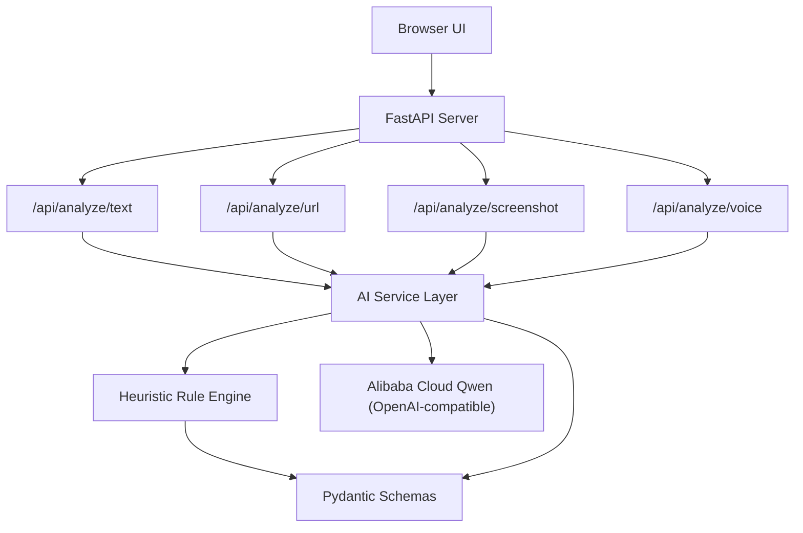
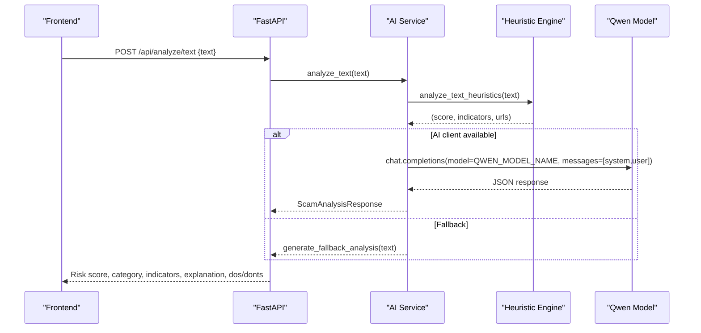
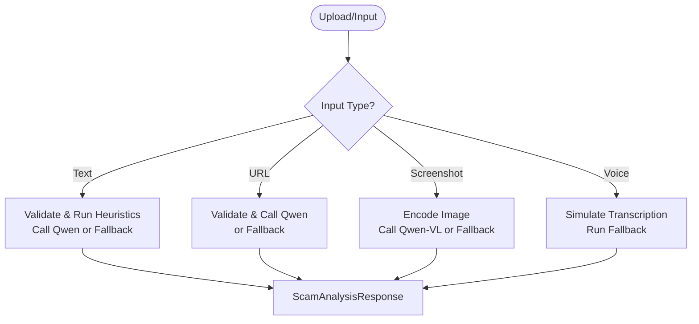
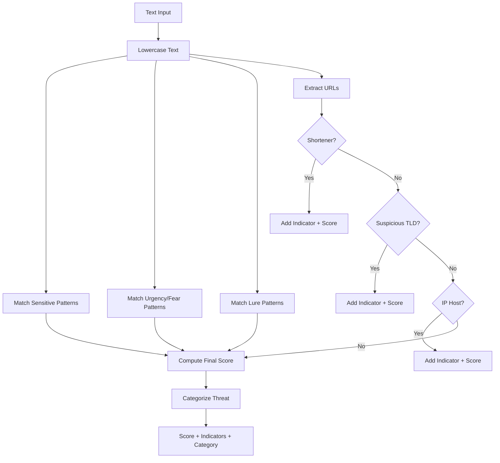
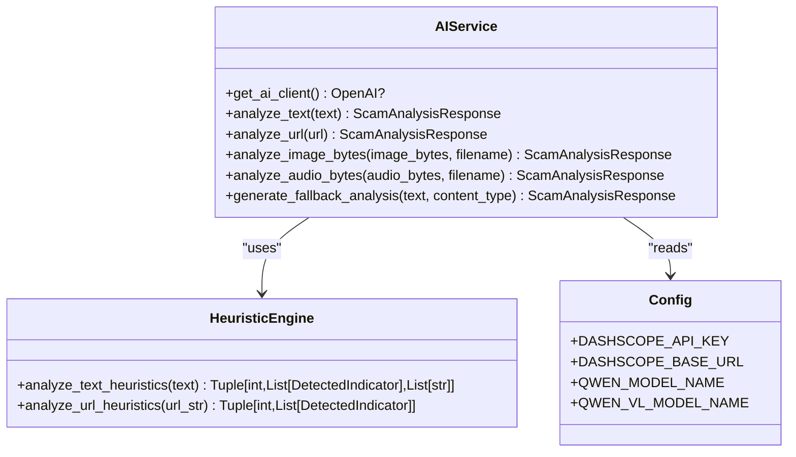
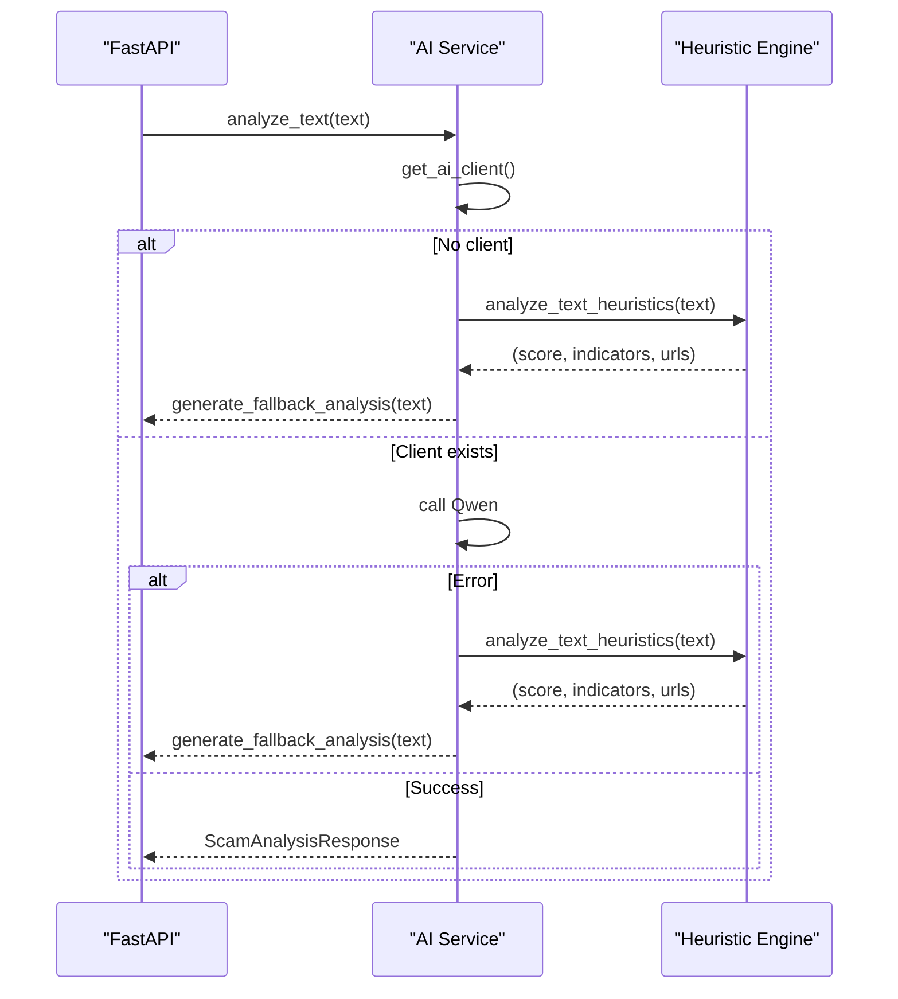
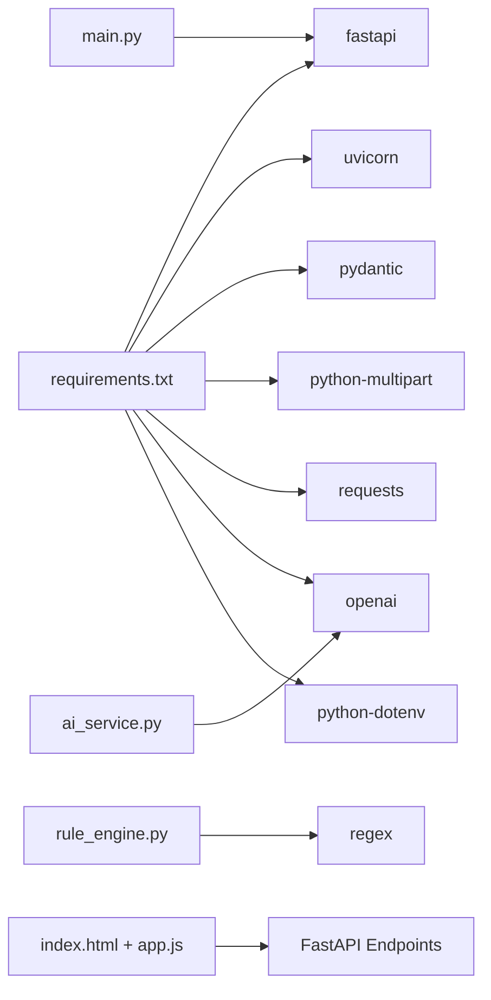

# AI Processing Engine

<cite>
**Referenced Files in This Document**
- [main.py](file://backend/app/main.py)
- [ai_service.py](file://backend/app/ai_service.py)
- [rule_engine.py](file://backend/app/rule_engine.py)
- [config.py](file://backend/app/config.py)
- [schemas.py](file://backend/app/schemas.py)
- [app.js](file://frontend/app.js)
- [index.html](file://frontend/index.html)
- [requirements.txt](file://backend/requirements.txt)
- [README.md](file://README.md)
</cite>

## Table of Contents
1. [Introduction](#introduction)
2. [Project Structure](#project-structure)
3. [Core Components](#core-components)
4. [Architecture Overview](#architecture-overview)
5. [Detailed Component Analysis](#detailed-component-analysis)
6. [Dependency Analysis](#dependency-analysis)
7. [Performance Considerations](#performance-considerations)
8. [Troubleshooting Guide](#troubleshooting-guide)
9. [Conclusion](#conclusion)
10. [Appendices](#appendices)

## Introduction
This document explains ScamShield AI’s processing engine with a focus on its dual-layer threat detection system. The platform performs multimodal analysis across text messages, screenshots, URLs, and audio recordings. It combines:
- A heuristic rule engine that uses regex-based pattern matching to detect phishing indicators, urgency tactics, and social engineering patterns instantly.
- An AI service integration with Alibaba Cloud Qwen models for advanced natural language understanding and visual analysis.
A robust fallback mechanism ensures continuous operation when external AI services are unavailable by switching to heuristic-only mode. The engine also implements risk scoring, threat categorization, and explainable AI output generation. Configuration options cover model selection, API key management, and performance tuning. Finally, it provides guidance for creating custom rules and extending detection patterns.

## Project Structure
The project is organized into backend and frontend layers:
- Backend (FastAPI):
  - API endpoints for text, URL, screenshot, and voice analysis
  - AI service layer integrating Qwen via OpenAI-compatible client
  - Heuristic rule engine using regex patterns
  - Pydantic schemas for request/response validation
  - Configuration loaded from environment variables
- Frontend (HTML/CSS/JS):
  - Multi-tab input interface for different modalities
  - Results visualization including risk gauge, indicators, explanations, and action checklists

**Diagram sources**
- [main.py:21-83](file://backend/app/main.py#L21-L83)
- [ai_service.py:9-219](file://backend/app/ai_service.py#L9-L219)
- [rule_engine.py:37-117](file://backend/app/rule_engine.py#L37-L117)
- [schemas.py:1-26](file://backend/app/schemas.py#L1-L26)

**Section sources**
- [main.py:21-83](file://backend/app/main.py#L21-L83)
- [index.html:42-122](file://frontend/index.html#L42-L122)
- [app.js:138-235](file://frontend/app.js#L138-L235)

## Core Components
- API Layer: FastAPI endpoints accept multimodal inputs and return standardized responses.
- AI Service Layer: Orchestrates calls to Qwen models for text, URL, image, and audio analysis; includes fallback logic.
- Heuristic Rule Engine: Regex-based detection of sensitive data requests, urgency/fear tactics, unrealistic lures, suspicious domains/TLDs, and IP-hosted URLs.
- Data Models: Pydantic schemas define consistent request/response structures and indicator metadata.
- Configuration: Environment-driven settings for API keys, base URLs, model names, and server host/port.

Key responsibilities:
- Validate inputs and enforce constraints via schemas.
- Perform instant heuristic scoring and flagging.
- Integrate with Qwen for advanced reasoning and visual analysis.
- Generate explainable outputs with risk scores, categories, and actionable guidance.

**Section sources**
- [main.py:44-68](file://backend/app/main.py#L44-L68)
- [ai_service.py:124-219](file://backend/app/ai_service.py#L124-L219)
- [rule_engine.py:37-117](file://backend/app/rule_engine.py#L37-L117)
- [schemas.py:4-26](file://backend/app/schemas.py#L4-L26)
- [config.py:6-11](file://backend/app/config.py#L6-L11)

## Architecture Overview
The processing engine follows a dual-layer architecture:
- Layer 1: Heuristic Rule Engine
  - Instant pattern matching using regex
  - Produces a numeric risk score and categorized indicators
- Layer 2: AI Service Integration
  - Uses Alibaba Cloud Qwen models for deeper semantic analysis and visual extraction
  - Falls back to heuristic-only mode if the AI client is unavailable or errors occur

**Diagram sources**
- [main.py:44-48](file://backend/app/main.py#L44-L48)
- [ai_service.py:124-154](file://backend/app/ai_service.py#L124-L154)
- [rule_engine.py:37-112](file://backend/app/rule_engine.py#L37-L112)

## Detailed Component Analysis

### Multimodal Analysis Pipeline
- Text Analysis:
  - Validates input via schema
  - Runs heuristics first to seed context for AI
  - Calls Qwen with structured prompt and JSON response format
  - Falls back to heuristic-only on error or missing API key
- URL Analysis:
  - Validates input via schema
  - Sends URL to Qwen for safety assessment
  - Falls back to heuristic-only if needed
- Screenshot Analysis:
  - Reads uploaded bytes and encodes to base64
  - Attempts Qwen-VL for OCR and scam analysis
  - If unavailable, simulates OCR and runs heuristic fallback
- Voice Analysis:
  - Accepts audio files
  - Simulates transcription and runs heuristic fallback

**Diagram sources**
- [main.py:44-68](file://backend/app/main.py#L44-L68)
- [ai_service.py:124-219](file://backend/app/ai_service.py#L124-L219)

**Section sources**
- [main.py:44-68](file://backend/app/main.py#L44-L68)
- [ai_service.py:124-219](file://backend/app/ai_service.py#L124-L219)

### Heuristic Rule Engine
The heuristic engine applies regex-based rules to detect:
- Sensitive data requests (OTP, CVV, passwords, national IDs)
- Urgency and fear tactics (immediate action, account suspension, legal threats)
- Unrealistic lures (lottery prizes, guaranteed returns, fake jobs)
- Suspicious URLs (shorteners, high-risk TLDs, direct IP hosts)

Risk scoring methodology:
- Base score increments per matched pattern category
- Capped at 100
- Indicators include category, description, and severity

Threat categorization logic:
- Based on heuristic score thresholds and keyword presence
- Maps to scam types such as OTP/Credential Theft, Investment Scam, Lottery/Prize Scam, Bank Impersonation, Phishing, or Safe

Explainable AI output:
- Generates summary, explanation bullets, recommended do’s and don’ts
- Provides detected indicators with severity levels

**Diagram sources**
- [rule_engine.py:37-112](file://backend/app/rule_engine.py#L37-L112)

**Section sources**
- [rule_engine.py:37-117](file://backend/app/rule_engine.py#L37-L117)

### AI Service Integration with Alibaba Cloud Qwen
- Client initialization:
  - Uses OpenAI-compatible client configured with DashScope API key and base URL
  - Returns None if API key is missing or placeholder
- Text analysis:
  - Combines heuristic signals with user prompt
  - Requests JSON response via structured format
  - Parses JSON into ScamAnalysisResponse
- URL analysis:
  - Sends URL to Qwen for safety evaluation
- Image analysis:
  - Encodes image to base64 and sends to Qwen-VL for OCR and scam analysis
  - Falls back to simulated OCR and heuristic analysis if unavailable
- Audio analysis:
  - Simulates transcription and runs heuristic fallback

**Diagram sources**
- [ai_service.py:9-219](file://backend/app/ai_service.py#L9-L219)
- [rule_engine.py:37-117](file://backend/app/rule_engine.py#L37-L117)
- [config.py:6-11](file://backend/app/config.py#L6-L11)

**Section sources**
- [ai_service.py:9-219](file://backend/app/ai_service.py#L9-L219)
- [config.py:6-11](file://backend/app/config.py#L6-L11)

### Fallback Mechanism
- Trigger conditions:
  - Missing or invalid API key
  - Network or API errors during Qwen calls
- Behavior:
  - Executes heuristic analysis to produce immediate results
  - Generates intelligent categorization and explanations based on heuristic signals
  - Ensures platform usability without external dependencies

**Diagram sources**
- [ai_service.py:9-16](file://backend/app/ai_service.py#L9-L16)
- [ai_service.py:124-154](file://backend/app/ai_service.py#L124-L154)
- [ai_service.py:156-176](file://backend/app/ai_service.py#L156-L176)

**Section sources**
- [ai_service.py:9-16](file://backend/app/ai_service.py#L9-L16)
- [ai_service.py:124-154](file://backend/app/ai_service.py#L124-L154)
- [ai_service.py:156-176](file://backend/app/ai_service.py#L156-L176)

### Risk Scoring Methodology
- Heuristic scoring:
  - Adds weighted points per matched pattern category
  - Caps final score at 100
- AI scoring:
  - Qwen returns a normalized integer score within 0–100
- Risk level mapping:
  - Low/Medium/High/Critical based on score thresholds and heuristic signals
- Threat categorization:
  - Keyword-based classification for scam type when using fallback
  - AI-generated categorization when using Qwen

**Section sources**
- [rule_engine.py:46-112](file://backend/app/rule_engine.py#L46-L112)
- [ai_service.py:50-122](file://backend/app/ai_service.py#L50-L122)
- [schemas.py:15-26](file://backend/app/schemas.py#L15-L26)

### Explainable AI Output Generation
- Outputs include:
  - Summary: concise executive overview
  - Detected indicators: category, description, severity
  - Explanation: bullet points detailing why the submission is dangerous
  - Recommended do’s and don’ts: actionable protection steps
- Generated by:
  - Heuristic fallback with predefined guidance
  - Qwen with structured JSON response enforced via response_format

**Section sources**
- [ai_service.py:18-48](file://backend/app/ai_service.py#L18-L48)
- [ai_service.py:50-122](file://backend/app/ai_service.py#L50-L122)
- [schemas.py:10-26](file://backend/app/schemas.py#L10-L26)

### Configuration Options
- Model selection:
  - QWEN_MODEL_NAME: default qwen-plus
  - QWEN_VL_MODEL_NAME: default qwen-vl-plus
- API key management:
  - DASHSCOPE_API_KEY: required for AI features
  - DASHSCOPE_BASE_URL: endpoint for OpenAI-compatible access
- Performance tuning:
  - PORT and HOST for server binding
  - Optional environment overrides via .env

**Section sources**
- [config.py:6-11](file://backend/app/config.py#L6-L11)
- [README.md:44-53](file://README.md#L44-L53)

### Custom Rule Creation and Extension Points
- Adding new detection patterns:
  - Extend SENSITIVE_PATTERNS, URGENCY_PATTERNS, or LURE_PATTERNS with new regex tuples (pattern, description, severity)
  - Update scoring weights if necessary
- Extending URL checks:
  - Add entries to SUSPICIOUS_DOMAINS or SUSPICIOUS_TLDS
  - Implement additional domain/IP checks in analyze_text_heuristics
- Enhancing categorization:
  - Expand keyword mappings in generate_fallback_analysis for more precise scam type classification
- Validation and testing:
  - Use frontend presets to test new rules against sample inputs
  - Verify indicator appearance and risk score changes

**Section sources**
- [rule_engine.py:6-35](file://backend/app/rule_engine.py#L6-L35)
- [rule_engine.py:46-112](file://backend/app/rule_engine.py#L46-L112)
- [ai_service.py:50-122](file://backend/app/ai_service.py#L50-L122)
- [app.js:13-19](file://frontend/app.js#L13-L19)

## Dependency Analysis
- Backend dependencies:
  - FastAPI and Uvicorn for API server
  - Pydantic for data validation
  - python-multipart for file uploads
  - requests for HTTP operations
  - openai for Qwen integration
  - python-dotenv for environment configuration
- Frontend dependencies:
  - Vanilla JavaScript for API calls and UI state management
  - HTML/CSS for responsive interface

**Diagram sources**
- [requirements.txt:1-8](file://backend/requirements.txt#L1-L8)
- [main.py:1-20](file://backend/app/main.py#L1-L20)
- [ai_service.py:1-8](file://backend/app/ai_service.py#L1-L8)
- [rule_engine.py:1-4](file://backend/app/rule_engine.py#L1-L4)

**Section sources**
- [requirements.txt:1-8](file://backend/requirements.txt#L1-L8)
- [main.py:1-20](file://backend/app/main.py#L1-L20)
- [ai_service.py:1-8](file://backend/app/ai_service.py#L1-L8)
- [rule_engine.py:1-4](file://backend/app/rule_engine.py#L1-L4)

## Performance Considerations
- Heuristic-first approach:
  - Instant pattern matching reduces latency and provides immediate feedback
- AI call optimization:
  - Use structured JSON responses to minimize parsing overhead
  - Cache frequent queries if applicable
- File handling:
  - Stream large uploads where possible
  - Limit file sizes to reduce memory usage
- Concurrency:
  - Leverage Uvicorn’s async capabilities for concurrent requests
- Fallback efficiency:
  - Ensure heuristic engine remains lightweight and fast

[No sources needed since this section provides general guidance]

## Troubleshooting Guide
Common issues and resolutions:
- Missing or invalid API key:
  - Platform automatically switches to heuristic-only mode
  - Verify DASHSCOPE_API_KEY in environment configuration
- Network errors calling Qwen:
  - Errors trigger fallback to heuristic analysis
  - Check network connectivity and base URL configuration
- Empty file uploads:
  - API returns validation errors for empty payloads
  - Ensure frontend sends valid files
- Unexpected results:
  - Review heuristic patterns and adjust weights or add new rules
  - Test with frontend presets to validate behavior

**Section sources**
- [ai_service.py:9-16](file://backend/app/ai_service.py#L9-L16)
- [ai_service.py:152-154](file://backend/app/ai_service.py#L152-L154)
- [main.py:46-68](file://backend/app/main.py#L46-L68)
- [app.js:138-235](file://frontend/app.js#L138-L235)

## Conclusion
ScamShield AI’s processing engine delivers a robust, dual-layer threat detection system combining instant heuristic analysis with advanced AI-powered reasoning. Its multimodal pipeline supports text, URLs, screenshots, and audio, while maintaining reliability through a resilient fallback mechanism. The engine produces clear, explainable outputs with actionable guidance, making it accessible to users with varying technical backgrounds. With configurable models, secure API key management, and extensible rule sets, the platform is well-positioned for ongoing enhancement and customization.

[No sources needed since this section summarizes without analyzing specific files]

## Appendices

### API Endpoints Reference
- POST /api/analyze/text: Analyze text/SMS content
- POST /api/analyze/url: Inspect URL safety
- POST /api/analyze/screenshot: Extract OCR and analyze images
- POST /api/analyze/voice: Transcribe and analyze audio
- GET /api/health: Health check endpoint

**Section sources**
- [main.py:36-68](file://backend/app/main.py#L36-L68)

### Frontend Interaction Flow
- User selects input modality and submits content
- Frontend calls appropriate API endpoint
- Backend processes via heuristic and/or AI layers
- Results displayed with risk gauge, indicators, explanations, and action plans

**Section sources**
- [index.html:42-122](file://frontend/index.html#L42-L122)
- [app.js:138-235](file://frontend/app.js#L138-L235)