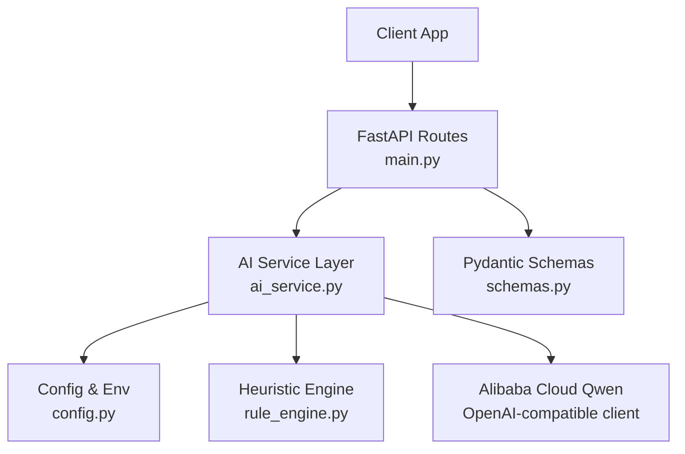
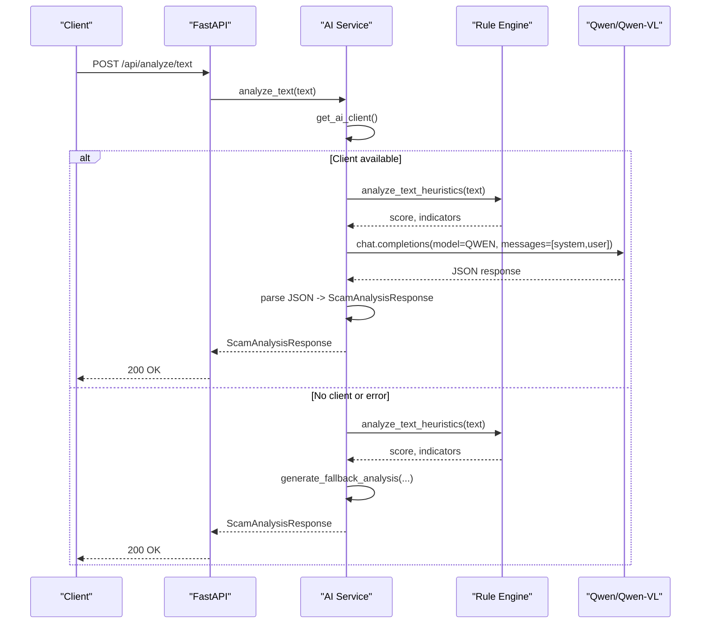
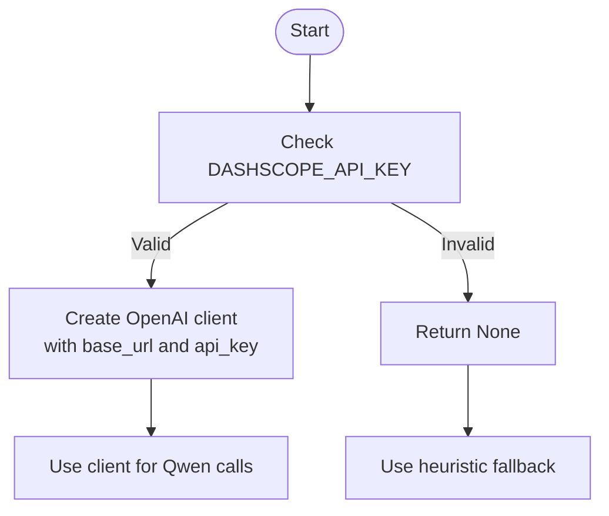
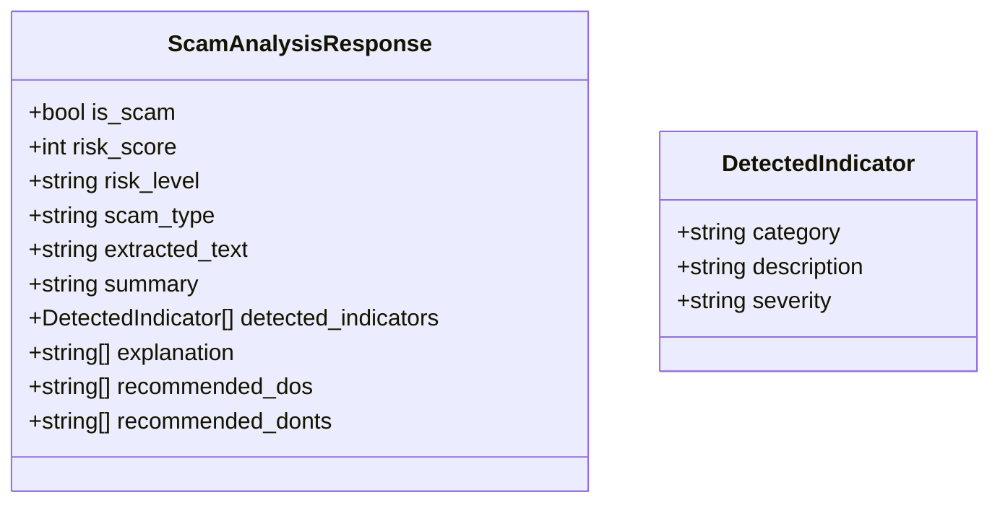
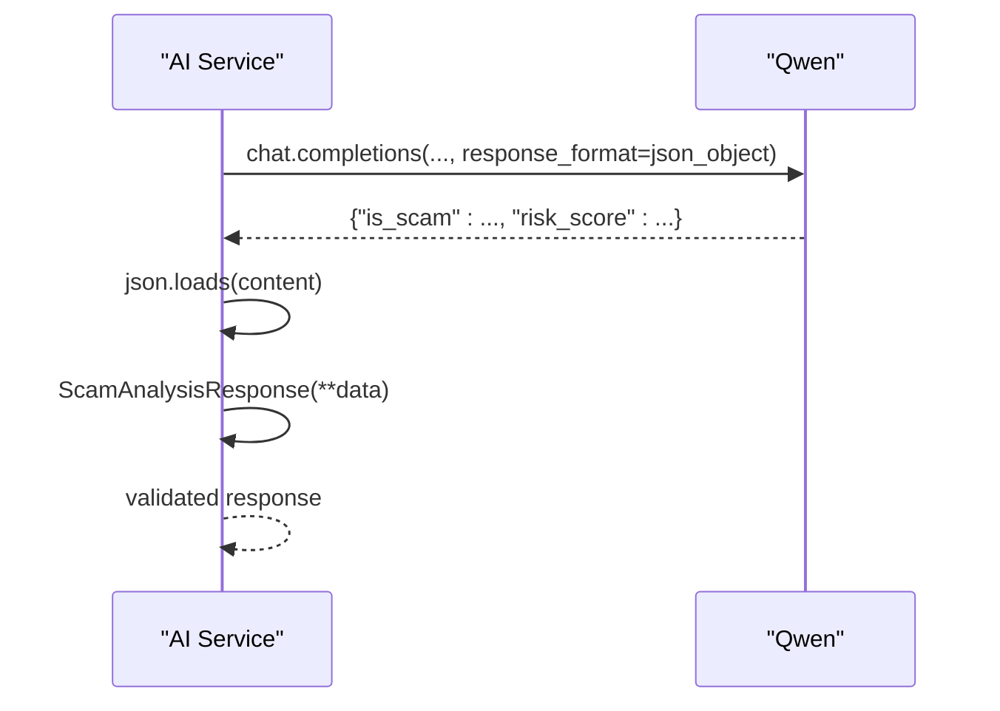
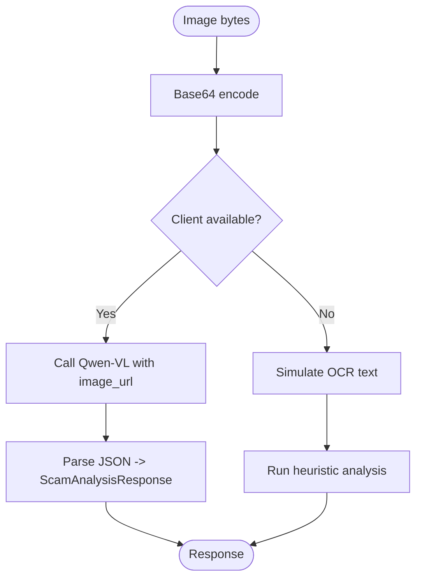
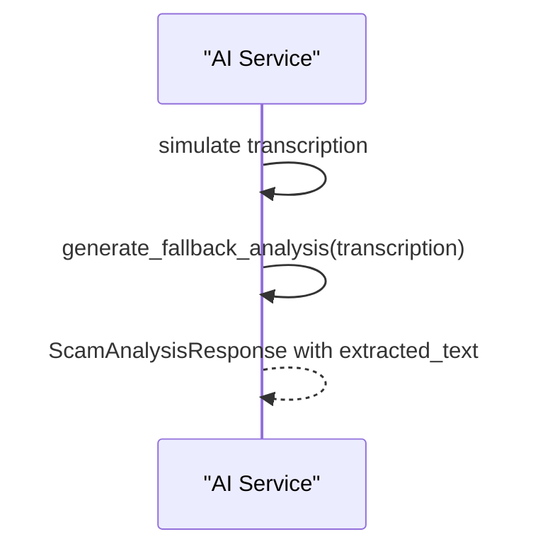
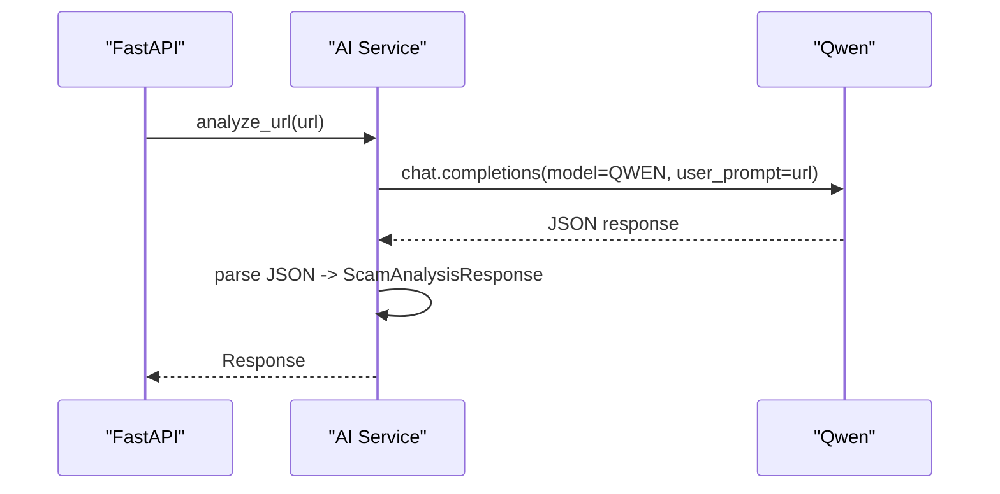
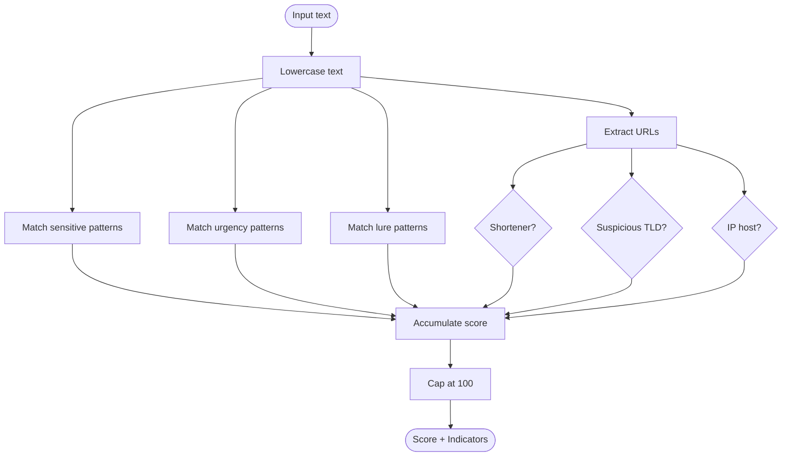
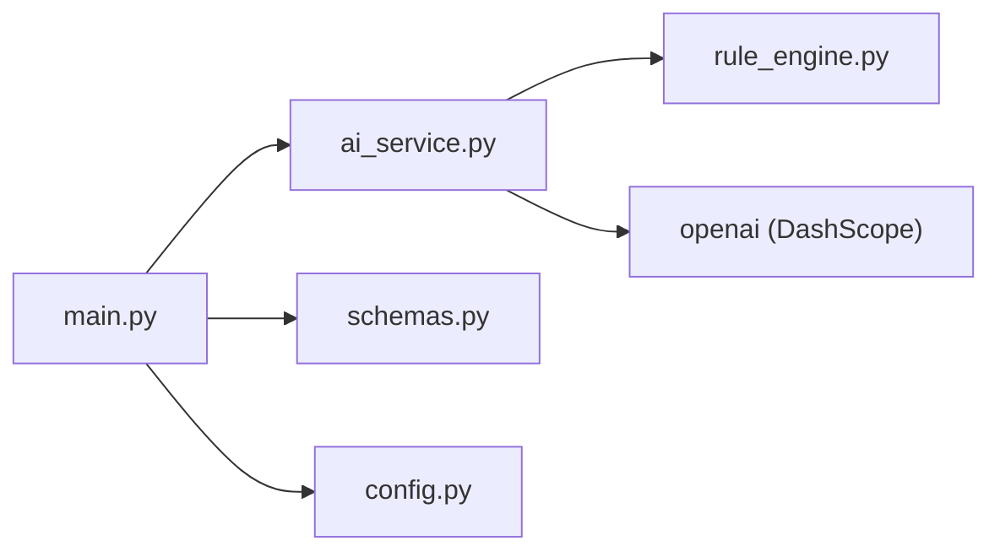

# AI Service Integration

<cite>
**Referenced Files in This Document**
- [ai_service.py](file://backend/app/ai_service.py)
- [config.py](file://backend/app/config.py)
- [schemas.py](file://backend/app/schemas.py)
- [main.py](file://backend/app/main.py)
- [rule_engine.py](file://backend/app/rule_engine.py)
- [README.md](file://README.md)
</cite>

## Table of Contents
1. [Introduction](#introduction)
2. [Project Structure](#project-structure)
3. [Core Components](#core-components)
4. [Architecture Overview](#architecture-overview)
5. [Detailed Component Analysis](#detailed-component-analysis)
6. [Dependency Analysis](#dependency-analysis)
7. [Performance Considerations](#performance-considerations)
8. [Troubleshooting Guide](#troubleshooting-guide)
9. [Conclusion](#conclusion)

## Introduction
This document explains the AI service integration layer that powers multimodal content analysis using Alibaba Cloud Qwen models (text and vision). It covers client initialization, API key management, connection handling, prompt engineering for different content types, JSON response parsing into structured ScamAnalysisResponse objects, image OCR processing, audio transcription simulation, URL analysis workflows, error handling strategies, timeout management, and graceful degradation when external AI services are unavailable.

The system provides a FastAPI backend exposing endpoints for text, URL, screenshot, and voice analysis. When an Alibaba Cloud DashScope API key is configured, it uses OpenAI-compatible clients to call Qwen or Qwen-VL models. If no valid key is present or calls fail, the system falls back to a deterministic heuristic engine to ensure continuous operation.

**Section sources**
- [README.md:1-68](file://README.md#L1-L68)
- [main.py:21-84](file://backend/app/main.py#L21-L84)

## Project Structure
At a high level:
- API surface: FastAPI routes in main.py handle requests and delegate to ai_service functions.
- AI integration: ai_service.py manages client creation, model calls, prompt construction, and fallback logic.
- Configuration: config.py loads environment variables for API keys, base URLs, model names, and server settings.
- Data contracts: schemas.py defines Pydantic models for request/response validation.
- Heuristics: rule_engine.py implements pattern-based detection used as a robust fallback and to enrich prompts.

**Diagram sources**
- [main.py:21-84](file://backend/app/main.py#L21-L84)
- [ai_service.py:9-16](file://backend/app/ai_service.py#L9-L16)
- [config.py:1-12](file://backend/app/config.py#L1-L12)
- [rule_engine.py:37-118](file://backend/app/rule_engine.py#L37-L118)
- [schemas.py:4-26](file://backend/app/schemas.py#L4-L26)

**Section sources**
- [main.py:21-84](file://backend/app/main.py#L21-L84)
- [ai_service.py:1-220](file://backend/app/ai_service.py#L1-L220)
- [config.py:1-12](file://backend/app/config.py#L1-L12)
- [schemas.py:1-26](file://backend/app/schemas.py#L1-L26)
- [rule_engine.py:1-118](file://backend/app/rule_engine.py#L1-L118)

## Core Components
- AI client initialization: get_ai_client returns an OpenAI-compatible client configured with DashScope base URL and API key if available; otherwise returns None to trigger fallback behavior.
- Text analysis: analyze_text builds a user prompt enriched by heuristic signals and calls Qwen with a strict JSON response format; on failure, it falls back to heuristic analysis.
- URL analysis: analyze_url sends a concise prompt to Qwen to evaluate safety and legitimacy; errors fall back to heuristic analysis.
- Image analysis: analyze_image_bytes encodes images to base64 and calls Qwen-VL for OCR and scam detection; if unavailable, it simulates OCR and runs heuristic analysis.
- Audio analysis: analyze_audio_bytes simulates transcription and runs heuristic analysis to produce a structured response.
- Heuristic engine: rule_engine.py applies regex patterns to detect sensitive data requests, urgency tactics, lures, suspicious domains/TLDs, and IP-hosted URLs, returning a score and indicators.

**Section sources**
- [ai_service.py:9-16](file://backend/app/ai_service.py#L9-L16)
- [ai_service.py:124-154](file://backend/app/ai_service.py#L124-L154)
- [ai_service.py:156-176](file://backend/app/ai_service.py#L156-L176)
- [ai_service.py:178-211](file://backend/app/ai_service.py#L178-L211)
- [ai_service.py:213-219](file://backend/app/ai_service.py#L213-L219)
- [rule_engine.py:37-118](file://backend/app/rule_engine.py#L37-L118)

## Architecture Overview
The integration layer follows a dual-layer architecture:
- Primary path: FastAPI routes invoke ai_service functions which call Alibaba Cloud Qwen via an OpenAI-compatible client. Responses are parsed into ScamAnalysisResponse using Pydantic.
- Fallback path: If no API key is configured or API calls fail, the system uses rule_engine heuristics to generate a safe, explainable analysis.

**Diagram sources**
- [main.py:44-48](file://backend/app/main.py#L44-L48)
- [ai_service.py:9-16](file://backend/app/ai_service.py#L9-L16)
- [ai_service.py:124-154](file://backend/app/ai_service.py#L124-L154)
- [rule_engine.py:37-118](file://backend/app/rule_engine.py#L37-L118)

## Detailed Component Analysis

### Client Initialization and API Key Management
- Environment-driven configuration: config.py loads DASHSCOPE_API_KEY, DASHSCOPE_BASE_URL, QWEN_MODEL_NAME, QWEN_VL_MODEL_NAME, PORT, HOST from environment variables.
- Conditional client creation: get_ai_client checks for a valid API key and returns an OpenAI client configured with the DashScope base URL; otherwise returns None.
- Graceful degradation: All analysis functions check for client availability and switch to heuristic fallback when needed.

**Diagram sources**
- [config.py:1-12](file://backend/app/config.py#L1-L12)
- [ai_service.py:9-16](file://backend/app/ai_service.py#L9-L16)

**Section sources**
- [config.py:1-12](file://backend/app/config.py#L1-L12)
- [ai_service.py:9-16](file://backend/app/ai_service.py#L9-L16)

### Prompt Engineering Approach
- System prompt: A fixed SYSTEM_PROMPT instructs the model to return strictly valid JSON matching the expected schema, including fields like is_scam, risk_score, risk_level, scam_type, summary, detected_indicators, explanation, recommended_dos, and recommended_donts.
- User message formatting:
  - Text: The user prompt includes the raw text and initial heuristic signals (score and flags) to guide the model’s reasoning.
  - URL: A concise instruction to assess safety and legitimacy.
  - Image: A two-part message containing a text instruction to extract all text and analyze for scams, plus an image payload encoded as base64 data URL.
  - Audio: Simulated transcription is passed to heuristic analysis; no live transcription pipeline is implemented.

**Diagram sources**
- [schemas.py:10-26](file://backend/app/schemas.py#L10-L26)

**Section sources**
- [ai_service.py:18-48](file://backend/app/ai_service.py#L18-L48)
- [ai_service.py:124-154](file://backend/app/ai_service.py#L124-L154)
- [ai_service.py:156-176](file://backend/app/ai_service.py#L156-L176)
- [ai_service.py:178-211](file://backend/app/ai_service.py#L178-L211)
- [schemas.py:10-26](file://backend/app/schemas.py#L10-L26)

### JSON Response Parsing and Validation
- Strict JSON output: Model calls specify response_format={"type": "json_object"} to enforce JSON responses.
- Parsing: The raw JSON string is parsed with json.loads and then unpacked into ScamAnalysisResponse via Pydantic, ensuring type validation and constraints (e.g., risk_score between 0 and 100).
- Error handling: Any exception during parsing or API calls triggers fallback to heuristic analysis to maintain reliability.

**Diagram sources**
- [ai_service.py:141-151](file://backend/app/ai_service.py#L141-L151)
- [schemas.py:15-26](file://backend/app/schemas.py#L15-L26)

**Section sources**
- [ai_service.py:141-154](file://backend/app/ai_service.py#L141-L154)
- [schemas.py:15-26](file://backend/app/schemas.py#L15-L26)

### Image OCR Processing
- Live OCR path: When a client is available, analyze_image_bytes encodes the image to base64 and sends it to Qwen-VL with a text instruction to extract all text and analyze for scams. The model’s JSON response is parsed into ScamAnalysisResponse.
- Fallback path: If no client or an error occurs, the function simulates OCR with a sample transcript and runs heuristic analysis, attaching the simulated OCR text to extracted_text.

**Diagram sources**
- [ai_service.py:178-211](file://backend/app/ai_service.py#L178-L211)

**Section sources**
- [ai_service.py:178-211](file://backend/app/ai_service.py#L178-L211)

### Audio Transcription Simulation
- Simulated transcription: analyze_audio_bytes constructs a sample vishing-style transcription and runs heuristic analysis to produce a structured response.
- Output enrichment: The filename and simulated transcription are attached to extracted_text for traceability.

**Diagram sources**
- [ai_service.py:213-219](file://backend/app/ai_service.py#L213-L219)

**Section sources**
- [ai_service.py:213-219](file://backend/app/ai_service.py#L213-L219)

### URL Analysis Workflow
- Live path: Sends a concise prompt to Qwen to evaluate URL safety and legitimacy; parses JSON into ScamAnalysisResponse.
- Fallback path: On absence of client or error, runs heuristic analysis on the URL string.

**Diagram sources**
- [main.py:50-54](file://backend/app/main.py#L50-L54)
- [ai_service.py:156-176](file://backend/app/ai_service.py#L156-L176)

**Section sources**
- [main.py:50-54](file://backend/app/main.py#L50-L54)
- [ai_service.py:156-176](file://backend/app/ai_service.py#L156-L176)

### Heuristic Engine Details
- Pattern categories:
  - Sensitive information requests (OTP, CVV, passwords, IDs).
  - Urgency and fear tactics (immediate action, account suspension, legal threats).
  - Lures (lottery prizes, investment promises, fake jobs).
  - Suspicious URLs (shorteners, high-risk TLDs, direct IP hosts).
- Scoring: Each matched pattern contributes weighted points toward a capped score (0–100), and indicators are collected for explainability.

**Diagram sources**
- [rule_engine.py:7-35](file://backend/app/rule_engine.py#L7-L35)
- [rule_engine.py:37-118](file://backend/app/rule_engine.py#L37-L118)

**Section sources**
- [rule_engine.py:7-35](file://backend/app/rule_engine.py#L7-L35)
- [rule_engine.py:37-118](file://backend/app/rule_engine.py#L37-L118)

## Dependency Analysis
- API layer depends on:
  - ai_service for core analysis logic and fallback orchestration.
  - schemas for request/response validation.
  - config for runtime settings.
- ai_service depends on:
  - openai client for Qwen/Qwen-VL calls.
  - rule_engine for heuristic fallback and prompt enrichment.
  - schemas for constructing typed responses.
- config depends on environment variables loaded via python-dotenv.

**Diagram sources**
- [main.py:8-19](file://backend/app/main.py#L8-L19)
- [ai_service.py:1-8](file://backend/app/ai_service.py#L1-L8)
- [config.py:1-12](file://backend/app/config.py#L1-L12)
- [rule_engine.py:1-5](file://backend/app/rule_engine.py#L1-L5)

**Section sources**
- [main.py:8-19](file://backend/app/main.py#L8-L19)
- [ai_service.py:1-8](file://backend/app/ai_service.py#L1-L8)
- [config.py:1-12](file://backend/app/config.py#L1-L12)
- [rule_engine.py:1-5](file://backend/app/rule_engine.py#L1-L5)

## Performance Considerations
- Avoid unnecessary network calls: The client existence check short-circuits to fast heuristic analysis when no API key is configured.
- Reduce payload size: For image analysis, base64 encoding is used; consider limiting image sizes in production to reduce bandwidth and latency.
- Prompt efficiency: Heuristic signals are included in prompts to improve accuracy without excessive context length.
- Concurrency: FastAPI handles concurrent requests; ensure upstream Qwen rate limits and timeouts are respected in production deployments.

[No sources needed since this section provides general guidance]

## Troubleshooting Guide
- Missing or invalid API key:
  - Symptom: All AI calls bypassed; heuristic fallback activates automatically.
  - Action: Set DASHSCOPE_API_KEY in environment; verify value is not a placeholder.
- Network or API errors:
  - Symptom: Exceptions during chat.completions calls.
  - Behavior: Errors are caught and logged; system falls back to heuristic analysis to avoid downtime.
- Invalid JSON from model:
  - Symptom: JSON parsing fails.
  - Behavior: Exception triggers fallback to heuristic analysis.
- Empty uploads:
  - Symptom: File upload endpoints validate empty payloads and return HTTP 400.
  - Action: Ensure non-empty files are uploaded.

**Section sources**
- [ai_service.py:152-154](file://backend/app/ai_service.py#L152-L154)
- [ai_service.py:174-176](file://backend/app/ai_service.py#L174-L176)
- [ai_service.py:204-206](file://backend/app/ai_service.py#L204-L206)
- [main.py:46-48](file://backend/app/main.py#L46-L48)
- [main.py:52-54](file://backend/app/main.py#L52-L54)
- [main.py:58-61](file://backend/app/main.py#L58-L61)
- [main.py:65-68](file://backend/app/main.py#L65-L68)

## Conclusion
The AI service integration layer provides a resilient, multimodal scam detection pipeline that combines Alibaba Cloud Qwen capabilities with a robust heuristic fallback. It ensures reliable operation through careful client initialization, environment-driven configuration, strict JSON response parsing, and comprehensive error handling. The design supports both online and offline modes, making it suitable for development, testing, and production environments where external AI services may be intermittently unavailable.

[No sources needed since this section summarizes without analyzing specific files]