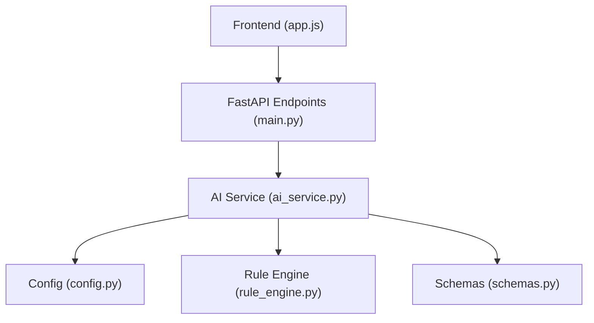
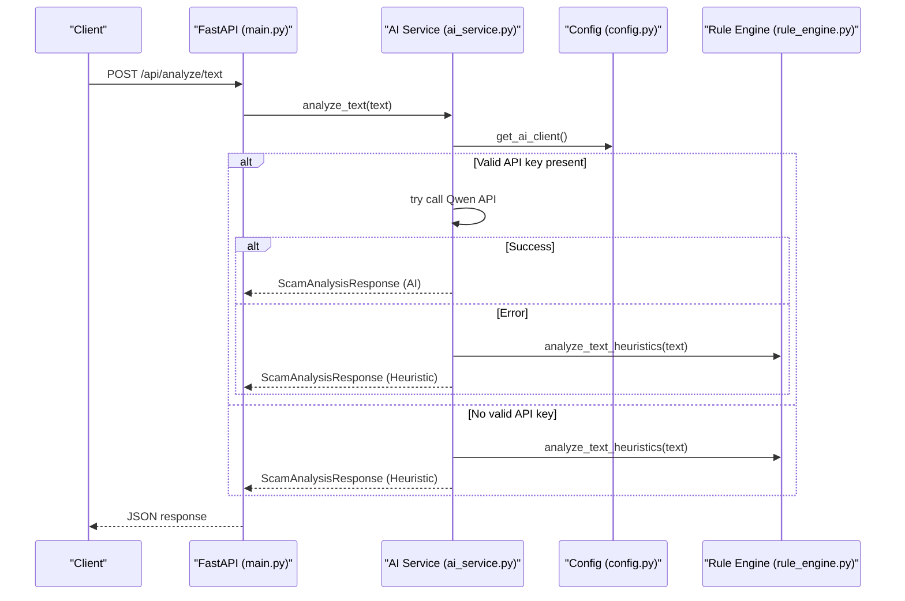
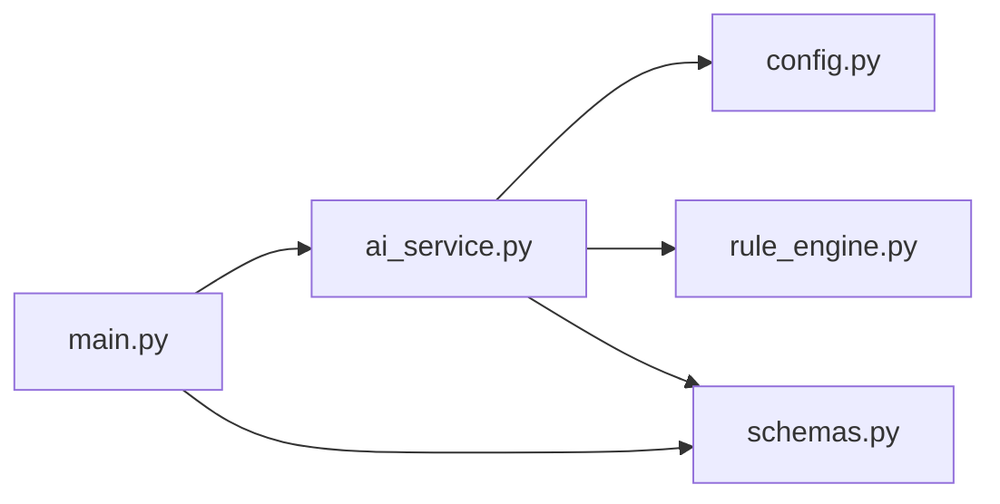
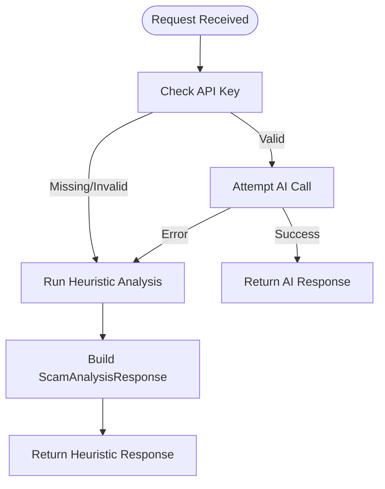

# Fallback Mechanism

<cite>
**Referenced Files in This Document**
- [ai_service.py](file://backend/app/ai_service.py)
- [rule_engine.py](file://backend/app/rule_engine.py)
- [config.py](file://backend/app/config.py)
- [schemas.py](file://backend/app/schemas.py)
- [main.py](file://backend/app/main.py)
- [app.js](file://frontend/app.js)
- [README.md](file://README.md)
</cite>

## Table of Contents
1. [Introduction](#introduction)
2. [Project Structure](#project-structure)
3. [Core Components](#core-components)
4. [Architecture Overview](#architecture-overview)
5. [Detailed Component Analysis](#detailed-component-analysis)
6. [Dependency Analysis](#dependency-analysis)
7. [Performance Considerations](#performance-considerations)
8. [Troubleshooting Guide](#troubleshooting-guide)
9. [Conclusion](#conclusion)
10. [Appendices](#appendices)

## Introduction
This document explains the intelligent fallback mechanism that keeps ScamShield operational when AI services are unavailable. It covers automatic detection of missing or invalid API keys, seamless switching to heuristic-only analysis, and how generate_fallback_analysis produces meaningful scam assessments using local pattern matching. It also documents risk score calculation, scam type categorization, explanation generation, configuration options, performance considerations for offline mode, monitoring approaches, and example scenarios comparing AI-powered versus heuristic-only results.

## Project Structure
The backend exposes a FastAPI application with endpoints that route requests to an AI service layer. The AI service attempts to use Alibaba Cloud Qwen via DashScope; if the API key is missing or invalid, or if calls fail, it falls back to a deterministic heuristic engine. The frontend consumes these endpoints and renders risk scores, indicators, explanations, and recommendations.

**Diagram sources**
- [main.py:44-68](file://backend/app/main.py#L44-L68)
- [ai_service.py:9-16](file://backend/app/ai_service.py#L9-L16)
- [rule_engine.py:37-117](file://backend/app/rule_engine.py#L37-L117)
- [config.py:6-9](file://backend/app/config.py#L6-L9)
- [schemas.py:15-25](file://backend/app/schemas.py#L15-L25)

**Section sources**
- [main.py:21-84](file://backend/app/main.py#L21-L84)
- [README.md:24-60](file://README.md#L24-L60)

## Core Components
- AI client initialization and fallback trigger: get_ai_client checks for a valid DashScope API key and returns None when missing or placeholder-like.
- Heuristic analysis: analyze_text_heuristics computes a risk score and flags indicators based on regex patterns for sensitive data, urgency, lures, and suspicious URLs.
- Fallback analysis: generate_fallback_analysis builds a complete ScamAnalysisResponse using only heuristics when AI is unavailable.
- Schemas: Pydantic models define request/response contracts used across the API.

Key responsibilities:
- ai_service.py: Orchestrates AI vs. fallback decisions and constructs responses.
- rule_engine.py: Implements deterministic scoring and indicator extraction.
- config.py: Loads environment variables for API keys and model names.
- schemas.py: Defines structured response types including risk_score, risk_level, scam_type, indicators, explanations, dos/donts.

**Section sources**
- [ai_service.py:9-16](file://backend/app/ai_service.py#L9-L16)
- [ai_service.py:50-122](file://backend/app/ai_service.py#L50-L122)
- [rule_engine.py:37-117](file://backend/app/rule_engine.py#L37-L117)
- [config.py:6-9](file://backend/app/config.py#L6-L9)
- [schemas.py:15-25](file://backend/app/schemas.py#L15-L25)

## Architecture Overview
The system uses a dual-layer approach:
- Primary path: AI-powered analysis via Qwen through DashScope.
- Fallback path: Deterministic heuristic analysis when AI cannot be reached.

**Diagram sources**
- [main.py:44-48](file://backend/app/main.py#L44-L48)
- [ai_service.py:124-154](file://backend/app/ai_service.py#L124-L154)
- [ai_service.py:9-16](file://backend/app/ai_service.py#L9-L16)
- [rule_engine.py:37-117](file://backend/app/rule_engine.py#L37-L117)

## Detailed Component Analysis

### Automatic Detection of Missing or Invalid API Keys
- get_ai_client inspects the configured API key and base URL from environment variables. If the key is empty or contains a placeholder value, it returns None, signaling that AI services should not be used.
- All analysis functions check the client before attempting remote calls and immediately fall back to heuristic analysis when the client is None.

Operational behavior:
- When no API key is set, all endpoints return heuristic-based results without network calls.
- When an API key is set but calls fail, exceptions are caught and the system transparently switches to heuristic analysis.

**Section sources**
- [config.py:6-9](file://backend/app/config.py#L6-L9)
- [ai_service.py:9-16](file://backend/app/ai_service.py#L9-L16)
- [ai_service.py:124-154](file://backend/app/ai_service.py#L124-L154)
- [ai_service.py:156-176](file://backend/app/ai_service.py#L156-L176)

### Seamless Switch to Heuristic-Only Analysis Mode
- analyze_text and analyze_url attempt AI calls first; on failure or absence of a client, they invoke generate_fallback_analysis.
- Image and audio analysis functions simulate OCR/transcription and then use generate_fallback_analysis to produce consistent results even without AI.

User impact:
- End users see the same response structure regardless of whether AI was used or not.
- Risk levels, scam types, and explanations are always provided.

**Section sources**
- [ai_service.py:124-154](file://backend/app/ai_service.py#L124-L154)
- [ai_service.py:156-176](file://backend/app/ai_service.py#L156-L176)
- [ai_service.py:178-219](file://backend/app/ai_service.py#L178-L219)

### generate_fallback_analysis: Meaningful Assessments Using Local Pattern Matching
generate_fallback_analysis performs:
- Heuristic scoring via analyze_text_heuristics to compute a numeric risk score and collect indicators.
- Risk level determination:
  - Score >= 85: Critical
  - Score >= 70: High
  - Score >= 30: Medium
  - Else: Low
- Scam type categorization based on keyword presence in the text:
  - OTP/Credential theft keywords map to “OTP / Credential Theft”
  - Investment-related keywords map to “Investment Scam”
  - Lottery/prize keywords map to “Lottery / Prize Scam”
  - Bank/service impersonation keywords map to “Bank / Service Impersonation”
  - Otherwise defaults to “Phishing Scam”
- Explanation and recommendations:
  - For high/critical risks: strong warnings, immediate actions, and clear do’s/don’ts.
  - For medium risks: cautious guidance and verification steps.
  - For low risks: general hygiene advice.

Output:
- A fully populated ScamAnalysisResponse with is_scam, risk_score, risk_level, scam_type, summary, detected_indicators, explanation, recommended_dos, and recommended_donts.

**Section sources**
- [ai_service.py:50-122](file://backend/app/ai_service.py#L50-L122)
- [rule_engine.py:37-117](file://backend/app/rule_engine.py#L37-L117)
- [schemas.py:15-25](file://backend/app/schemas.py#L15-L25)

### Risk Score Calculation in Fallback Mode
- Base scoring components:
  - Sensitive information requests add significant weight.
  - Urgency/fear tactics add moderate weight.
  - Unrealistic reward/lure patterns add moderate weight.
  - Suspicious URLs (shorteners, high-risk TLDs, direct IP hosts) add additional weight.
- The final score is capped at 100.

Complexity:
- Time complexity is linear in the length of the input text due to regex scans and URL parsing.
- Space complexity is proportional to the number of detected indicators and extracted URLs.

**Section sources**
- [rule_engine.py:37-117](file://backend/app/rule_engine.py#L37-L117)

### Scam Type Categorization Logic
- Keyword-driven classification ensures consistent mapping from content signals to scam categories.
- Priority order:
  - OTP/Credential theft
  - Investment scam
  - Lottery/prize scam
  - Bank/service impersonation
  - Phishing scam (default)

This logic provides actionable categorization even without AI reasoning.

**Section sources**
- [ai_service.py:59-70](file://backend/app/ai_service.py#L59-L70)

### Explanation Generation for Heuristic-Based Results
- Explanations are tailored to the risk tier:
  - High/Critical: Emphasizes multiple red flags, emotional manipulation, credential requests, and link redirections.
  - Medium: Notes resemblance to scam templates and recommends verification.
  - Low: Highlights absence of sensitive data requests and artificial urgency.
- Recommendations include concrete do’s and don’ts appropriate to the risk level.

**Section sources**
- [ai_service.py:72-109](file://backend/app/ai_service.py#L72-L109)

### Configuration Options for Controlling Fallback Behavior
- Environment variables:
  - DASHSCOPE_API_KEY: If empty or placeholder-like, AI is disabled and fallback is always used.
  - DASHSCOPE_BASE_URL: Base endpoint for DashScope-compatible API.
  - QWEN_MODEL_NAME: Model identifier for text analysis.
  - QWEN_VL_MODEL_NAME: Model identifier for image analysis.
  - PORT/HOST: Server binding settings.
- Behavior:
  - Without a valid API key, all endpoints operate in heuristic-only mode.
  - With a valid key, AI is attempted; failures automatically revert to heuristic mode.

**Section sources**
- [config.py:6-9](file://backend/app/config.py#L6-L9)
- [README.md:44-53](file://README.md#L44-L53)

### Monitoring Approaches to Track Fallback Usage
Recommended practices:
- Add logging around fallback triggers:
  - Log when get_ai_client returns None due to missing/invalid keys.
  - Log when AI calls raise exceptions and fallback is invoked.
- Emit metrics:
  - Count of requests processed in AI mode vs. fallback mode.
  - Average latency per mode.
  - Distribution of risk levels produced by fallback.
- Health checks:
  - Expose a simple endpoint to report current mode (AI available or fallback active).
- Observability:
  - Correlate fallback events with upstream errors or timeouts.
  - Alert on spikes in fallback usage indicating potential provider outages.

[No sources needed since this section provides general guidance]

### Performance Considerations in Offline Mode
- Deterministic regex scanning is fast and CPU-bound; expect sub-millisecond to millisecond processing for typical message lengths.
- URL parsing adds minimal overhead; shortener checks and TLD lookups are constant-time per URL.
- Memory footprint remains small; only indicators and extracted URLs are stored.
- Frontend rendering is lightweight; risk gauge and lists update efficiently.

**Section sources**
- [rule_engine.py:37-117](file://backend/app/rule_engine.py#L37-L117)
- [app.js:49-136](file://frontend/app.js#L49-L136)

### Example Scenarios Where Fallback Activates
- No API key configured:
  - All endpoints return heuristic-based results immediately.
- API key present but provider unreachable:
  - Exceptions during chat.completions.create trigger fallback.
- Image/audio uploads:
  - Even with AI enabled, image and audio flows simulate OCR/transcription and rely on generate_fallback_analysis to produce consistent outputs.

**Section sources**
- [ai_service.py:9-16](file://backend/app/ai_service.py#L9-L16)
- [ai_service.py:124-154](file://backend/app/ai_service.py#L124-L154)
- [ai_service.py:156-176](file://backend/app/ai_service.py#L156-L176)
- [ai_service.py:178-219](file://backend/app/ai_service.py#L178-L219)

### Quality Differences: AI-Powered vs. Heuristic-Only
- AI-powered:
  - Leverages advanced language understanding to provide nuanced summaries and explanations.
  - May detect subtle social engineering cues beyond explicit keywords.
- Heuristic-only:
  - Provides reliable baseline detection grounded in known scam patterns.
  - Produces consistent risk scores and categorized scam types based on explicit signals.
  - Explanations and recommendations are practical and safety-focused.

In practice, both modes return the same response schema, ensuring consistent user experience while preserving safety guarantees.

**Section sources**
- [ai_service.py:124-154](file://backend/app/ai_service.py#L124-L154)
- [ai_service.py:50-122](file://backend/app/ai_service.py#L50-L122)

## Dependency Analysis
The following diagram shows how modules depend on each other to implement fallback behavior.

**Diagram sources**
- [main.py:8-19](file://backend/app/main.py#L8-L19)
- [ai_service.py:5-7](file://backend/app/ai_service.py#L5-L7)
- [config.py:6-9](file://backend/app/config.py#L6-L9)
- [rule_engine.py:1-4](file://backend/app/rule_engine.py#L1-L4)
- [schemas.py:1-2](file://backend/app/schemas.py#L1-L2)

**Section sources**
- [main.py:8-19](file://backend/app/main.py#L8-L19)
- [ai_service.py:5-7](file://backend/app/ai_service.py#L5-L7)

## Performance Considerations
- Fallback mode avoids network latency and external dependencies, making it suitable for offline testing and resilient operation.
- Regex-based analysis scales well with input size; consider batching or streaming for very large payloads if needed.
- Frontend updates are synchronous after receiving JSON; ensure UI responsiveness by keeping payload sizes reasonable.

[No sources needed since this section provides general guidance]

## Troubleshooting Guide
Common issues and resolutions:
- Empty or placeholder API key:
  - Ensure DASHSCOPE_API_KEY is set to a valid key; otherwise, the system will run in heuristic-only mode.
- Network errors during AI calls:
  - Check connectivity and provider status; the system will automatically fall back to heuristic analysis.
- Unexpected risk levels:
  - Review detected indicators to understand which patterns contributed to the score.
- Frontend not displaying results:
  - Verify that the API responds with the expected schema fields (risk_score, risk_level, scam_type, etc.).

**Section sources**
- [config.py:6-9](file://backend/app/config.py#L6-L9)
- [ai_service.py:124-154](file://backend/app/ai_service.py#L124-L154)
- [schemas.py:15-25](file://backend/app/schemas.py#L15-L25)
- [app.js:54-136](file://frontend/app.js#L54-L136)

## Conclusion
ScamShield’s intelligent fallback mechanism ensures continuous, safe operation by automatically detecting missing or invalid AI credentials and seamlessly switching to heuristic-only analysis. The generate_fallback_analysis function delivers meaningful scam assessments with robust risk scoring, categorization, and actionable explanations. Configuration is straightforward via environment variables, and performance in offline mode is efficient and predictable. By adopting the suggested monitoring practices, operators can track fallback usage and maintain reliability under varying conditions.

[No sources needed since this section summarizes without analyzing specific files]

## Appendices

### Data Flow Diagram for Text Analysis (Fallback Path)

**Diagram sources**
- [ai_service.py:9-16](file://backend/app/ai_service.py#L9-L16)
- [ai_service.py:124-154](file://backend/app/ai_service.py#L124-L154)
- [rule_engine.py:37-117](file://backend/app/rule_engine.py#L37-L117)