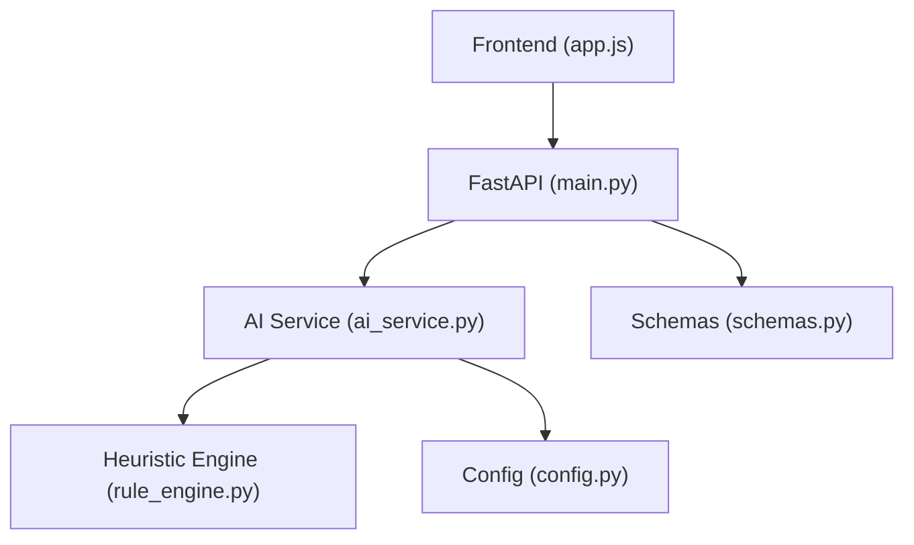
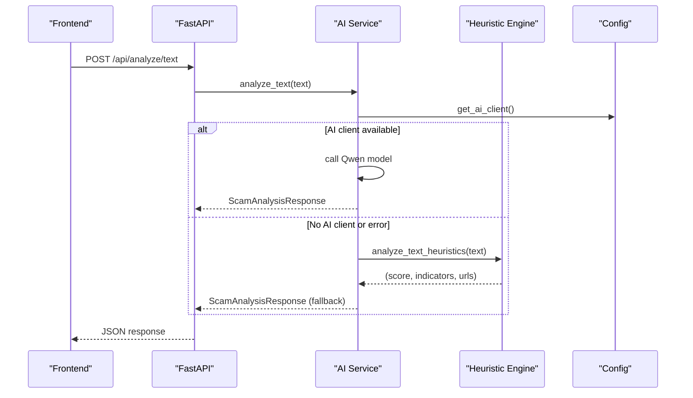
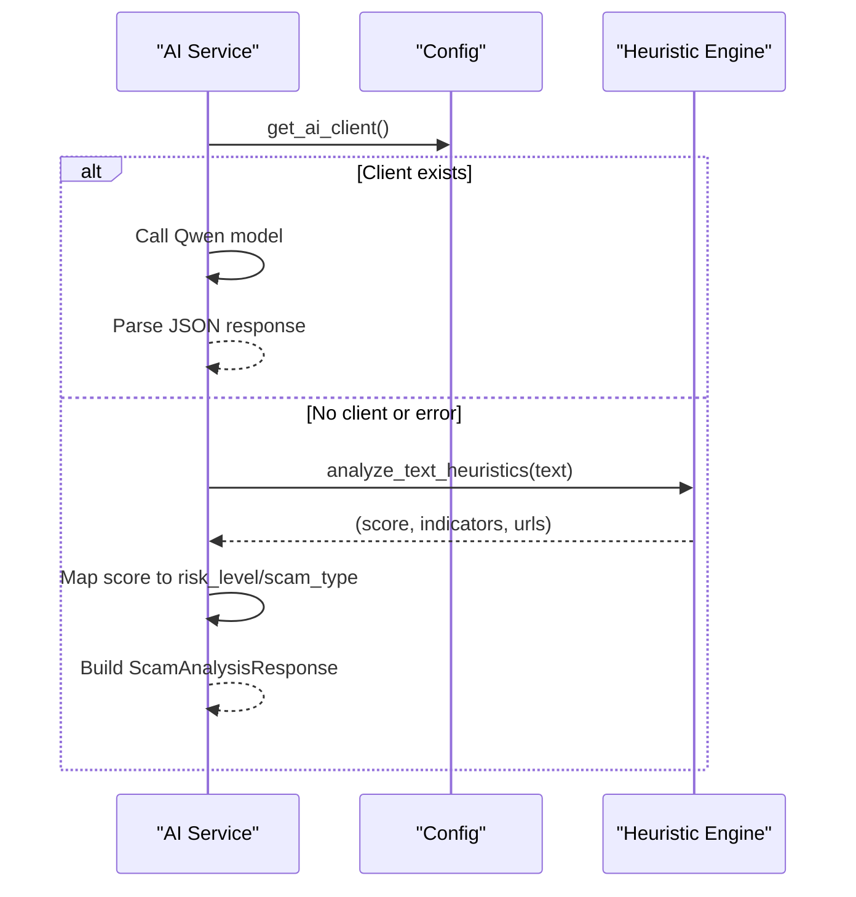
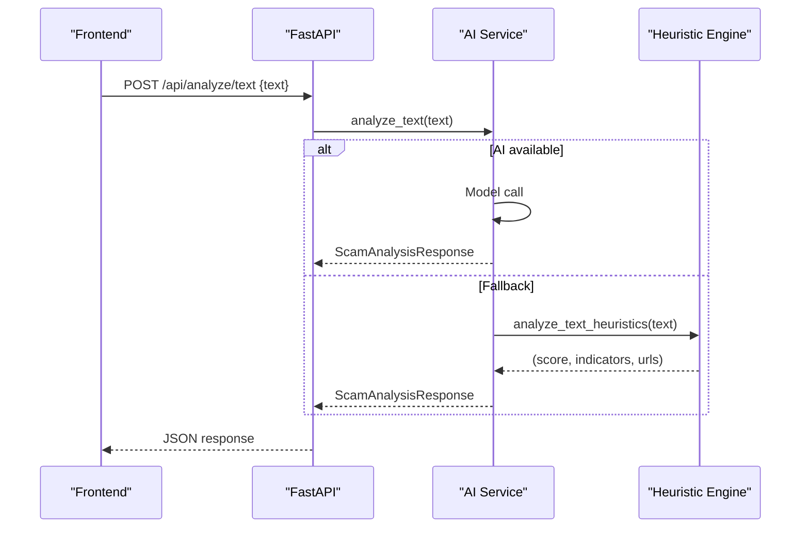
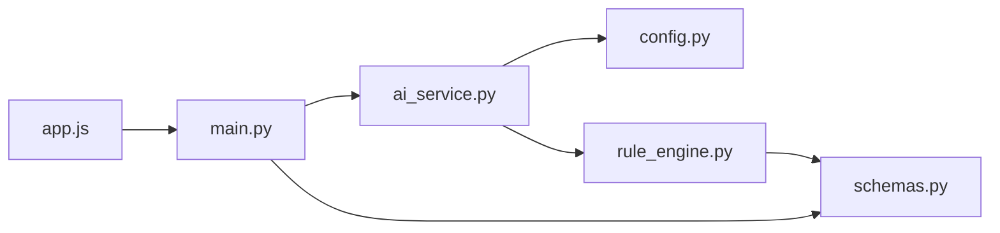

# Heuristic Rule Engine

<cite>
**Referenced Files in This Document**
- [rule_engine.py](file://backend/app/rule_engine.py)
- [ai_service.py](file://backend/app/ai_service.py)
- [main.py](file://backend/app/main.py)
- [schemas.py](file://backend/app/schemas.py)
- [config.py](file://backend/app/config.py)
- [app.js](file://frontend/app.js)
- [README.md](file://README.md)
</cite>

## Table of Contents
1. [Introduction](#introduction)
2. [Project Structure](#project-structure)
3. [Core Components](#core-components)
4. [Architecture Overview](#architecture-overview)
5. [Detailed Component Analysis](#detailed-component-analysis)
6. [Dependency Analysis](#dependency-analysis)
7. [Performance Considerations](#performance-considerations)
8. [Troubleshooting Guide](#troubleshooting-guide)
9. [Conclusion](#conclusion)
10. [Appendices](#appendices)

## Introduction
This document explains the heuristic rule engine that performs instant pattern matching and threat detection for phishing, urgency tactics, social engineering patterns, and suspicious URL structures. It covers:
- Regex-based algorithms used to detect indicators
- Scoring methodology that calculates risk scores from 0 to 100 based on severity
- Indicator categorization system (e.g., Sensitive Information Request, Urgency, Domain Spoofing, Financial Threat)
- Examples of custom rule creation and extension points
- Integration with the AI service layer as both primary analysis method and fallback when AI services are unavailable

The heuristic engine is designed to be fast, deterministic, and explainable, providing immediate feedback while complementing AI-driven analysis.

## Project Structure
The backend exposes a FastAPI application that routes requests to an AI service layer. The AI service uses the heuristic engine for instant checks and falls back to it when the AI provider is not configured or fails. The frontend calls these endpoints and renders results, including risk score, indicators, explanations, and recommended actions.

**Diagram sources**
- [main.py:44-68](file://backend/app/main.py#L44-L68)
- [ai_service.py:124-176](file://backend/app/ai_service.py#L124-L176)
- [rule_engine.py:37-117](file://backend/app/rule_engine.py#L37-L117)
- [config.py:6-11](file://backend/app/config.py#L6-L11)
- [schemas.py:1-26](file://backend/app/schemas.py#L1-L26)

**Section sources**
- [main.py:21-84](file://backend/app/main.py#L21-L84)
- [README.md:17-60](file://README.md#L17-L60)

## Core Components
- Heuristic Rule Engine: Applies regex rules to text and URLs to detect scam indicators and compute a risk score.
- AI Service Layer: Orchestrates AI model calls and falls back to heuristics when needed.
- API Endpoints: Expose text, URL, screenshot, and voice analysis endpoints.
- Data Schemas: Define request/response models and indicator structures.
- Configuration: Loads environment variables for AI provider and server settings.

Key responsibilities:
- Instant detection via regex patterns for sensitive data, urgency, lures, and suspicious URLs
- Risk scoring from 0–100 based on weighted severity contributions
- Categorization of detected indicators into meaningful groups
- Fallback behavior ensuring robust operation without external AI dependencies

**Section sources**
- [rule_engine.py:7-117](file://backend/app/rule_engine.py#L7-L117)
- [ai_service.py:9-176](file://backend/app/ai_service.py#L9-L176)
- [main.py:44-68](file://backend/app/main.py#L44-L68)
- [schemas.py:10-26](file://backend/app/schemas.py#L10-L26)
- [config.py:6-11](file://backend/app/config.py#L6-L11)

## Architecture Overview
The system follows a layered architecture:
- Frontend UI triggers analysis via REST endpoints
- FastAPI validates inputs and delegates to AI service
- AI service attempts AI model analysis; if unavailable or failing, it uses heuristic engine
- Heuristic engine returns structured indicators and risk score
- Results are standardized via schemas and returned to the frontend

**Diagram sources**
- [main.py:44-48](file://backend/app/main.py#L44-L48)
- [ai_service.py:124-154](file://backend/app/ai_service.py#L124-L154)
- [rule_engine.py:37-112](file://backend/app/rule_engine.py#L37-L112)
- [config.py:9-16](file://backend/app/ai_service.py#L9-L16)

## Detailed Component Analysis

### Heuristic Rule Engine
The heuristic engine applies regex-based rules to detect scam indicators and computes a cumulative risk score capped at 100. It processes:
- Sensitive data requests (e.g., OTP, CVV, passwords)
- Urgency and fear tactics (e.g., “account suspended,” law enforcement impersonation)
- Lure patterns (e.g., lottery prizes, guaranteed returns, fake jobs)
- Suspicious URL characteristics (shorteners, high-risk TLDs, direct IP addresses)

Scoring methodology:
- Each matched category contributes a fixed weight to base_score:
  - Sensitive data: +35 per match
  - Urgency/fear: +25 per match
  - Lures: +25 per match
  - Shortened URL: +20 per match
  - High-risk TLD: +20 per match
  - Direct IP host: +35 per match
- Final score = min(100, base_score)

Indicator categories:
- Sensitive Information Request
- Psychological Urgency & Fear
- Unrealistic Reward / Lure
- Obfuscated / Shortened URL
- High-Risk Domain Extension
- Direct IP Host URL

```mermaid
flowchart TD
Start(["Function Entry"]) --> Lower["Normalize text to lowercase"]
Lower --> CheckSensitive["Check sensitive data patterns"]
CheckSensitive --> AddSensitive{"Match found?"}
AddSensitive --> |Yes| ScoreSensitive["Add +35 to base_score<br/>Create indicator"]
AddSensitive --> |No| CheckUrgency["Check urgency/fear patterns"]
ScoreSensitive --> CheckUrgency
CheckUrgency --> AddUrgency{"Match found?"}
AddUrgency --> |Yes| ScoreUrgency["Add +25 to base_score<br/>Create indicator"]
AddUrgency --> |No| CheckLure["Check lure patterns"]
ScoreUrgency --> CheckLure
CheckLure --> AddLure{"Match found?"}
AddLure --> |Yes| ScoreLure["Add +25 to base_score<br/>Create indicator"]
AddLure --> |No| ExtractURLs["Extract URLs from text"]
ScoreLure --> ExtractURLs
ExtractURLs --> ForEachURL["For each URL"]
ForEachURL --> CheckShortener{"Is shortener?"}
CheckShortener --> |Yes| ScoreShortener["Add +20<br/>Obfuscated URL indicator"]
CheckShortener --> |No| CheckTLD{"High-risk TLD?"}
ScoreShortener --> CheckTLD
CheckTLD --> |Yes| ScoreTLD["Add +20<br/>High-risk TLD indicator"]
CheckTLD --> |No| CheckIP{"Direct IP domain?"}
ScoreTLD --> CheckIP
CheckIP --> |Yes| ScoreIP["Add +35<br/>Direct IP indicator"]
CheckIP --> |No| NextURL["Next URL"]
ScoreIP --> NextURL
NextURL --> Done{"More URLs?"}
Done --> |Yes| ForEachURL
Done --> |No| CapScore["Cap score at 100"]
CapScore --> Return(["Return score, indicators, URLs"])
```

**Diagram sources**
- [rule_engine.py:37-112](file://backend/app/rule_engine.py#L37-L112)

**Section sources**
- [rule_engine.py:7-117](file://backend/app/rule_engine.py#L7-L117)

### AI Service Layer Integration
The AI service integrates with the heuristic engine in two ways:
- Primary path: When an AI client is configured, it calls the model and returns structured responses.
- Fallback path: If no AI client is available or an exception occurs, it uses heuristic analysis to generate a complete response.

Fallback logic:
- Uses heuristic score to determine risk level and scam type
- Constructs explanation, recommended dos/donts, and summary
- Ensures consistent schema output even without AI

**Diagram sources**
- [ai_service.py:9-16](file://backend/app/ai_service.py#L9-L16)
- [ai_service.py:124-154](file://backend/app/ai_service.py#L124-L154)
- [rule_engine.py:37-112](file://backend/app/rule_engine.py#L37-L112)

**Section sources**
- [ai_service.py:9-176](file://backend/app/ai_service.py#L9-L176)
- [config.py:6-11](file://backend/app/config.py#L6-L11)

### API Endpoints and Data Flow
Endpoints expose analysis capabilities:
- Text analysis: POST /api/analyze/text
- URL analysis: POST /api/analyze/url
- Screenshot analysis: POST /api/analyze/screenshot
- Voice analysis: POST /api/analyze/voice

Data flow:
- Frontend sends payload to endpoint
- Endpoint validates input and calls AI service
- AI service either uses AI model or heuristic engine
- Response adheres to ScamAnalysisResponse schema

**Diagram sources**
- [main.py:44-48](file://backend/app/main.py#L44-L48)
- [ai_service.py:124-154](file://backend/app/ai_service.py#L124-L154)
- [rule_engine.py:37-112](file://backend/app/rule_engine.py#L37-L112)

**Section sources**
- [main.py:44-68](file://backend/app/main.py#L44-L68)
- [schemas.py:15-26](file://backend/app/schemas.py#L15-L26)

### Indicator Categorization System
Indicators are grouped into categories to help users understand threats:
- Sensitive Information Request: Requests for OTP, CVV, passwords, national IDs
- Psychological Urgency & Fear: Artificial urgency, account suspension threats, law enforcement impersonation
- Unrealistic Reward / Lure: Lottery prizes, guaranteed returns, fake job offers
- Obfuscated / Shortened URL: Use of URL shorteners to hide destinations
- High-Risk Domain Extension: Domains ending in commonly abused TLDs
- Direct IP Host URL: Raw IP addresses instead of legitimate domains

These categories map to severity levels (low, medium, high, critical) and contribute to the overall risk score.

**Section sources**
- [rule_engine.py:7-112](file://backend/app/rule_engine.py#L7-L112)
- [schemas.py:10-14](file://backend/app/schemas.py#L10-L14)

### Custom Rule Creation and Extension Points
To extend detection capabilities:
- Add new regex patterns to existing lists (e.g., SENSITIVE_PATTERNS, URGENCY_PATTERNS, LURE_PATTERNS)
- Introduce new pattern lists for new categories
- Update scoring weights in analyze_text_heuristics to reflect severity
- Ensure indicators use appropriate categories and severities

Pattern definition syntax:
- Tuple format: (regex_pattern, description, severity)
- Regex should target relevant keywords/phrases
- Severity values: low, medium, high, critical

Examples of extension points:
- New financial threat patterns (e.g., crypto scams, investment fraud)
- Additional URL heuristics (e.g., known malicious domains, typosquatting)
- Social engineering tactics (e.g., pretexting, baiting)

**Section sources**
- [rule_engine.py:7-26](file://backend/app/rule_engine.py#L7-L26)
- [rule_engine.py:47-112](file://backend/app/rule_engine.py#L47-L112)

### Scoring Methodology
Risk scoring is additive and capped at 100:
- Sensitive data matches: +35 each
- Urgency/fear matches: +25 each
- Lure matches: +25 each
- Shortened URL: +20 each
- High-risk TLD: +20 each
- Direct IP host: +35 each

Final score = min(100, sum of all contributions)

This approach ensures that multiple strong signals result in higher risk scores, while single weak signals remain proportionate.

**Section sources**
- [rule_engine.py:47-112](file://backend/app/rule_engine.py#L47-L112)

## Dependency Analysis
The system has clear separation of concerns:
- main.py depends on ai_service.py and schemas.py
- ai_service.py depends on config.py and rule_engine.py
- rule_engine.py depends on schemas.py
- Frontend app.js calls API endpoints exposed by main.py

**Diagram sources**
- [main.py:8-18](file://backend/app/main.py#L8-L18)
- [ai_service.py:4-7](file://backend/app/ai_service.py#L4-L7)
- [rule_engine.py:1-4](file://backend/app/rule_engine.py#L1-L4)
- [app.js:148-154](file://frontend/app.js#L148-L154)

**Section sources**
- [main.py:8-18](file://backend/app/main.py#L8-L18)
- [ai_service.py:4-7](file://backend/app/ai_service.py#L4-L7)
- [rule_engine.py:1-4](file://backend/app/rule_engine.py#L1-L4)

## Performance Considerations
- Heuristic analysis is O(n) over text length with regex operations, making it suitable for real-time processing
- URL extraction and parsing add minimal overhead
- Caching could be introduced for repeated analyses of identical content
- Regex patterns should be optimized to avoid catastrophic backtracking
- Consider batching analyses for bulk processing scenarios

[No sources needed since this section provides general guidance]

## Troubleshooting Guide
Common issues and resolutions:
- AI service unavailable: System automatically falls back to heuristic mode
- Empty inputs: API returns validation errors for empty text/URL/file uploads
- Network errors: Frontend displays connection errors and alerts
- Pattern misclassification: Review and adjust regex patterns and severity weights
- Environment configuration: Ensure .env file contains required API keys for AI features

Debugging steps:
- Check health endpoint to verify service status
- Validate input payloads before submission
- Review heuristic indicators to understand detection logic
- Test with sample presets to verify functionality

**Section sources**
- [main.py:46-68](file://backend/app/main.py#L46-L68)
- [ai_service.py:124-154](file://backend/app/ai_service.py#L124-L154)
- [app.js:148-158](file://frontend/app.js#L148-L158)

## Conclusion
The heuristic rule engine provides a robust, fast, and explainable foundation for scam detection. It operates independently or as a fallback to AI services, ensuring reliability across different deployment scenarios. The modular design allows easy extension through new patterns and categories, while the scoring system offers consistent risk assessment. Combined with the AI service layer, it delivers comprehensive threat detection with actionable insights for users.

[No sources needed since this section summarizes without analyzing specific files]

## Appendices

### API Reference
Endpoints for analysis:
- POST /api/analyze/text: Analyze text messages for scam indicators
- POST /api/analyze/url: Analyze URLs for suspicious characteristics
- POST /api/analyze/screenshot: Analyze image screenshots for embedded text and scams
- POST /api/analyze/voice: Analyze audio recordings for voice phishing

Request/response formats follow Pydantic schemas defined in schemas.py.

**Section sources**
- [main.py:44-68](file://backend/app/main.py#L44-L68)
- [schemas.py:4-26](file://backend/app/schemas.py#L4-L26)

### Configuration Options
Environment variables:
- DASHSCOPE_API_KEY: API key for Alibaba Cloud Model Studio
- DASHSCOPE_BASE_URL: Base URL for AI service
- QWEN_MODEL_NAME: Model name for text analysis
- QWEN_VL_MODEL_NAME: Model name for vision-language tasks
- PORT: Server port (default 8000)
- HOST: Server host (default 0.0.0.0)

**Section sources**
- [config.py:6-11](file://backend/app/config.py#L6-L11)

### Frontend Integration
The frontend provides:
- Tab-based interface for different analysis types
- File upload handling for images and audio
- Real-time result display with risk gauges and indicators
- Preset examples for testing

**Section sources**
- [app.js:1-236](file://frontend/app.js#L1-L236)