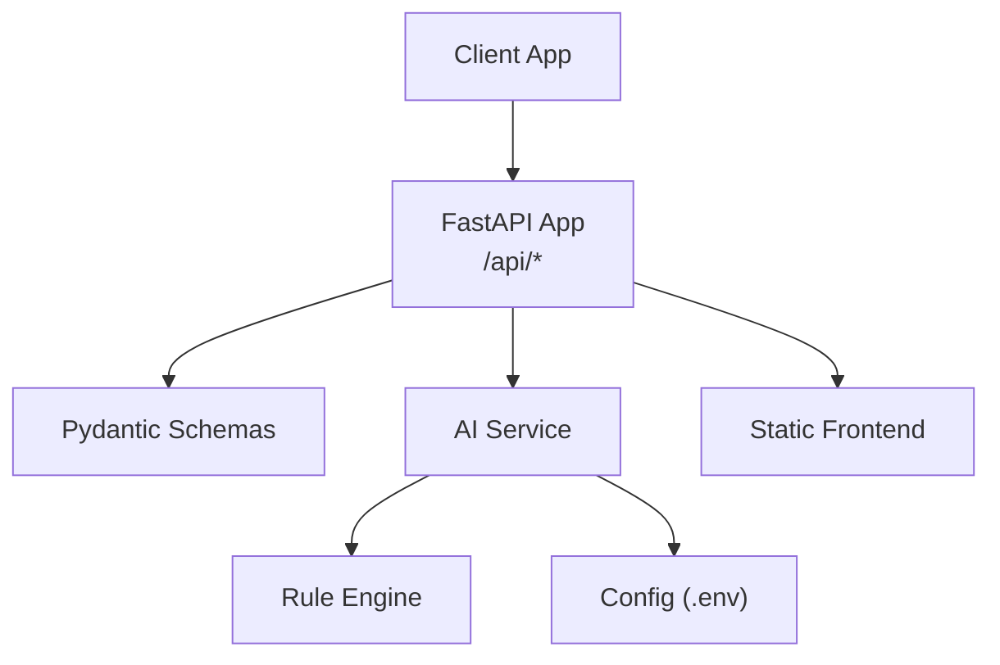
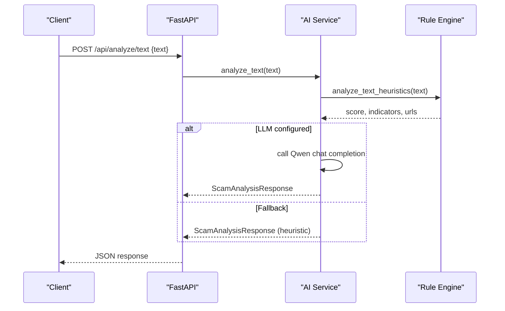
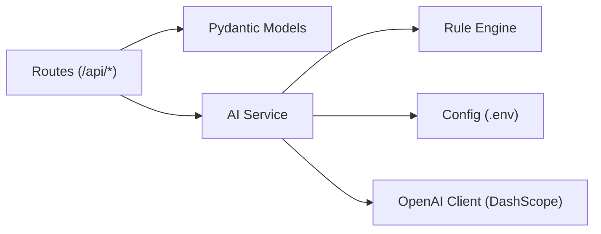

# API Reference

<cite>
**Referenced Files in This Document**
- [main.py](file://backend/app/main.py)
- [schemas.py](file://backend/app/schemas.py)
- [ai_service.py](file://backend/app/ai_service.py)
- [rule_engine.py](file://backend/app/rule_engine.py)
- [config.py](file://backend/app/config.py)
- [README.md](file://README.md)
</cite>

## Table of Contents
1. [Introduction](#introduction)
2. [Project Structure](#project-structure)
3. [Core Components](#core-components)
4. [Architecture Overview](#architecture-overview)
5. [Detailed Component Analysis](#detailed-component-analysis)
6. [Dependency Analysis](#dependency-analysis)
7. [Performance Considerations](#performance-considerations)
8. [Troubleshooting Guide](#troubleshooting-guide)
9. [Conclusion](#conclusion)

## Introduction
This document provides comprehensive API documentation for ScamShield AI’s REST endpoints focused on multimodal analysis. It covers HTTP methods, URL patterns, request/response schemas, authentication considerations, and best practices for client integration. The platform supports text analysis, URL inspection, screenshot upload, voice recording analysis, and a health check endpoint. Responses include unified risk scoring and threat categorization with explanations and recommendations.

## Project Structure
The backend is implemented with FastAPI and Pydantic schemas. Core modules:
- main.py: FastAPI application, routes, CORS configuration, static frontend mounting
- schemas.py: Pydantic models for requests and responses
- ai_service.py: Multimodal analysis logic (text, URL, image, audio) with fallback heuristics
- rule_engine.py: Heuristic-based pattern detection used when LLM is unavailable or as a pre-check
- config.py: Environment-driven configuration for API keys, model names, and server host/port

**Diagram sources**
- [main.py:21-84](file://backend/app/main.py#L21-L84)
- [schemas.py:1-26](file://backend/app/schemas.py#L1-L26)
- [ai_service.py:1-220](file://backend/app/ai_service.py#L1-L220)
- [rule_engine.py:1-118](file://backend/app/rule_engine.py#L1-L118)
- [config.py:1-12](file://backend/app/config.py#L1-L12)

**Section sources**
- [main.py:21-84](file://backend/app/main.py#L21-L84)
- [schemas.py:1-26](file://backend/app/schemas.py#L1-L26)
- [ai_service.py:1-220](file://backend/app/ai_service.py#L1-L220)
- [rule_engine.py:1-118](file://backend/app/rule_engine.py#L1-L118)
- [config.py:1-12](file://backend/app/config.py#L1-L12)

## Core Components
- FastAPI app with CORS enabled for cross-origin requests
- Unified response schema with fields: is_scam, risk_score, risk_level, scam_type, extracted_text, summary, detected_indicators, explanation, recommended_dos, recommended_donts
- Heuristic engine that computes risk scores and flags indicators based on regex patterns
- Optional LLM integration via Alibaba Cloud DashScope (Qwen/Qwen-VL) with automatic fallback to heuristic mode

Key behaviors:
- Input validation enforced by Pydantic models
- Empty input checks raise 400 errors
- Fallback analysis ensures functionality without an active API key

**Section sources**
- [main.py:27-68](file://backend/app/main.py#L27-L68)
- [schemas.py:4-26](file://backend/app/schemas.py#L4-L26)
- [ai_service.py:50-122](file://backend/app/ai_service.py#L50-L122)
- [rule_engine.py:37-112](file://backend/app/rule_engine.py#L37-L112)

## Architecture Overview
The API exposes five endpoints. All analysis endpoints return the unified ScamAnalysisResponse.

**Diagram sources**
- [main.py:44-48](file://backend/app/main.py#L44-L48)
- [ai_service.py:124-154](file://backend/app/ai_service.py#L124-L154)
- [rule_engine.py:37-112](file://backend/app/rule_engine.py#L37-L112)

**Section sources**
- [main.py:36-68](file://backend/app/main.py#L36-L68)
- [ai_service.py:124-219](file://backend/app/ai_service.py#L124-L219)

## Detailed Component Analysis

### Health Check
- Method: GET
- URL: /api/health
- Authentication: None
- Request body: None
- Response: JSON object with status, service name, version
- Example success response:
  - { "status": "healthy", "service": "ScamShield AI", "version": "1.0.0" }

Notes:
- Useful for readiness probes and monitoring
- No rate limiting configured in code; consider adding at gateway level if needed

**Section sources**
- [main.py:36-42](file://backend/app/main.py#L36-L42)

### Text Analysis
- Method: POST
- URL: /api/analyze/text
- Authentication: None
- Request body:
  - text: string (required), non-empty after trimming whitespace
- Validation:
  - If empty, returns 400 error with detail message
- Response: ScamAnalysisResponse
- Behavior:
  - Uses heuristic analysis first; if LLM configured, calls Qwen chat completion with structured JSON output; otherwise falls back to heuristic analysis
- Example successful response fields:
  - is_scam: boolean
  - risk_score: integer 0–100
  - risk_level: "Low" | "Medium" | "High" | "Critical"
  - scam_type: e.g., "Phishing", "Investment Scam", "Safe"
  - extracted_text: optional string
  - summary: short executive summary
  - detected_indicators: array of { category, description, severity }
  - explanation: array of strings
  - recommended_dos: array of strings
  - recommended_donts: array of strings

Example cURL:
- curl -X POST http://localhost:8000/api/analyze/text -H "Content-Type: application/json" -d '{"text":"Your account has been suspended. Click here to verify now."}'

Error handling:
- 400 Bad Request if text is empty

**Section sources**
- [main.py:44-48](file://backend/app/main.py#L44-L48)
- [schemas.py:4-6](file://backend/app/schemas.py#L4-L6)
- [ai_service.py:124-154](file://backend/app/ai_service.py#L124-L154)
- [rule_engine.py:37-112](file://backend/app/rule_engine.py#L37-L112)

### URL Inspection
- Method: POST
- URL: /api/analyze/url
- Authentication: None
- Request body:
  - url: string (required), non-empty after trimming whitespace
- Validation:
  - If empty, returns 400 error with detail message
- Response: ScamAnalysisResponse
- Behavior:
  - If LLM configured, analyzes URL via Qwen; otherwise uses heuristic fallback
- Example cURL:
  - curl -X POST http://localhost:8000/api/analyze/url -H "Content-Type: application/json" -d '{"url":"http://bit.ly/fake-bank-login.xyz"}'

Error handling:
- 400 Bad Request if url is empty

**Section sources**
- [main.py:50-54](file://backend/app/main.py#L50-L54)
- [schemas.py:7-8](file://backend/app/schemas.py#L7-L8)
- [ai_service.py:156-176](file://backend/app/ai_service.py#L156-L176)
- [rule_engine.py:114-117](file://backend/app/rule_engine.py#L114-L117)

### Screenshot Upload
- Method: POST
- URL: /api/analyze/screenshot
- Authentication: None
- Request:
  - multipart/form-data with field file (required)
  - filename defaults to "screenshot.png" if not provided
- Validation:
  - If uploaded bytes are empty, returns 400 error
- Response: ScamAnalysisResponse
- Behavior:
  - Encodes image to base64 and sends to Qwen-VL if configured; otherwise simulates OCR and runs heuristic analysis
  - extracted_text may include "[OCR Extracted from <filename>]: ..."
- Example cURL:
  - curl -X POST http://localhost:8000/api/analyze/screenshot -F "file=@path/to/image.png"

Error handling:
- 400 Bad Request if file is empty

**Section sources**
- [main.py:56-61](file://backend/app/main.py#L56-L61)
- [ai_service.py:178-211](file://backend/app/ai_service.py#L178-L211)

### Voice Recording Analysis
- Method: POST
- URL: /api/analyze/voice
- Authentication: None
- Request:
  - multipart/form-data with field file (required)
  - filename defaults to "voice_recording.mp3" if not provided
- Validation:
  - If uploaded bytes are empty, returns 400 error
- Response: ScamAnalysisResponse
- Behavior:
  - Simulated transcription for demo; runs heuristic analysis
  - extracted_text may include "[Voice-to-Text Transcription of <filename>]: ..."
- Example cURL:
  - curl -X POST http://localhost:8000/api/analyze/voice -F "file=@path/to/audio.mp3"

Error handling:
- 400 Bad Request if file is empty

**Section sources**
- [main.py:63-68](file://backend/app/main.py#L63-L68)
- [ai_service.py:213-219](file://backend/app/ai_service.py#L213-L219)

### Unified Response Schema
All analysis endpoints return ScamAnalysisResponse with the following fields:
- is_scam: boolean indicating whether content is likely a scam
- risk_score: integer from 0 to 100
- risk_level: "Low" | "Medium" | "High" | "Critical"
- scam_type: descriptive category such as "Phishing", "Bank Impersonation", "Investment Scam", "Fake Job Scam", "Lottery/Prize Scam", "Tech Support Scam", "OTP Theft", "Safe"
- extracted_text: optional string containing OCR or transcription results
- summary: concise executive summary
- detected_indicators: list of objects with category, description, severity
- explanation: list of strings explaining why it is dangerous
- recommended_dos: list of actionable steps to stay safe
- recommended_donts: list of warnings about what not to do

Validation rules:
- risk_score must be between 0 and 100 inclusive
- detected_indicators entries include severity values: low, medium, high, critical

**Section sources**
- [schemas.py:10-26](file://backend/app/schemas.py#L10-L26)

## Dependency Analysis
The API depends on:
- FastAPI for routing and middleware
- Pydantic for request/response validation
- OpenAI-compatible client for DashScope (optional)
- Heuristic rule engine for offline fallback and pre-checks
- Environment variables for configuration

**Diagram sources**
- [main.py:21-84](file://backend/app/main.py#L21-L84)
- [ai_service.py:1-220](file://backend/app/ai_service.py#L1-L220)
- [rule_engine.py:1-118](file://backend/app/rule_engine.py#L1-L118)
- [config.py:1-12](file://backend/app/config.py#L1-L12)

**Section sources**
- [main.py:21-84](file://backend/app/main.py#L21-L84)
- [ai_service.py:1-220](file://backend/app/ai_service.py#L1-L220)
- [rule_engine.py:1-118](file://backend/app/rule_engine.py#L1-L118)
- [config.py:1-12](file://backend/app/config.py#L1-L12)

## Performance Considerations
- CORS is enabled with allow_origins=["*"], which is permissive; restrict origins in production to trusted domains
- No built-in rate limiting; implement at reverse proxy or gateway layer (e.g., Nginx, API gateway) to protect endpoints
- File uploads: ensure size limits are enforced at the gateway or application level to prevent abuse
- LLM calls: network latency and quotas apply; fallback mode ensures availability but may reduce accuracy
- Heuristic analysis is fast and deterministic; use it for quick triage before invoking LLM

[No sources needed since this section provides general guidance]

## Troubleshooting Guide
Common issues and resolutions:
- Empty inputs: Endpoints validate required fields; ensure payload contains non-empty text/url or valid file uploads
- Missing API key: If DASHSCOPE_API_KEY is not set or placeholder, system automatically uses heuristic fallback; configure environment variables for full LLM capabilities
- Network errors: LLM calls may fail; the system logs errors and falls back to heuristic analysis
- CORS errors: Ensure your frontend origin matches allowed origins; currently all origins are allowed, but tighten in production
- Large files: Enforce maximum file sizes at the gateway; avoid oversized payloads to prevent timeouts

Debugging tips:
- Use the health check endpoint to verify service availability
- Inspect response fields like explanation and detected_indicators to understand scoring rationale
- Validate request payloads against schemas to catch formatting issues early

**Section sources**
- [main.py:27-68](file://backend/app/main.py#L27-L68)
- [ai_service.py:10-16](file://backend/app/ai_service.py#L10-L16)
- [ai_service.py:152-154](file://backend/app/ai_service.py#L152-L154)
- [config.py:6-11](file://backend/app/config.py#L6-L11)

## Conclusion
ScamShield AI provides a robust multimodal analysis API with clear, unified responses and strong fallback behavior. Clients should integrate using the documented endpoints, handle validation errors, and consider production hardening for CORS and rate limiting. The combination of heuristic detection and optional LLM reasoning offers both reliability and depth in scam analysis.

[No sources needed since this section summarizes without analyzing specific files]