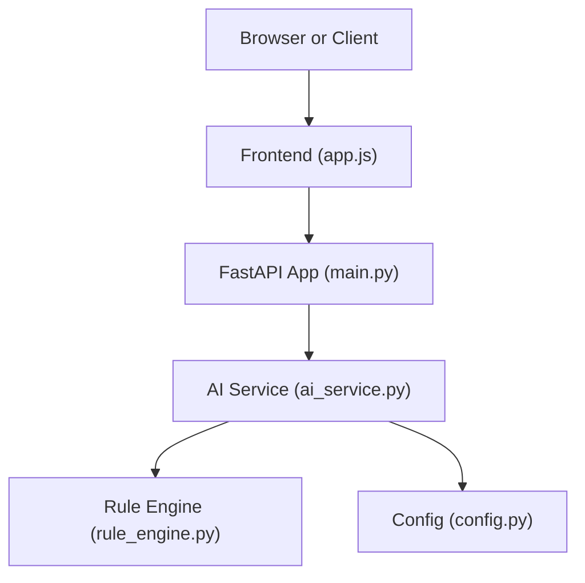
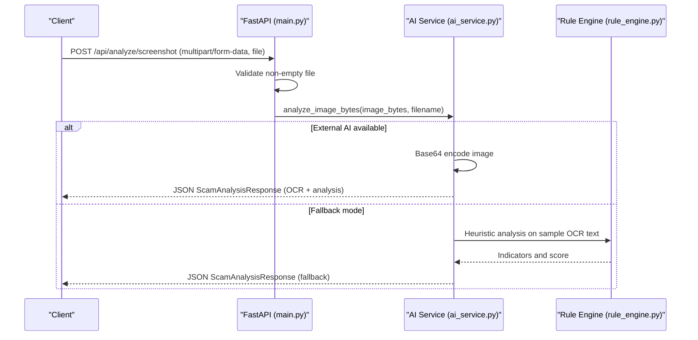
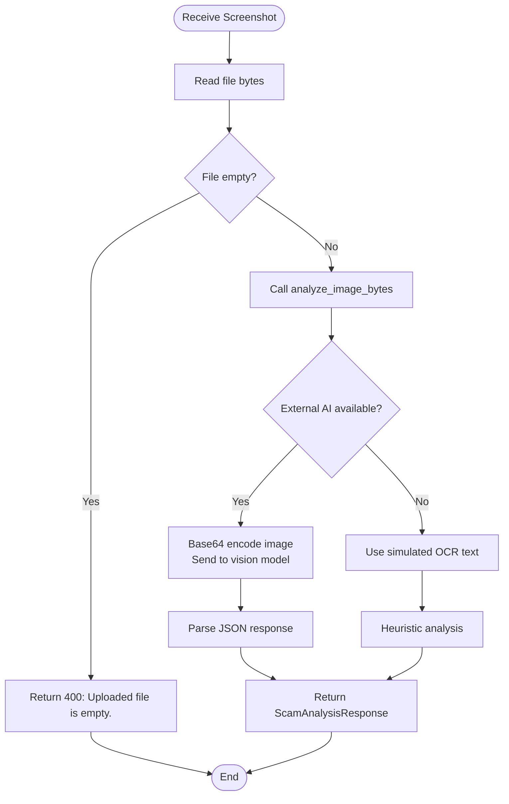
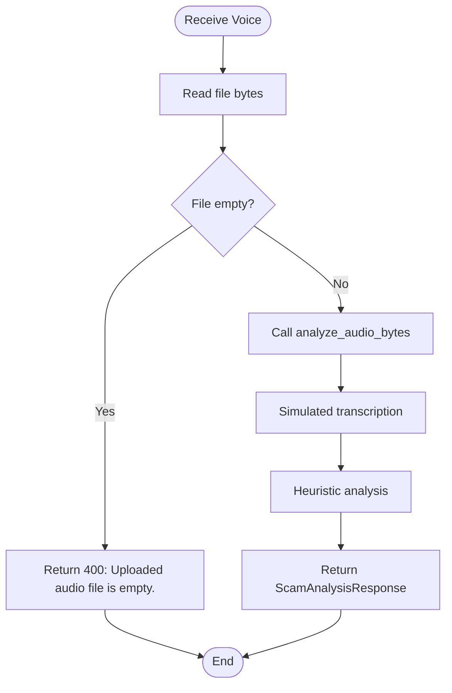
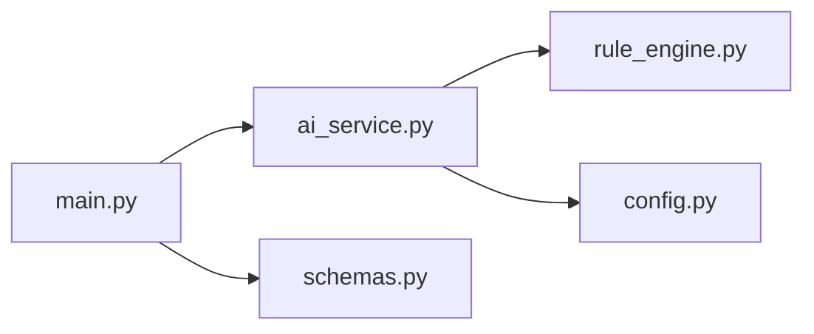

# File Upload APIs

<cite>
**Referenced Files in This Document**
- [main.py](file://backend/app/main.py)
- [ai_service.py](file://backend/app/ai_service.py)
- [schemas.py](file://backend/app/schemas.py)
- [config.py](file://backend/app/config.py)
- [rule_engine.py](file://backend/app/rule_engine.py)
- [app.js](file://frontend/app.js)
- [requirements.txt](file://backend/requirements.txt)
- [README.md](file://README.md)
</cite>

## Table of Contents
1. [Introduction](#introduction)
2. [Project Structure](#project-structure)
3. [Core Components](#core-components)
4. [Architecture Overview](#architecture-overview)
5. [Detailed Component Analysis](#detailed-component-analysis)
6. [Dependency Analysis](#dependency-analysis)
7. [Performance Considerations](#performance-considerations)
8. [Troubleshooting Guide](#troubleshooting-guide)
9. [Conclusion](#conclusion)
10. [Appendices](#appendices)

## Introduction
This document provides detailed API documentation for the file upload endpoints that analyze screenshots and voice recordings to detect scams, phishing, and social engineering attempts. It covers multipart/form-data uploads, supported formats, size limitations, asynchronous processing behavior, OCR extraction for images, audio transcription for voice, response schemas, error handling, CORS configuration, and security considerations.

The endpoints are:
- POST /api/analyze/screenshot
- POST /api/analyze/voice

Both accept a single uploaded file via multipart/form-data and return a standardized scam analysis result.

## Project Structure
The backend is built with FastAPI and exposes REST endpoints. The AI service integrates with an OpenAI-compatible provider (Alibaba Cloud DashScope/Qwen) when configured; otherwise, it falls back to heuristic-based analysis. The frontend demonstrates how to call these endpoints using FormData.

**Diagram sources**
- [main.py:21-34](file://backend/app/main.py#L21-L34)
- [ai_service.py:9-16](file://backend/app/ai_service.py#L9-L16)
- [rule_engine.py:37-112](file://backend/app/rule_engine.py#L37-L112)
- [config.py:6-11](file://backend/app/config.py#L6-L11)

**Section sources**
- [main.py:21-34](file://backend/app/main.py#L21-L34)
- [README.md:17-20](file://README.md#L17-L20)

## Core Components
- Endpoints:
  - POST /api/analyze/screenshot: Accepts image files and performs OCR-like text extraction followed by scam analysis.
  - POST /api/analyze/voice: Accepts audio files and performs voice-to-text transcription followed by scam analysis.
- Request format: multipart/form-data with a field named file.
- Response format: ScamAnalysisResponse schema including risk score, risk level, scam type, extracted text, indicators, explanations, and recommendations.
- Processing pipeline:
  - Screenshot: Read bytes -> optional OCR via vision model -> scam analysis -> response.
  - Voice: Read bytes -> simulated transcription -> scam analysis -> response.
- Fallback behavior: If no external AI key is configured, the system uses heuristic analysis to produce results offline.

**Section sources**
- [main.py:56-68](file://backend/app/main.py#L56-L68)
- [ai_service.py:178-219](file://backend/app/ai_service.py#L178-L219)
- [schemas.py:15-25](file://backend/app/schemas.py#L15-L25)

## Architecture Overview
The file upload flow involves the client sending multipart/form-data to the FastAPI endpoint, which reads the file bytes and delegates analysis to the AI service. The AI service either calls the Qwen vision model for OCR or uses a fallback heuristic engine to generate scam analysis.

**Diagram sources**
- [main.py:56-61](file://backend/app/main.py#L56-L61)
- [ai_service.py:178-211](file://backend/app/ai_service.py#L178-L211)
- [rule_engine.py:37-112](file://backend/app/rule_engine.py#L37-L112)

## Detailed Component Analysis

### Endpoint: POST /api/analyze/screenshot
- Purpose: Analyze a screenshot image to extract text (OCR) and detect scams.
- Request:
  - Method: POST
  - Path: /api/analyze/screenshot
  - Content-Type: multipart/form-data
  - Field name: file
  - Supported formats: Any image format readable by the vision model or fallback logic (e.g., JPEG, PNG). The implementation base64-encodes the image for the vision model; if unavailable, it uses a simulated OCR path.
  - Size limits: Not explicitly enforced in code. Clients should implement reasonable client-side limits and server-side validation if needed.
- Behavior:
  - Reads file bytes and ensures the payload is not empty.
  - Calls analyze_image_bytes to perform OCR-like extraction and scam analysis.
  - Returns ScamAnalysisResponse.
- Example usage:
  - JavaScript FormData: See [app.js:187-210](file://frontend/app.js#L187-L210)
  - curl: Use -F "file=@path/to/image.png"
  - Python requests: Use files={"file": open("image.png", "rb")}

**Section sources**
- [main.py:56-61](file://backend/app/main.py#L56-L61)
- [ai_service.py:178-211](file://backend/app/ai_service.py#L178-L211)
- [app.js:187-210](file://frontend/app.js#L187-L210)

#### Screenshot Processing Flow

**Diagram sources**
- [main.py:56-61](file://backend/app/main.py#L56-L61)
- [ai_service.py:178-211](file://backend/app/ai_service.py#L178-L211)

### Endpoint: POST /api/analyze/voice
- Purpose: Analyze a voice recording to transcribe audio and detect scams.
- Request:
  - Method: POST
  - Path: /api/analyze/voice
  - Content-Type: multipart/form-data
  - Field name: file
  - Supported formats: Any audio format accepted by the client and server (e.g., MP3, WAV). The implementation simulates transcription for demo purposes.
  - Size limits: Not explicitly enforced in code. Implement client/server-side validation as needed.
- Behavior:
  - Reads file bytes and ensures the payload is not empty.
  - Calls analyze_audio_bytes to simulate transcription and perform scam analysis.
  - Returns ScamAnalysisResponse.
- Example usage:
  - JavaScript FormData: See [app.js:212-235](file://frontend/app.js#L212-L235)
  - curl: Use -F "file=@path/to/recording.mp3"
  - Python requests: Use files={"file": open("recording.mp3", "rb")}

**Section sources**
- [main.py:63-68](file://backend/app/main.py#L63-L68)
- [ai_service.py:213-219](file://backend/app/ai_service.py#L213-L219)
- [app.js:212-235](file://frontend/app.js#L212-L235)

#### Voice Processing Flow

**Diagram sources**
- [main.py:63-68](file://backend/app/main.py#L63-L68)
- [ai_service.py:213-219](file://backend/app/ai_service.py#L213-L219)

### Response Schema: ScamAnalysisResponse
All endpoints return a consistent JSON structure:
- is_scam: boolean indicating whether the content is likely a scam.
- risk_score: integer from 0 to 100 representing risk severity.
- risk_level: string categorization such as Low, Medium, High, Critical.
- scam_type: descriptive category like Phishing, Investment Scam, OTP Theft, Safe, etc.
- extracted_text: optional string containing OCR-extracted text or voice transcription.
- detected_indicators: list of objects with category, description, and severity.
- explanation: list of strings explaining why the content is dangerous.
- recommended_dos: list of actionable steps to stay safe.
- recommended_donts: list of warnings about what not to do.

**Section sources**
- [schemas.py:15-25](file://backend/app/schemas.py#L15-L25)

### Error Handling
- Empty file payloads:
  - Screenshot: Returns HTTP 400 with detail "Uploaded file is empty."
  - Voice: Returns HTTP 400 with detail "Uploaded audio file is empty."
- Unsupported or corrupted files:
  - No explicit validation for MIME types or file integrity beyond emptiness checks. Clients should validate formats and sizes before uploading.
- Processing timeouts:
  - No explicit timeout configuration in the endpoints. Long-running operations may depend on external AI service latency. Implement client-side timeouts and retry logic as needed.

**Section sources**
- [main.py:56-68](file://backend/app/main.py#L56-L68)

### CORS Configuration
- CORS is enabled with allow_origins set to "*", allowing all origins. Credentials are allowed, and all methods and headers are permitted. This configuration facilitates cross-origin file uploads from browsers.

**Section sources**
- [main.py:27-34](file://backend/app/main.py#L27-L34)

### Security Considerations
- Input validation: Only emptiness is validated. Add MIME type checks, file size limits, and virus scanning in production.
- Rate limiting: Not implemented. Consider adding rate limiting to prevent abuse.
- Storage: Uploaded files are read into memory and not persisted. Ensure memory limits are appropriate for large files.
- External dependencies: When external AI keys are configured, ensure secure storage of credentials via environment variables.

**Section sources**
- [main.py:56-68](file://backend/app/main.py#L56-L68)
- [config.py:6-11](file://backend/app/config.py#L6-L11)

## Dependency Analysis
The endpoints depend on:
- FastAPI for routing and request parsing.
- AI service for OCR and transcription logic.
- Rule engine for heuristic analysis when external AI is unavailable.
- Configuration for API keys and model names.

**Diagram sources**
- [main.py:8-19](file://backend/app/main.py#L8-L19)
- [ai_service.py:1-7](file://backend/app/ai_service.py#L1-L7)
- [rule_engine.py:1-4](file://backend/app/rule_engine.py#L1-L4)
- [config.py:6-11](file://backend/app/config.py#L6-L11)
- [schemas.py:1-2](file://backend/app/schemas.py#L1-L2)

**Section sources**
- [main.py:8-19](file://backend/app/main.py#L8-L19)
- [ai_service.py:1-7](file://backend/app/ai_service.py#L1-L7)
- [rule_engine.py:1-4](file://backend/app/rule_engine.py#L1-L4)
- [config.py:6-11](file://backend/app/config.py#L6-L11)
- [schemas.py:1-2](file://backend/app/schemas.py#L1-L2)

## Performance Considerations
- Memory usage: Files are read entirely into memory. For large files, consider streaming or chunked uploads.
- External AI latency: Vision model calls can be slow; implement client-side timeouts and user feedback.
- Fallback mode: Heuristic analysis is fast and does not require external services.

[No sources needed since this section provides general guidance]

## Troubleshooting Guide
- Common errors:
  - 400 Bad Request: Empty file payload. Ensure the file field is present and non-empty.
  - Network errors: Check CORS settings and network connectivity.
  - Timeouts: Increase client-side timeout or optimize server resources.
- Debugging tips:
  - Verify file selection in the frontend before upload.
  - Inspect server logs for exceptions during AI calls.
  - Confirm environment variables for external AI keys if enabling advanced features.

**Section sources**
- [main.py:56-68](file://backend/app/main.py#L56-L68)
- [ai_service.py:178-219](file://backend/app/ai_service.py#L178-L219)

## Conclusion
The file upload endpoints provide robust multimodal scam detection through screenshot OCR and voice transcription pipelines. They support standard multipart/form-data uploads, return structured analysis results, and include fallback heuristic analysis for offline operation. For production deployments, add input validation, size limits, rate limiting, and secure credential management.

[No sources needed since this section summarizes without analyzing specific files]

## Appendices

### Example Requests

- JavaScript FormData (Screenshot):
  - See [app.js:187-210](file://frontend/app.js#L187-L210)
- JavaScript FormData (Voice):
  - See [app.js:212-235](file://frontend/app.js#L212-L235)
- curl (Screenshot):
  - curl -X POST -F "file=@path/to/screenshot.png" http://localhost:8000/api/analyze/screenshot
- curl (Voice):
  - curl -X POST -F "file=@path/to/recording.mp3" http://localhost:8000/api/analyze/voice
- Python requests (Screenshot):
  - import requests; files = {"file": open("screenshot.png", "rb")}; requests.post("http://localhost:8000/api/analyze/screenshot", files=files)
- Python requests (Voice):
  - import requests; files = {"file": open("recording.mp3", "rb")}; requests.post("http://localhost:8000/api/analyze/voice", files=files)

**Section sources**
- [app.js:187-235](file://frontend/app.js#L187-L235)

### Supported Formats and Limits
- Image formats: JPEG, PNG, and other formats compatible with the vision model or fallback logic.
- Audio formats: MP3, WAV, and other common audio formats accepted by clients and servers.
- Size limits: Not enforced in code. Implement client-side and server-side validation as needed.

**Section sources**
- [ai_service.py:178-219](file://backend/app/ai_service.py#L178-L219)

### Asynchronous Processing Notes
- Endpoints are async in FastAPI but perform synchronous I/O for file reading and AI calls. True asynchronous processing (e.g., background tasks) is not implemented. For long-running jobs, consider task queues and polling endpoints.

**Section sources**
- [main.py:56-68](file://backend/app/main.py#L56-L68)