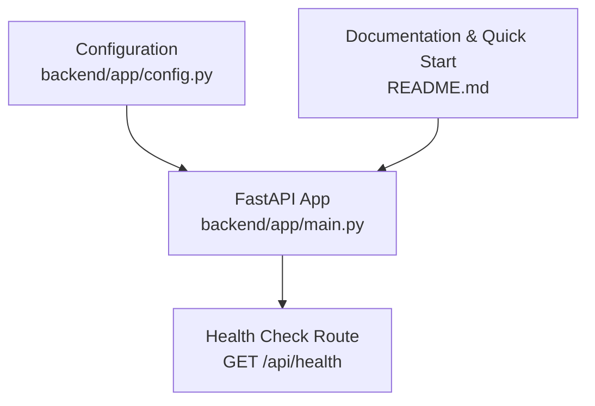
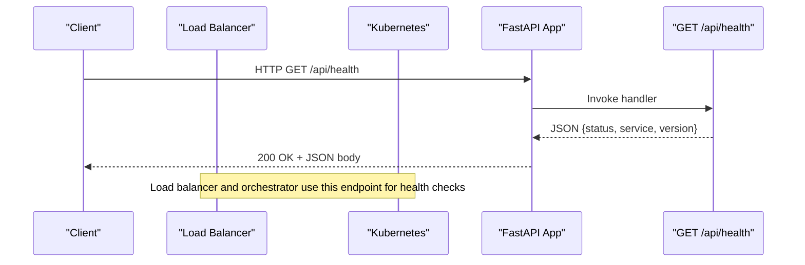

# Health Check API

<cite>
**Referenced Files in This Document**
- [main.py](file://backend/app/main.py)
- [config.py](file://backend/app/config.py)
- [README.md](file://README.md)
</cite>

## Table of Contents
1. [Introduction](#introduction)
2. [Project Structure](#project-structure)
3. [Core Components](#core-components)
4. [Architecture Overview](#architecture-overview)
5. [Detailed Component Analysis](#detailed-component-analysis)
6. [Dependency Analysis](#dependency-analysis)
7. [Performance Considerations](#performance-considerations)
8. [Troubleshooting Guide](#troubleshooting-guide)
9. [Conclusion](#conclusion)
10. [Appendices](#appendices)

## Introduction
This document describes the Health Check API endpoint for the ScamShield AI application. The endpoint provides a lightweight mechanism to verify that the service is running and healthy, returning a simple JSON payload with status, service name, and version information. It is intended for:
- Application health monitoring
- Load balancer health checks
- Deployment verification
- Integration with container orchestration platforms (e.g., Kubernetes liveness/readiness probes) and Docker health checks

The endpoint is implemented using FastAPI and returns a consistent JSON structure suitable for automated systems.

## Project Structure
The health check endpoint is defined in the backend application module alongside other API routes. Configuration such as host and port are loaded from environment variables.

**Diagram sources**
- [main.py:21-42](file://backend/app/main.py#L21-L42)
- [config.py:6-11](file://backend/app/config.py#L6-L11)
- [README.md:55-60](file://README.md#L55-L60)

**Section sources**
- [main.py:21-42](file://backend/app/main.py#L21-L42)
- [config.py:6-11](file://backend/app/config.py#L6-L11)
- [README.md:55-60](file://README.md#L55-L60)

## Core Components
- Health Check Endpoint: GET /api/health
  - Purpose: Indicate whether the service is up and healthy
  - Response: JSON object containing status, service, and version fields
  - Use cases: Monitoring, load balancers, orchestration probes

- Configuration: Host and Port
  - Loaded from environment variables with defaults
  - Used when running the server via Uvicorn

**Section sources**
- [main.py:36-42](file://backend/app/main.py#L36-L42)
- [config.py:6-11](file://backend/app/config.py#L6-L11)

## Architecture Overview
The health check endpoint is part of the FastAPI application and responds synchronously without external dependencies. It can be called by any HTTP client, including monitoring tools, load balancers, or orchestration platforms.

**Diagram sources**
- [main.py:36-42](file://backend/app/main.py#L36-L42)

## Detailed Component Analysis

### Health Check Endpoint: GET /api/health
- Method: GET
- Path: /api/health
- Authentication: None
- Request Body: None
- Success Response: 200 OK
  - Content-Type: application/json
  - Body schema:
    - status: string — indicates health state (e.g., "healthy")
    - service: string — human-readable service name (e.g., "ScamShield AI")
    - version: string — application version (e.g., "1.0.0")
- Error Responses:
  - 5xx errors may occur if the server process fails to respond; otherwise, the endpoint is designed to be lightweight and non-failing under normal conditions.

Example responses:
- Healthy:
  - { "status": "healthy", "service": "ScamShield AI", "version": "1.0.0" }

Interpretation:
- status == "healthy" implies the service is reachable and responding normally.
- service identifies the application instance.
- version helps track which deployment revision is serving requests.

Integration examples:
- cURL:
  - curl http://localhost:8000/api/health
- Python requests:
  - requests.get("http://localhost:8000/api/health")
- Node.js fetch:
  - fetch("http://localhost:8000/api/health").then(r => r.json())

Monitoring system calls:
- Prometheus scrape target or custom exporter can poll this endpoint at intervals and record availability metrics.
- External uptime monitors (e.g., Pingdom, UptimeRobot) can call this endpoint to verify availability.

Container orchestration integrations:
- Kubernetes liveness probe:
  - httpGet path: /api/health
  - Periodic interval configured per deployment needs
- Kubernetes readiness probe:
  - Same endpoint can be used to indicate readiness after startup
- Docker healthcheck:
  - CMD curl -f http://localhost:8000/api/health || exit 1

Notes:
- The endpoint does not perform heavy operations; it simply returns a static response indicating the process is alive and responsive.
- Ensure the application is listening on the expected host and port before configuring probes.

**Section sources**
- [main.py:36-42](file://backend/app/main.py#L36-L42)

### Configuration and Runtime
- Host and Port:
  - HOST and PORT are read from environment variables with sensible defaults
  - When running locally, the default port is typically 8000
- Running the app:
  - The README documents how to run the application using Uvicorn

Operational implications:
- If the service is unreachable on the configured host/port, health checks will fail.
- Ensure environment variables are set correctly in production environments.

**Section sources**
- [config.py:6-11](file://backend/app/config.py#L6-L11)
- [README.md:55-60](file://README.md#L55-L60)

## Dependency Analysis
The health check endpoint has no runtime dependencies beyond the FastAPI framework and the underlying ASGI server (Uvicorn). It does not call databases, external APIs, or file systems.

**Diagram sources**
- [main.py:36-42](file://backend/app/main.py#L36-L42)

**Section sources**
- [main.py:36-42](file://backend/app/main.py#L36-L42)

## Performance Considerations
- Lightweight: Returns a small JSON payload with minimal processing overhead.
- Stateless: No session or state management required.
- Scalable: Suitable for high-frequency polling by load balancers and orchestrators.
- Network: Keep timeouts reasonable in probes to avoid unnecessary restarts during transient network issues.

[No sources needed since this section provides general guidance]

## Troubleshooting Guide
Common issues and resolutions:
- Endpoint returns 404:
  - Verify the route is mounted and the base URL is correct (e.g., http://host:port/api/health).
- Endpoint unreachable:
  - Confirm the server is running and bound to the expected HOST and PORT.
  - Check firewall rules and ingress configurations.
- Probes failing repeatedly:
  - Increase probe timeout and failure thresholds.
  - Validate DNS resolution and network policies.
- Version mismatch:
  - Ensure the deployed version matches expectations by checking the version field in the response.

Operational tips:
- Log health check traffic to detect unusual polling patterns.
- Use the service field to identify specific deployments in multi-instance environments.

**Section sources**
- [config.py:6-11](file://backend/app/config.py#L6-L11)
- [README.md:55-60](file://README.md#L55-L60)

## Conclusion
The /api/health endpoint provides a simple, reliable way to monitor application health and integrate with load balancers and orchestration platforms. Its minimal footprint makes it ideal for frequent checks without impacting performance. By standardizing on a predictable JSON response, teams can easily implement automated health checks across diverse environments.

[No sources needed since this section summarizes without analyzing specific files]

## Appendices

### API Definition Summary
- Endpoint: GET /api/health
- Response:
  - status: string — e.g., "healthy"
  - service: string — e.g., "ScamShield AI"
  - version: string — e.g., "1.0.0"

### Example Calls
- cURL:
  - curl http://localhost:8000/api/health
- Python:
  - requests.get("http://localhost:8000/api/health")
- Node.js:
  - fetch("http://localhost:8000/api/health").then(r => r.json())

### Kubernetes Liveness Probe Example
- httpGet:
  - path: /api/health
  - port: 8000
- Initial delay and period can be tuned based on startup time and expected latency.

### Docker Healthcheck Example
- CMD curl -f http://localhost:8000/api/health || exit 1

[No sources needed since this section provides general guidance]