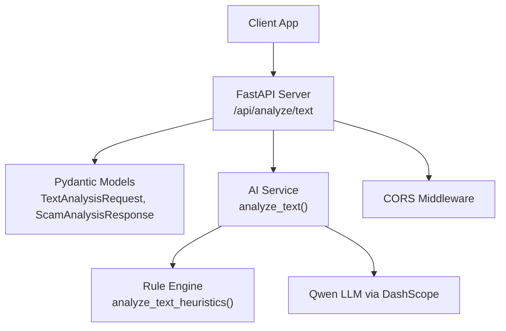
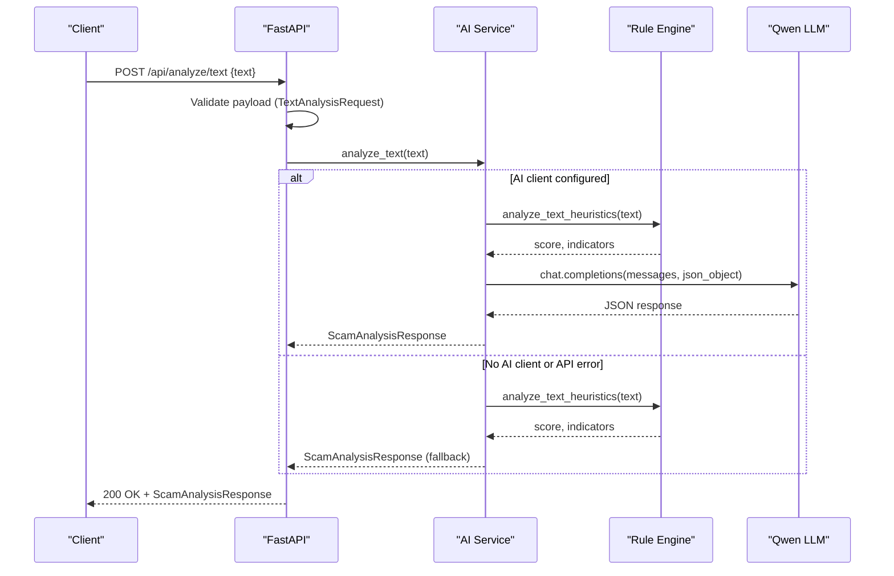
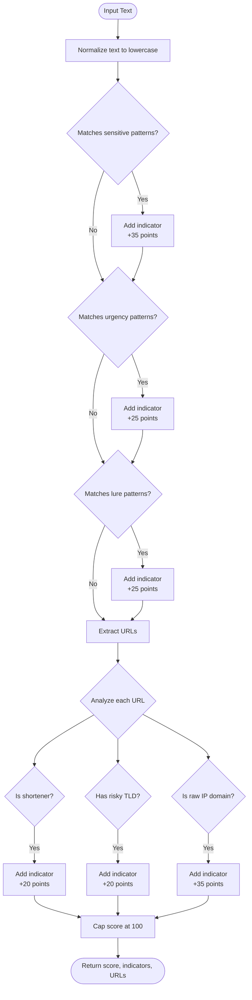
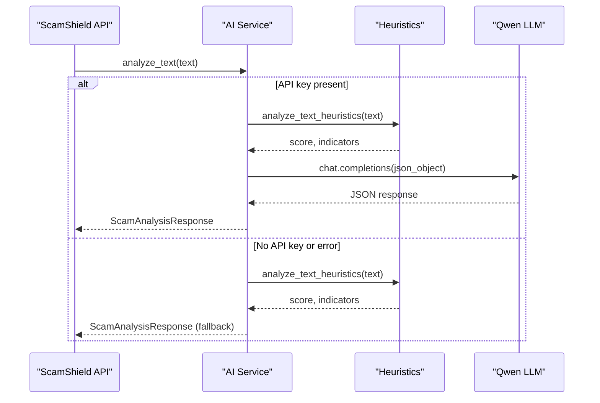
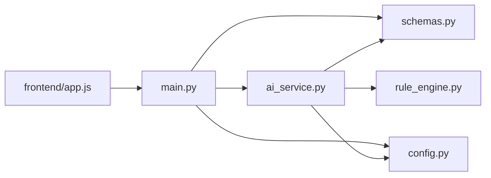

# Text Analysis API

<cite>
**Referenced Files in This Document**
- [main.py](file://backend/app/main.py)
- [schemas.py](file://backend/app/schemas.py)
- [ai_service.py](file://backend/app/ai_service.py)
- [rule_engine.py](file://backend/app/rule_engine.py)
- [config.py](file://backend/app/config.py)
- [app.js](file://frontend/app.js)
- [README.md](file://README.md)
</cite>

## Table of Contents
1. [Introduction](#introduction)
2. [Project Structure](#project-structure)
3. [Core Components](#core-components)
4. [Architecture Overview](#architecture-overview)
5. [Detailed Component Analysis](#detailed-component-analysis)
6. [Dependency Analysis](#dependency-analysis)
7. [Performance Considerations](#performance-considerations)
8. [Troubleshooting Guide](#troubleshooting-guide)
9. [Conclusion](#conclusion)
10. [Appendices](#appendices)

## Introduction
This document provides detailed API documentation for the text analysis endpoint (/api/analyze/text). It covers the POST method, request and response schemas, risk scoring, threat categorization, explanation fields, example payloads, client integration examples (curl and JavaScript fetch), error handling, CORS configuration, and best practices for processing large text inputs.

## Project Structure
The backend is a FastAPI application that exposes multiple endpoints, including /api/analyze/text. The endpoint validates input using Pydantic models and delegates analysis to an AI service with a heuristic fallback. The frontend demonstrates how to call the API from a browser.

**Diagram sources**
- [main.py:21-34](file://backend/app/main.py#L21-L34)
- [main.py:44-48](file://backend/app/main.py#L44-L48)
- [schemas.py:4-25](file://backend/app/schemas.py#L4-L25)
- [ai_service.py:124-154](file://backend/app/ai_service.py#L124-L154)
- [rule_engine.py:37-112](file://backend/app/rule_engine.py#L37-L112)
- [config.py:6-11](file://backend/app/config.py#L6-L11)

**Section sources**
- [main.py:21-84](file://backend/app/main.py#L21-L84)
- [schemas.py:1-26](file://backend/app/schemas.py#L1-L26)
- [ai_service.py:1-220](file://backend/app/ai_service.py#L1-L220)
- [rule_engine.py:1-118](file://backend/app/rule_engine.py#L1-L118)
- [config.py:1-12](file://backend/app/config.py#L1-L12)
- [README.md:17-60](file://README.md#L17-L60)

## Core Components
- Endpoint: POST /api/analyze/text
  - Validates request body using TextAnalysisRequest
  - Returns ScamAnalysisResponse
- Request schema: TextAnalysisRequest
  - text: required string; validated by Pydantic and server-side empty check
- Response schema: ScamAnalysisResponse
  - is_scam: boolean
  - risk_score: integer 0–100
  - risk_level: "Low", "Medium", "High", or "Critical"
  - scam_type: category such as "Phishing", "Investment Scam", "Fake Job Scam", "OTP Theft", "Bank Impersonation", "Safe", etc.
  - extracted_text: optional string (used for image/voice flows; may be null for text)
  - summary: short executive summary
  - detected_indicators: list of DetectedIndicator objects
    - category: descriptive label
    - description: why it was flagged
    - severity: "low", "medium", "high", "critical"
  - explanation: list of strings explaining why this is dangerous
  - recommended_dos: actionable steps to stay safe
  - recommended_donts: warnings about what not to do

Risk scoring system
- Score range: 0–100
- Risk levels are derived from score thresholds in the heuristic engine and mapped to Low/Medium/High/Critical
- Threat categorization (scam_type) is inferred from content patterns and heuristics

Explanation fields
- explanation: human-readable reasons for danger
- recommended_dos/recommended_donts: concrete protective guidance

**Section sources**
- [main.py:44-48](file://backend/app/main.py#L44-L48)
- [schemas.py:4-25](file://backend/app/schemas.py#L4-L25)
- [ai_service.py:50-122](file://backend/app/ai_service.py#L50-L122)
- [rule_engine.py:37-112](file://backend/app/rule_engine.py#L37-L112)

## Architecture Overview
The endpoint performs validation, then calls analyze_text. If an AI client is configured, it attempts a Qwen LLM call; otherwise, it falls back to a rule-based heuristic engine. Errors during AI calls trigger fallback behavior to ensure consistent responses.

**Diagram sources**
- [main.py:44-48](file://backend/app/main.py#L44-L48)
- [ai_service.py:124-154](file://backend/app/ai_service.py#L124-L154)
- [rule_engine.py:37-112](file://backend/app/rule_engine.py#L37-L112)
- [config.py:6-11](file://backend/app/config.py#L6-L11)

## Detailed Component Analysis

### Endpoint: POST /api/analyze/text
- Path: /api/analyze/text
- Method: POST
- Request Content-Type: application/json
- Request Body: TextAnalysisRequest
  - text: required string; must not be empty after trimming whitespace
- Success Response: ScamAnalysisResponse (HTTP 200)
- Error Responses:
  - HTTP 400 if text is empty or missing
  - HTTP 5xx if internal errors occur (e.g., upstream AI service failure triggers fallback; network or parsing issues may surface as server errors)

Validation and flow
- FastAPI validates the JSON body against TextAnalysisRequest
- Empty text is rejected with a 400 error
- On success, the endpoint returns a structured ScamAnalysisResponse

Example requests
- curl
  - Example: POST with a JSON body containing a text field
  - Replace HOST and PORT with your deployment values
- JavaScript fetch
  - Use fetch('/api/analyze/text', { method: 'POST', headers: { 'Content-Type': 'application/json' }, body: JSON.stringify({ text }) })

Note: For production, set appropriate CORS origins and credentials.

**Section sources**
- [main.py:44-48](file://backend/app/main.py#L44-L48)
- [schemas.py:4-6](file://backend/app/schemas.py#L4-L6)

### Request Schema: TextAnalysisRequest
- Fields:
  - text: string (required); represents message content or SMS text to analyze
- Validation:
  - Required field enforced by Pydantic
  - Server enforces non-empty after trimming

**Section sources**
- [schemas.py:4-6](file://backend/app/schemas.py#L4-L6)
- [main.py:44-48](file://backend/app/main.py#L44-L48)

### Response Schema: ScamAnalysisResponse
- Fields:
  - is_scam: boolean indicating whether the content is likely a scam
  - risk_score: integer 0–100
  - risk_level: "Low", "Medium", "High", or "Critical"
  - scam_type: categorized type such as "Phishing", "Investment Scam", "Fake Job Scam", "OTP Theft", "Bank Impersonation", "Safe", etc.
  - extracted_text: optional string; used when OCR/transcription applies
  - summary: concise summary of findings
  - detected_indicators: array of DetectedIndicator
    - category: descriptive label (e.g., "Sensitive Information Request", "Psychological Urgency & Fear", "Unrealistic Reward / Lure", "Obfuscated / Shortened URL", "High-Risk Domain Extension", "Direct IP Host URL")
    - description: explanation of why the indicator was flagged
    - severity: "low", "medium", "high", "critical"
  - explanation: array of strings explaining why this is dangerous
  - recommended_dos: array of actionable safety steps
  - recommended_donts: array of warnings about what not to do

Risk scoring and categorization
- Heuristic engine computes a base score by summing weighted signals:
  - Sensitive data requests: high weight
  - Urgency/fear tactics: medium-high weight
  - Unrealistic rewards/lures: medium-high weight
  - Suspicious URLs (shorteners, risky TLDs, direct IPs): additional weights
- Final score is capped at 100
- Risk level mapping:
  - High probability (score >= 70): "High" or "Critical" depending on threshold
  - Medium probability (score >= 30): "Medium"
  - Low probability (< 30): "Low"
- Scam type inference uses keyword heuristics (e.g., OTP/cv/pin/password -> OTP/Credential theft; investment keywords -> Investment Scam; lottery/prize keywords -> Lottery/Prize Scam; bank suspension keywords -> Bank Impersonation; default to Phishing)

Explanation and guidance
- explanation: bullet-style reasons for danger
- recommended_dos/recommended_donts: practical advice for users

**Section sources**
- [schemas.py:10-25](file://backend/app/schemas.py#L10-L25)
- [ai_service.py:50-122](file://backend/app/ai_service.py#L50-L122)
- [rule_engine.py:37-112](file://backend/app/rule_engine.py#L37-L112)

### Heuristic Rule Engine
The rule engine scans text for:
- Sensitive information requests (OTP, CVV, passwords, IDs)
- Urgency and fear tactics (immediate action, account suspension, legal threats)
- Unrealistic rewards/lures (lottery, guaranteed returns, fake jobs)
- Suspicious URLs (shorteners, risky TLDs, direct IP addresses)

It returns a calculated score, a list of indicators, and extracted URLs.

**Diagram sources**
- [rule_engine.py:37-112](file://backend/app/rule_engine.py#L37-L112)

**Section sources**
- [rule_engine.py:1-118](file://backend/app/rule_engine.py#L1-L118)

### AI Integration and Fallback
- If a DashScope API key is configured, the service calls Qwen LLM with a strict JSON schema prompt
- On any exception or missing API key, the service falls back to heuristic analysis to ensure consistent responses
- The fallback maps heuristic scores to risk levels and infers scam types based on keywords

**Diagram sources**
- [ai_service.py:9-16](file://backend/app/ai_service.py#L9-L16)
- [ai_service.py:124-154](file://backend/app/ai_service.py#L124-L154)
- [config.py:6-11](file://backend/app/config.py#L6-L11)

**Section sources**
- [ai_service.py:9-16](file://backend/app/ai_service.py#L9-L16)
- [ai_service.py:124-154](file://backend/app/ai_service.py#L124-L154)
- [config.py:6-11](file://backend/app/config.py#L6-L11)

## Dependency Analysis
- main.py imports schemas, ai_service, and config; defines CORS middleware and endpoints
- ai_service depends on OpenAI-compatible client, config, schemas, and rule_engine
- rule_engine depends on schemas for DetectedIndicator
- Frontend app.js demonstrates calling /api/analyze/text with fetch

**Diagram sources**
- [main.py:1-20](file://backend/app/main.py#L1-L20)
- [ai_service.py:1-8](file://backend/app/ai_service.py#L1-L8)
- [rule_engine.py:1-5](file://backend/app/rule_engine.py#L1-L5)
- [app.js:138-161](file://frontend/app.js#L138-L161)

**Section sources**
- [main.py:1-84](file://backend/app/main.py#L1-L84)
- [ai_service.py:1-220](file://backend/app/ai_service.py#L1-L220)
- [rule_engine.py:1-118](file://backend/app/rule_engine.py#L1-L118)
- [app.js:138-161](file://frontend/app.js#L138-L161)

## Performance Considerations
- Large text inputs:
  - Prefer chunking or summarizing very long messages before sending to reduce payload size and processing time
  - Consider rate limiting and timeouts on the client side
- Heuristic fallback:
  - Fast and deterministic; useful when AI service is unavailable or slow
- AI calls:
  - Network latency and model response times can vary; implement retries with exponential backoff on the client
- CORS:
  - Restrict allow_origins to trusted domains in production to mitigate cross-origin risks

[No sources needed since this section provides general guidance]

## Troubleshooting Guide
Common issues and resolutions:
- Empty text input:
  - Behavior: HTTP 400 with detail "Text cannot be empty."
  - Resolution: Ensure the text field is provided and not blank after trimming
- AI service failures:
  - Behavior: Falls back to heuristic analysis; logs indicate error
  - Resolution: Verify DASHSCOPE_API_KEY and base URL; check network connectivity; inspect logs for specific errors
- CORS errors in browser:
  - Behavior: Blocked requests due to origin mismatch
  - Resolution: Configure CORS allow_origins to include your frontend domain; ensure methods and headers are allowed
- Unexpected response format:
  - Behavior: Parsing errors if AI returns invalid JSON
  - Resolution: The service catches exceptions and falls back to heuristic analysis; verify model settings and prompts

**Section sources**
- [main.py:44-48](file://backend/app/main.py#L44-L48)
- [ai_service.py:152-154](file://backend/app/ai_service.py#L152-L154)
- [main.py:27-34](file://backend/app/main.py#L27-L34)

## Conclusion
The /api/analyze/text endpoint provides robust scam detection with clear, explainable outputs. It combines fast heuristic analysis with optional AI reasoning, ensuring reliability even when external services are unavailable. Clients should handle validation errors, implement retries, and configure CORS appropriately for production use.

[No sources needed since this section summarizes without analyzing specific files]

## Appendices

### Example Requests and Responses

- cURL example
  - Send a POST request with a JSON body containing the text field
  - Replace HOST and PORT with your deployment values

- JavaScript fetch example
  - Use fetch to POST JSON with a text field to /api/analyze/text
  - Handle loading states and display results as shown in the frontend

- Sample suspicious messages that typically trigger scam detection
  - Phishing attempt: Message claiming urgent account suspension with a link to update KYC and enter OTP immediately
  - Urgency tactic: Warning that an account will be permanently closed unless action is taken within 24 hours
  - Social engineering pattern: Request for OTP, password, or PIN under the guise of verification or prize claim
  - Investment lure: Promises of guaranteed returns or daily profits with minimal effort
  - Fake job/task: Offers to earn money via simple tasks through unofficial channels

- Example response fields
  - is_scam: true/false
  - risk_score: 0–100
  - risk_level: "Low", "Medium", "High", "Critical"
  - scam_type: e.g., "Phishing", "OTP Theft", "Investment Scam", "Safe"
  - summary: concise finding
  - detected_indicators: list with category, description, severity
  - explanation: reasons for danger
  - recommended_dos/recommended_donts: protective guidance

[No sources needed since this section provides conceptual examples]

### CORS Configuration
- Default configuration allows all origins for development
- In production, restrict allow_origins to trusted domains
- Ensure allow_methods and allow_headers cover expected client requests

**Section sources**
- [main.py:27-34](file://backend/app/main.py#L27-L34)

### Best Practices for Processing Large Text Inputs
- Trim and validate input on the client before sending
- Limit maximum text length to reasonable bounds
- Implement client-side timeouts and retries
- Consider preprocessing (e.g., truncation or summarization) for very long inputs

[No sources needed since this section provides general guidance]