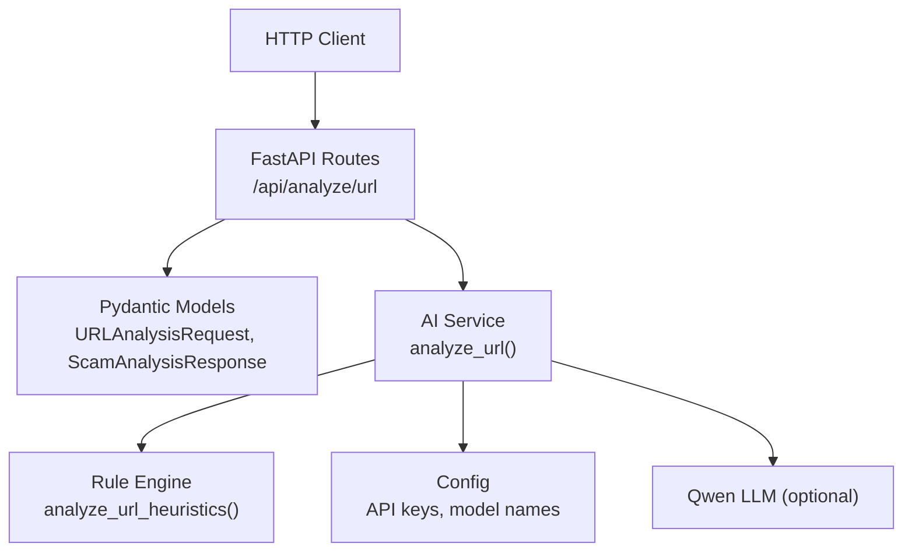
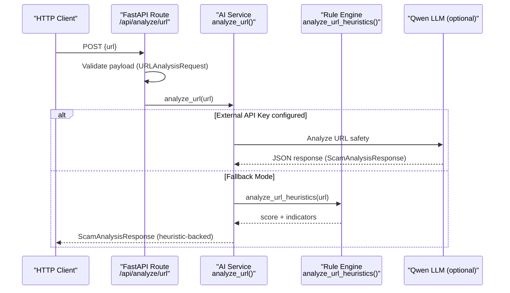
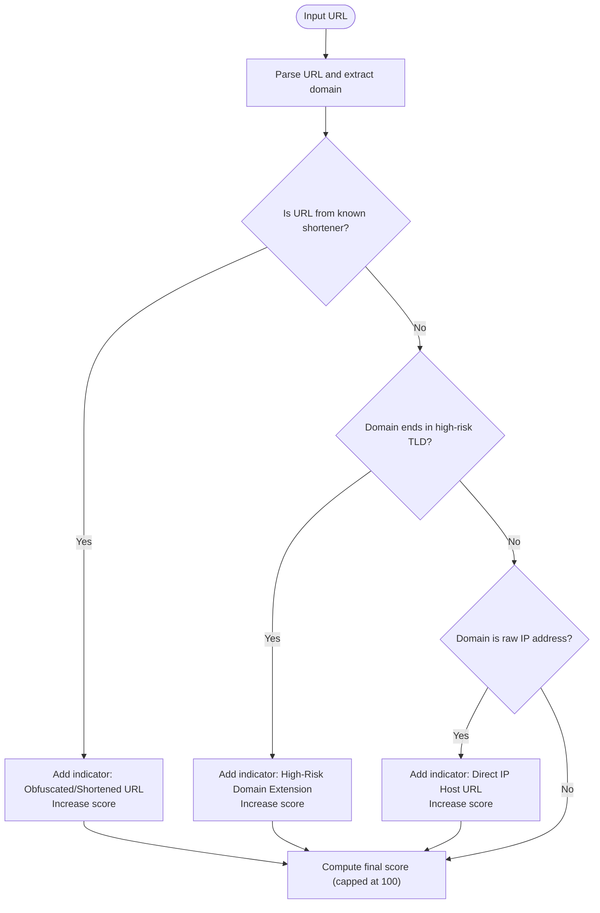
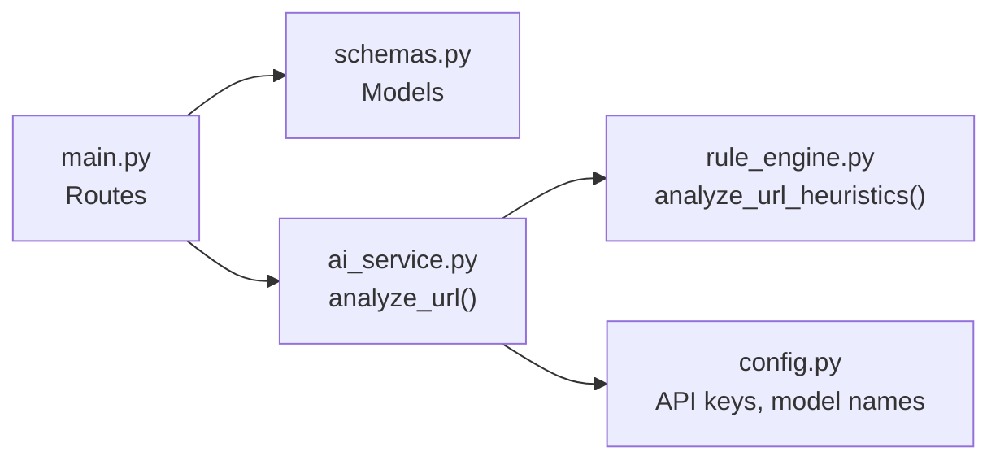

# URL Inspection API

<cite>
**Referenced Files in This Document**
- [main.py](file://backend/app/main.py)
- [schemas.py](file://backend/app/schemas.py)
- [ai_service.py](file://backend/app/ai_service.py)
- [rule_engine.py](file://backend/app/rule_engine.py)
- [config.py](file://backend/app/config.py)
- [README.md](file://README.md)
</cite>

## Table of Contents
1. [Introduction](#introduction)
2. [Project Structure](#project-structure)
3. [Core Components](#core-components)
4. [Architecture Overview](#architecture-overview)
5. [Detailed Component Analysis](#detailed-component-analysis)
6. [Dependency Analysis](#dependency-analysis)
7. [Performance Considerations](#performance-considerations)
8. [Troubleshooting Guide](#troubleshooting-guide)
9. [Conclusion](#conclusion)
10. [Appendices](#appendices)

## Introduction
This document provides comprehensive API documentation for the URL inspection endpoint /api/analyze/url. It explains the POST request schema, validation rules, and the response format used by ScamShield AI to analyze URLs. It also details how domain reputation signals, suspicious link detection, and heuristic analysis are applied to determine risk scores, threat categories, and actionable recommendations. Practical examples and error handling guidance are included to help you integrate this endpoint effectively.

## Project Structure
The URL inspection feature is implemented as a FastAPI application with modular components:
- API routes define endpoints and input validation
- Schemas define request/response models
- AI service orchestrates LLM-based analysis with heuristic fallbacks
- Rule engine performs pattern-based heuristics on text and URLs
- Configuration loads environment variables for external services

**Diagram sources**
- [main.py:50-54](file://backend/app/main.py#L50-L54)
- [schemas.py:7-25](file://backend/app/schemas.py#L7-L25)
- [ai_service.py:156-176](file://backend/app/ai_service.py#L156-L176)
- [rule_engine.py:114-117](file://backend/app/rule_engine.py#L114-L117)
- [config.py:6-11](file://backend/app/config.py#L6-L11)

**Section sources**
- [main.py:21-84](file://backend/app/main.py#L21-L84)
- [schemas.py:1-26](file://backend/app/schemas.py#L1-L26)
- [ai_service.py:1-220](file://backend/app/ai_service.py#L1-L220)
- [rule_engine.py:1-118](file://backend/app/rule_engine.py#L1-L118)
- [config.py:1-12](file://backend/app/config.py#L1-L12)
- [README.md:1-68](file://README.md#L1-L68)

## Core Components
- Endpoint: POST /api/analyze/url
  - Validates input using Pydantic model URLAnalysisRequest
  - Delegates to AI service analyze_url() which uses Qwen LLM when configured; otherwise falls back to heuristic analysis
- Request schema: URLAnalysisRequest
  - url: string field required; validated by FastAPI/Pydantic at route level
- Response schema: ScamAnalysisResponse
  - Fields include is_scam, risk_score, risk_level, scam_type, extracted_text, summary, detected_indicators, explanation, recommended_dos, recommended_donts

Key behaviors:
- Empty URL results in HTTP 400 error
- When no external API key is configured, the system runs in heuristic fallback mode, still returning structured responses with risk scoring and indicators
- Heuristic analysis inspects domains, TLDs, shorteners, IP hosts, and patterns within the URL string

**Section sources**
- [main.py:50-54](file://backend/app/main.py#L50-L54)
- [schemas.py:7-25](file://backend/app/schemas.py#L7-L25)
- [ai_service.py:156-176](file://backend/app/ai_service.py#L156-L176)
- [rule_engine.py:114-117](file://backend/app/rule_engine.py#L114-L117)

## Architecture Overview
The URL inspection flow combines rule-based heuristics and optional LLM reasoning:

**Diagram sources**
- [main.py:50-54](file://backend/app/main.py#L50-L54)
- [ai_service.py:156-176](file://backend/app/ai_service.py#L156-L176)
- [rule_engine.py:114-117](file://backend/app/rule_engine.py#L114-L117)
- [config.py:6-11](file://backend/app/config.py#L6-L11)

## Detailed Component Analysis

### Endpoint: POST /api/analyze/url
- Purpose: Inspect a single URL for scam/phishing indicators and return a structured risk assessment
- Input: JSON body with a url field
- Validation:
  - Field presence enforced by Pydantic model URLAnalysisRequest
  - Non-empty string enforced at route level; empty or whitespace-only returns HTTP 400
- Processing:
  - If an external API key is configured, the URL is analyzed via Qwen LLM with a strict JSON output schema
  - If not configured, heuristic fallback analyzes the URL string using pattern matching and domain checks
- Output: ScamAnalysisResponse with fields including risk_score, risk_level, scam_type, detected_indicators, explanation, recommended_dos, recommended_donts

Example usage patterns:
- cURL:
  - curl -X POST http://localhost:8000/api/analyze/url -H "Content-Type: application/json" -d '{"url":"https://example.com"}'
- Python requests:
  - requests.post("http://localhost:8000/api/analyze/url", json={"url": "https://example.com"})
- JavaScript fetch:
  - fetch("/api/analyze/url", { method: "POST", headers: {"Content-Type":"application/json"}, body: JSON.stringify({url:"https://example.com"}) })

Error handling:
- Missing or empty url: HTTP 400 with detail indicating URL cannot be empty
- Malformed URL: Handled by downstream logic; if parsing fails, heuristic fallback may still produce a conservative result based on available signals

**Section sources**
- [main.py:50-54](file://backend/app/main.py#L50-L54)
- [schemas.py:7-8](file://backend/app/schemas.py#L7-L8)
- [ai_service.py:156-176](file://backend/app/ai_service.py#L156-L176)

### Request Schema: URLAnalysisRequest
- url: string
  - Required field
  - Must be non-empty after stripping whitespace
  - Represents the suspicious URL to analyze

Validation behavior:
- Enforced by Pydantic model and route-level check
- Returns HTTP 400 if missing or empty

**Section sources**
- [schemas.py:7-8](file://backend/app/schemas.py#L7-L8)
- [main.py:50-54](file://backend/app/main.py#L50-L54)

### Response Schema: ScamAnalysisResponse
Fields:
- is_scam: boolean indicating whether the submission is likely a scam
- risk_score: integer from 0 to 100 representing risk magnitude
- risk_level: string category such as Low, Medium, High, Critical
- scam_type: descriptive category like Phishing, Investment Scam, Fake Job Scam, OTP Theft, Safe
- extracted_text: optional string containing extracted content (for URLs, typically the submitted URL itself in fallback mode)
- summary: concise executive summary explaining findings
- detected_indicators: list of DetectedIndicator objects with category, description, severity
- explanation: list of strings detailing why the submission is dangerous
- recommended_dos: list of safe actions to take
- recommended_donts: list of warnings about what not to do

Heuristic mapping:
- In fallback mode, risk_level and scam_type are derived from heuristic signals and thresholds
- detected_indicators reflect specific flags raised by rule engine (e.g., shortened URL, high-risk TLD, direct IP host)

**Section sources**
- [schemas.py:10-25](file://backend/app/schemas.py#L10-L25)
- [ai_service.py:50-122](file://backend/app/ai_service.py#L50-L122)

### Heuristic Analysis and Domain Reputation
The rule engine applies pattern-based checks to detect suspicious elements in URLs:

- Suspicious URL shorteners:
  - Recognizes common shortening services to flag obfuscated links
- High-risk TLDs:
  - Flags domains ending in extensions commonly associated with fraud
- Direct IP addresses:
  - Detects raw IP usage instead of legitimate registered domains
- Textual patterns:
  - Although primarily designed for text, URL strings can trigger sensitive data requests, urgency cues, and lure patterns when embedded in text contexts

Risk scoring:
- Each indicator contributes to a cumulative base score capped at 100
- Thresholds map to risk levels and scam types in fallback mode

**Diagram sources**
- [rule_engine.py:28-35](file://backend/app/rule_engine.py#L28-L35)
- [rule_engine.py:76-112](file://backend/app/rule_engine.py#L76-L112)
- [rule_engine.py:114-117](file://backend/app/rule_engine.py#L114-L117)

**Section sources**
- [rule_engine.py:28-35](file://backend/app/rule_engine.py#L28-L35)
- [rule_engine.py:76-112](file://backend/app/rule_engine.py#L76-L112)
- [rule_engine.py:114-117](file://backend/app/rule_engine.py#L114-L117)

### Example Scenarios and Expected Responses
Note: The following examples illustrate expected behaviors and response structures based on the implementation. Actual values depend on configuration and inputs.

- Typosquatting domain example:
  - Input: {"url": "https://paypa1-login.com/update"}
  - Behavior: Heuristic fallback may flag suspicious domain characteristics; response includes risk_score, risk_level, scam_type (e.g., Phishing), detected_indicators describing suspicious domain traits, explanation, recommended_dos/donts
- Shortened link example:
  - Input: {"url": "https://bit.ly/abc123"}
  - Behavior: Flagged as obfuscated/shortened URL; increases risk score; response includes indicator for shortened URL and cautious recommendation
- Known phishing site example:
  - Input: {"url": "https://secure-bank-verify.xyz/otp"}
  - Behavior: May be flagged for high-risk TLD and suspicious context; response includes phishing-related scam_type and protective recommendations

Response structure highlights:
- risk_score: 0–100
- risk_level: Low/Medium/High/Critical
- scam_type: e.g., Phishing, OTP / Credential Theft, Investment Scam, Lottery / Prize Scam, Bank / Service Impersonation, Safe
- detected_indicators: array of {category, description, severity}
- explanation: array of strings explaining risks
- recommended_dos/donts: actionable guidance

**Section sources**
- [ai_service.py:50-122](file://backend/app/ai_service.py#L50-L122)
- [rule_engine.py:28-35](file://backend/app/rule_engine.py#L28-L35)
- [rule_engine.py:76-112](file://backend/app/rule_engine.py#L76-L112)

### Error Handling for Malformed URLs and Invalid Domains
- Empty URL:
  - Route-level validation returns HTTP 400 with detail indicating URL cannot be empty
- Malformed URL:
  - Downstream parsing may fail; in fallback mode, heuristic analysis still attempts to extract signals and return a conservative response
  - If external LLM is configured and fails, the system falls back to heuristic analysis to ensure consistent response shape

Best practices:
- Always validate URL format before sending to avoid unnecessary errors
- Handle HTTP 400 responses gracefully in clients
- Use retry logic only for transient network issues, not for malformed payloads

**Section sources**
- [main.py:50-54](file://backend/app/main.py#L50-L54)
- [ai_service.py:156-176](file://backend/app/ai_service.py#L156-L176)

## Dependency Analysis
The URL inspection endpoint depends on several modules:

Coupling and cohesion:
- main.py defines routes and delegates processing to ai_service.py
- ai_service.py coordinates between rule_engine.py and optional LLM client
- schemas.py centralizes request/response contracts ensuring type safety
- config.py isolates environment-dependent settings

Potential circular dependencies:
- None observed; imports are directional from routes to service to rules/config

External integration points:
- OpenAI-compatible client for Qwen LLM (optional)
- Environment variables for API key and base URL

**Diagram sources**
- [main.py:8-19](file://backend/app/main.py#L8-L19)
- [ai_service.py:1-8](file://backend/app/ai_service.py#L1-L8)
- [rule_engine.py:1-5](file://backend/app/rule_engine.py#L1-L5)
- [config.py:1-11](file://backend/app/config.py#L1-L11)

**Section sources**
- [main.py:8-19](file://backend/app/main.py#L8-L19)
- [ai_service.py:1-8](file://backend/app/ai_service.py#L1-L8)
- [rule_engine.py:1-5](file://backend/app/rule_engine.py#L1-L5)
- [config.py:1-11](file://backend/app/config.py#L1-L11)

## Performance Considerations
- Heuristic fallback is lightweight and deterministic, suitable for offline testing and low-latency scenarios
- LLM-based analysis introduces network latency and depends on external service availability
- Caching repeated URL analyses could reduce redundant calls if integrated at the application layer
- Batch processing multiple URLs should consider rate limits and concurrency controls when using external APIs

[No sources needed since this section provides general guidance]

## Troubleshooting Guide
Common issues and resolutions:
- HTTP 400 for empty URL:
  - Ensure the url field is present and non-empty in the request payload
- Unexpected risk scores:
  - Verify that heuristic patterns match your use case; adjust expectations based on domain/TLD/shortener flags
- External API failures:
  - System automatically falls back to heuristic analysis; confirm environment variables for API key and base URL if using LLM features
- CORS errors in browser:
  - Middleware allows all origins; ensure frontend requests target correct host/port

Debugging tips:
- Log request payloads and responses to verify schema compliance
- Inspect detected_indicators to understand which rules triggered
- Test with known benign and malicious URLs to calibrate expectations

**Section sources**
- [main.py:50-54](file://backend/app/main.py#L50-L54)
- [ai_service.py:156-176](file://backend/app/ai_service.py#L156-L176)
- [rule_engine.py:28-35](file://backend/app/rule_engine.py#L28-L35)
- [rule_engine.py:76-112](file://backend/app/rule_engine.py#L76-L112)

## Conclusion
The /api/analyze/url endpoint provides robust URL inspection through a combination of heuristic pattern matching and optional LLM reasoning. It returns a standardized ScamAnalysisResponse with clear risk scoring, threat categorization, and actionable guidance. The system gracefully handles missing or malformed inputs and ensures consistent outputs even in offline mode. Integrate this endpoint to enhance security workflows by detecting typosquatting, shortened links, high-risk TLDs, and other suspicious URL characteristics.

[No sources needed since this section summarizes without analyzing specific files]

## Appendices

### API Reference Summary
- Endpoint: POST /api/analyze/url
- Request:
  - Body: JSON object with url field (string, required)
- Response:
  - JSON object conforming to ScamAnalysisResponse schema
- Errors:
  - 400 Bad Request: Empty or missing url field

### Practical Examples
- cURL:
  - curl -X POST http://localhost:8000/api/analyze/url -H "Content-Type: application/json" -d '{"url":"https://example.com"}'
- Python requests:
  - requests.post("http://localhost:8000/api/analyze/url", json={"url": "https://example.com"})
- JavaScript fetch:
  - fetch("/api/analyze/url", { method: "POST", headers: {"Content-Type":"application/json"}, body: JSON.stringify({url:"https://example.com"}) })

[No sources needed since this section provides general guidance]