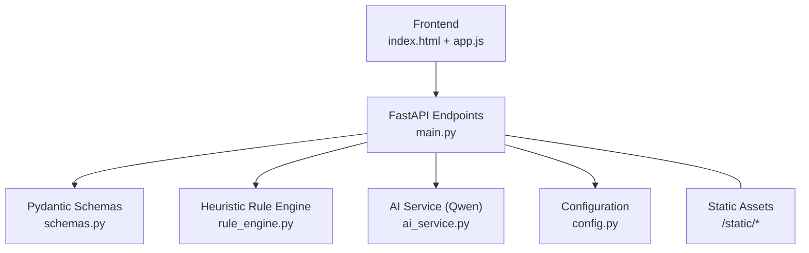
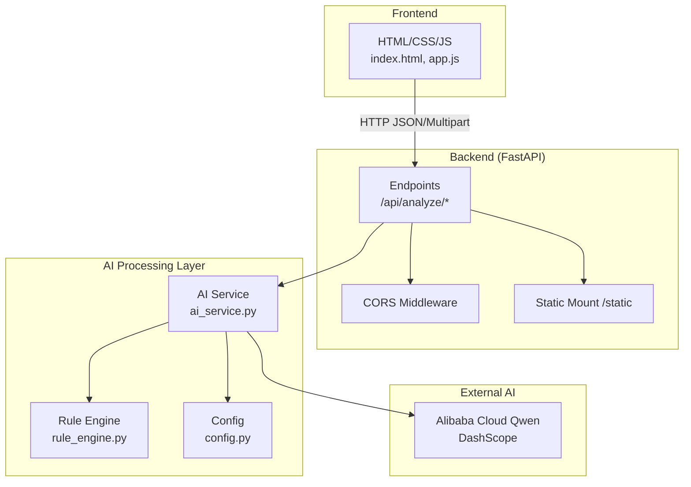
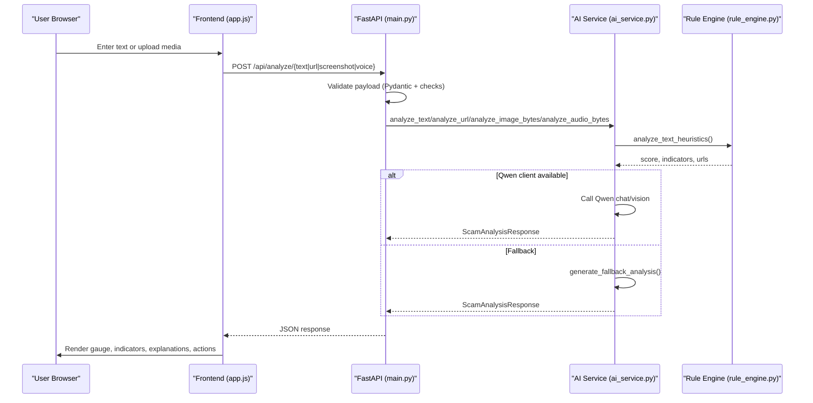
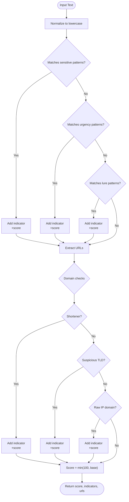
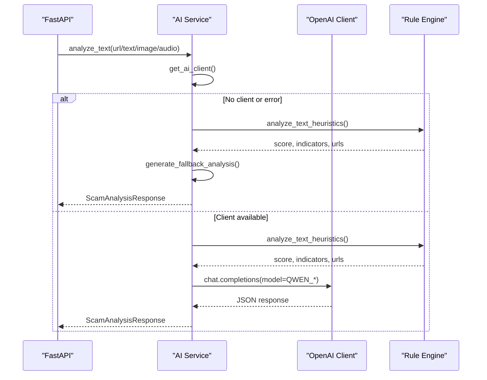
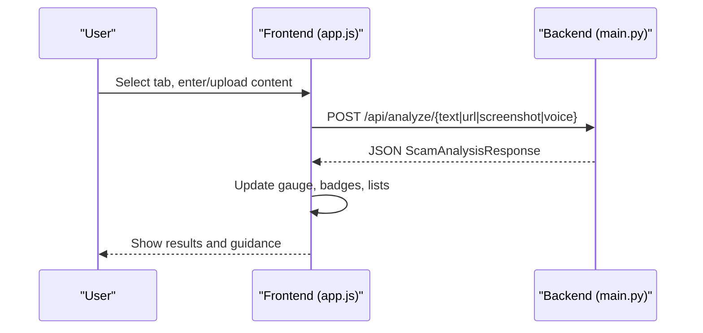
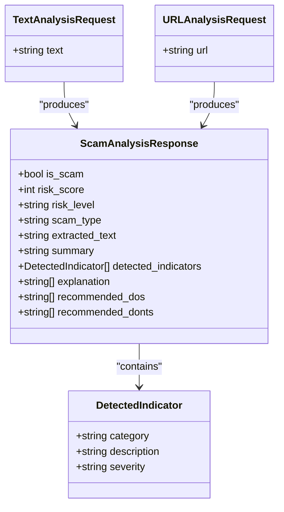
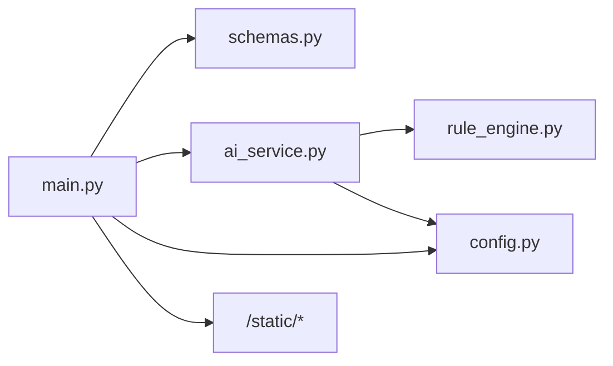

# Architecture Overview

<cite>
**Referenced Files in This Document**
- [main.py](file://backend/app/main.py)
- [ai_service.py](file://backend/app/ai_service.py)
- [rule_engine.py](file://backend/app/rule_engine.py)
- [config.py](file://backend/app/config.py)
- [schemas.py](file://backend/app/schemas.py)
- [app.js](file://frontend/app.js)
- [index.html](file://frontend/index.html)
- [requirements.txt](file://backend/requirements.txt)
- [README.md](file://README.md)
</cite>

## Table of Contents
1. [Introduction](#introduction)
2. [Project Structure](#project-structure)
3. [Core Components](#core-components)
4. [Architecture Overview](#architecture-overview)
5. [Detailed Component Analysis](#detailed-component-analysis)
6. [Dependency Analysis](#dependency-analysis)
7. [Performance Considerations](#performance-considerations)
8. [Troubleshooting Guide](#troubleshooting-guide)
9. [Conclusion](#conclusion)
10. [Appendices](#appendices)

## Introduction
ScamShield AI is a multimodal threat detection platform that analyzes text, images (screenshots), URLs, and audio to detect scams, phishing, and social engineering attacks. It combines an instant heuristic rule engine with Alibaba Cloud Qwen LLM reasoning to produce explainable results, including risk scores, scam types, indicators, explanations, and actionable guidance. The system provides a responsive frontend dashboard and a FastAPI backend that serves both the UI and analysis APIs.

Key design goals:
- Multimodal input support with consistent result schema
- Dual-layer intelligence: fast heuristics plus LLM reasoning
- Graceful fallback when external AI services are unavailable
- Explainable outputs for end users

**Section sources**
- [README.md:1-21](file://README.md#L1-L21)

## Project Structure
The project is organized into three primary layers:
- Frontend: HTML/CSS/JS single-page application served by the backend
- Backend API: FastAPI endpoints handling validation, orchestration, and responses
- AI Processing Layer: Heuristic rule engine and optional Qwen LLM integration
- Configuration: Environment-driven settings for ports, hosts, and AI service credentials

**Diagram sources**
- [main.py:21-84](file://backend/app/main.py#L21-L84)
- [ai_service.py:1-220](file://backend/app/ai_service.py#L1-L220)
- [rule_engine.py:1-118](file://backend/app/rule_engine.py#L1-L118)
- [schemas.py:1-26](file://backend/app/schemas.py#L1-L26)
- [config.py:1-12](file://backend/app/config.py#L1-L12)
- [index.html:1-212](file://frontend/index.html#L1-L212)
- [app.js:1-236](file://frontend/app.js#L1-L236)

**Section sources**
- [main.py:21-84](file://backend/app/main.py#L21-L84)
- [index.html:1-212](file://frontend/index.html#L1-L212)
- [app.js:1-236](file://frontend/app.js#L1-L236)
- [requirements.txt:1-8](file://backend/requirements.txt#L1-L8)

## Core Components
- FastAPI Application: Defines CORS, health check, and analysis endpoints; mounts static frontend assets
- Request/Response Schemas: Pydantic models enforce input/output contracts
- Heuristic Rule Engine: Regex-based pattern matching scoring sensitive data requests, urgency tactics, lures, and suspicious URLs/domains
- AI Service: Orchestrates calls to Alibaba Cloud Qwen (text and vision) with robust fallback to heuristic-only mode
- Configuration: Loads environment variables for API keys, model names, and server binding
- Frontend: Tabbed UI for text, screenshot, URL, and voice inputs; displays risk gauge, indicators, explanations, and action plans

**Section sources**
- [main.py:21-84](file://backend/app/main.py#L21-L84)
- [schemas.py:1-26](file://backend/app/schemas.py#L1-L26)
- [rule_engine.py:1-118](file://backend/app/rule_engine.py#L1-L118)
- [ai_service.py:1-220](file://backend/app/ai_service.py#L1-L220)
- [config.py:1-12](file://backend/app/config.py#L1-L12)
- [index.html:1-212](file://frontend/index.html#L1-L212)
- [app.js:1-236](file://frontend/app.js#L1-L236)

## Architecture Overview
High-level architecture separates concerns across four layers:
- Frontend User Interface: Presents input modes and visualizes results
- FastAPI Backend Services: Validates inputs, orchestrates processing, and returns structured responses
- AI Processing Layer: Combines heuristic rules and Qwen LLM reasoning
- Heuristic Rule Engine: Instant pattern matching for rapid triage and fallback

**Diagram sources**
- [main.py:21-84](file://backend/app/main.py#L21-L84)
- [ai_service.py:1-220](file://backend/app/ai_service.py#L1-L220)
- [rule_engine.py:1-118](file://backend/app/rule_engine.py#L1-L118)
- [config.py:1-12](file://backend/app/config.py#L1-L12)
- [index.html:1-212](file://frontend/index.html#L1-L212)
- [app.js:1-236](file://frontend/app.js#L1-L236)

## Detailed Component Analysis

### FastAPI Endpoints and Input Validation
- Health endpoint for service status
- Text analysis endpoint validates non-empty text
- URL analysis endpoint validates non-empty URL
- Screenshot endpoint reads multipart file and forwards bytes
- Voice endpoint reads multipart file and forwards bytes
- Static mounting serves the frontend under /static and root path

**Diagram sources**
- [main.py:36-68](file://backend/app/main.py#L36-L68)
- [ai_service.py:124-220](file://backend/app/ai_service.py#L124-L220)
- [rule_engine.py:37-118](file://backend/app/rule_engine.py#L37-L118)
- [app.js:139-235](file://frontend/app.js#L139-L235)

**Section sources**
- [main.py:36-84](file://backend/app/main.py#L36-L84)
- [schemas.py:1-26](file://backend/app/schemas.py#L1-L26)

### Heuristic Rule Engine
- Detects sensitive information requests (OTP, CVV, passwords, IDs)
- Identifies urgency/fear tactics (account suspension, law enforcement impersonation)
- Flags unrealistic rewards/lures (lottery, investment promises, fake jobs)
- Extracts URLs and evaluates domains for shorteners, high-risk TLDs, and raw IPs
- Produces a cumulative score capped at 100 and a list of detected indicators

**Diagram sources**
- [rule_engine.py:37-118](file://backend/app/rule_engine.py#L37-L118)

**Section sources**
- [rule_engine.py:1-118](file://backend/app/rule_engine.py#L1-L118)

### AI Service and Dual-Layer Intelligence
- Attempts to connect to Alibaba Cloud Qwen using configured credentials
- For text: runs heuristics first, then augments with Qwen reasoning; falls back if API unavailable or error occurs
- For URL: similar flow with heuristic context and Qwen reasoning
- For images: attempts Qwen-Vision OCR and analysis; falls back to simulated OCR and heuristic analysis
- For audio: uses simulated transcription and heuristic analysis
- Always returns a consistent ScamAnalysisResponse structure

**Diagram sources**
- [ai_service.py:9-17](file://backend/app/ai_service.py#L9-L17)
- [ai_service.py:50-122](file://backend/app/ai_service.py#L50-L122)
- [ai_service.py:124-220](file://backend/app/ai_service.py#L124-L220)
- [rule_engine.py:37-118](file://backend/app/rule_engine.py#L37-L118)

**Section sources**
- [ai_service.py:1-220](file://backend/app/ai_service.py#L1-L220)

### Frontend Interaction Flow
- Tabbed interface supports text, screenshot, URL, and voice inputs
- Preset examples help demonstrate typical scam patterns
- File selection updates UI state and enables submission
- Results display includes risk gauge, scam type, summary, indicators, explanations, and recommended actions
- Fetches data from backend endpoints and renders responses dynamically

**Diagram sources**
- [index.html:52-121](file://frontend/index.html#L52-L121)
- [app.js:139-235](file://frontend/app.js#L139-L235)
- [main.py:44-68](file://backend/app/main.py#L44-L68)

**Section sources**
- [index.html:1-212](file://frontend/index.html#L1-L212)
- [app.js:1-236](file://frontend/app.js#L1-L236)

### Data Models and Contracts
- TextAnalysisRequest and URLAnalysisRequest define required fields for text and URL analysis
- DetectedIndicator standardizes categories, descriptions, and severity levels
- ScamAnalysisResponse defines the unified output schema used across all modalities

**Diagram sources**
- [schemas.py:4-26](file://backend/app/schemas.py#L4-L26)

**Section sources**
- [schemas.py:1-26](file://backend/app/schemas.py#L1-L26)

## Dependency Analysis
- FastAPI application depends on Pydantic schemas for validation and response modeling
- AI service depends on OpenAI-compatible client for Qwen integration and on the rule engine for heuristic scoring
- Rule engine depends on regex and URL parsing utilities
- Configuration module loads environment variables for API keys, model names, and server settings
- Frontend depends on backend endpoints for analysis and serves static assets via FastAPI

**Diagram sources**
- [main.py:8-19](file://backend/app/main.py#L8-L19)
- [ai_service.py:1-8](file://backend/app/ai_service.py#L1-L8)
- [rule_engine.py:1-5](file://backend/app/rule_engine.py#L1-L5)
- [config.py:1-12](file://backend/app/config.py#L1-L12)

**Section sources**
- [main.py:8-19](file://backend/app/main.py#L8-L19)
- [ai_service.py:1-8](file://backend/app/ai_service.py#L1-L8)
- [rule_engine.py:1-5](file://backend/app/rule_engine.py#L1-L5)
- [config.py:1-12](file://backend/app/config.py#L1-L12)

## Performance Considerations
- Heuristic analysis is lightweight and deterministic, providing immediate feedback and enabling offline operation
- Qwen LLM calls introduce latency and depend on network availability; errors trigger fallback to ensure responsiveness
- Image and audio flows simulate transcription in fallback mode to avoid heavy dependencies while maintaining UX
- Static asset serving reduces frontend load time by hosting UI directly through the backend

[No sources needed since this section provides general guidance]

## Troubleshooting Guide
- Empty inputs: Endpoints return HTTP 400 with descriptive details for empty text, URL, or uploaded files
- Missing AI credentials: If DASHSCOPE_API_KEY is not set or invalid, the system automatically operates in heuristic fallback mode
- Network errors: Exceptions during Qwen calls are caught and logged; fallback analysis ensures consistent responses
- CORS issues: Middleware allows cross-origin requests broadly; adjust allow_origins for production security
- Static assets: Ensure frontend directory exists; otherwise, static mount is skipped

**Section sources**
- [main.py:44-68](file://backend/app/main.py#L44-L68)
- [ai_service.py:9-17](file://backend/app/ai_service.py#L9-L17)
- [ai_service.py:152-154](file://backend/app/ai_service.py#L152-L154)
- [ai_service.py:174-176](file://backend/app/ai_service.py#L174-L176)
- [ai_service.py:204-211](file://backend/app/ai_service.py#L204-L211)
- [main.py:27-34](file://backend/app/main.py#L27-L34)
- [main.py:70-79](file://backend/app/main.py#L70-L79)

## Conclusion
ScamShield AI’s architecture cleanly separates user interaction, API orchestration, heuristic analysis, and optional LLM reasoning. The dual-layer approach ensures fast, reliable detection even without external AI services, while still leveraging advanced reasoning when available. The unified response schema and explainable outputs make results accessible and actionable for end users.

[No sources needed since this section summarizes without analyzing specific files]

## Appendices

### Technology Stack Decisions
- Backend: FastAPI for high-performance async APIs, Pydantic for robust schema validation, Uvicorn as ASGI server
- AI Integration: OpenAI-compatible client to connect to Alibaba Cloud DashScope (Qwen) for text and vision tasks
- Frontend: Vanilla HTML/CSS/JS for simplicity and direct integration with backend static serving
- Configuration: python-dotenv for environment-driven settings, supporting local development and deployment flexibility

**Section sources**
- [requirements.txt:1-8](file://backend/requirements.txt#L1-L8)
- [config.py:1-12](file://backend/app/config.py#L1-L12)
- [README.md:17-21](file://README.md#L17-L21)