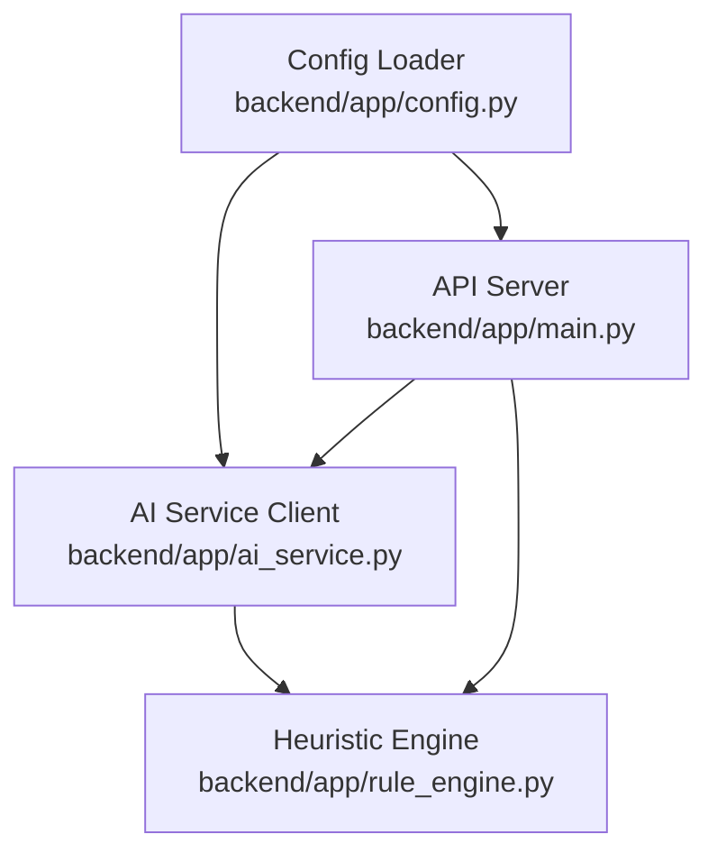
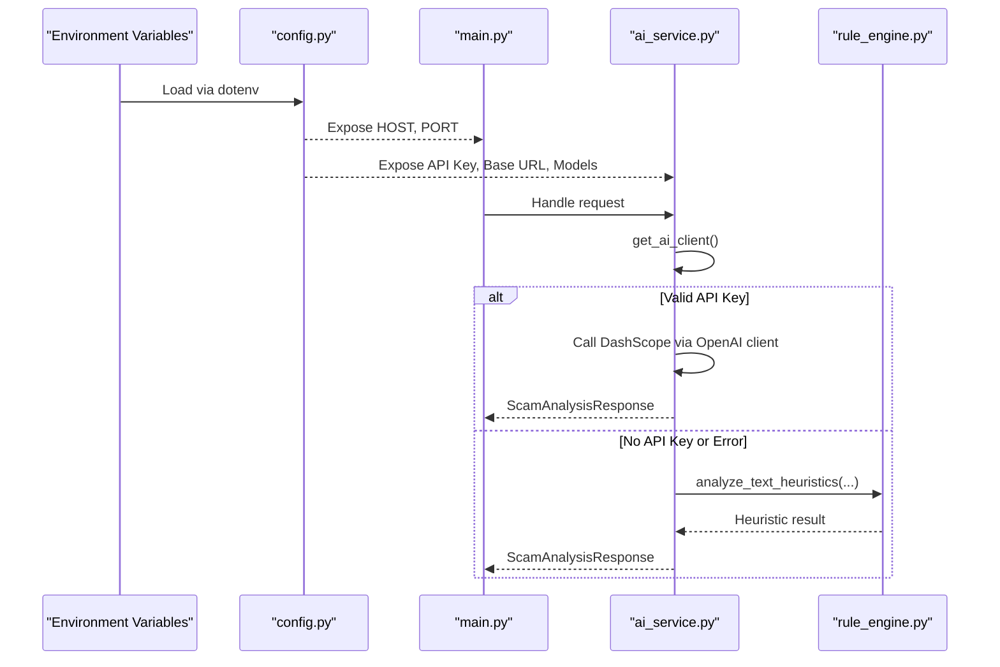
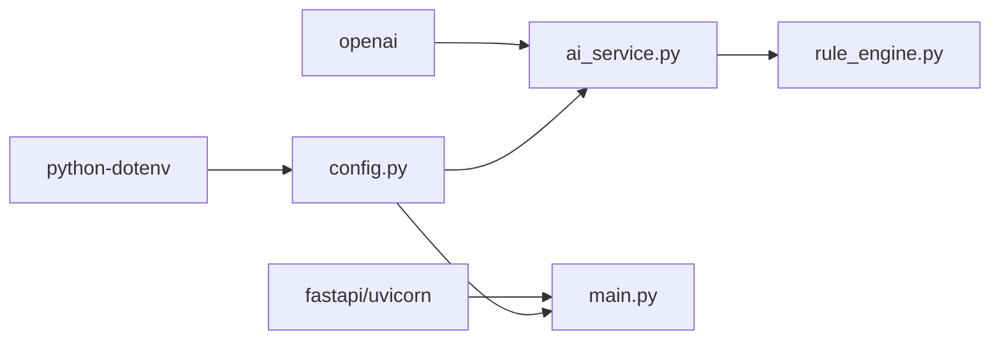

# Configuration Management

<cite>
**Referenced Files in This Document**
- [config.py](file://backend/app/config.py)
- [main.py](file://backend/app/main.py)
- [ai_service.py](file://backend/app/ai_service.py)
- [rule_engine.py](file://backend/app/rule_engine.py)
- [requirements.txt](file://backend/requirements.txt)
- [README.md](file://README.md)
</cite>

## Table of Contents
1. [Introduction](#introduction)
2. [Project Structure](#project-structure)
3. [Core Components](#core-components)
4. [Architecture Overview](#architecture-overview)
5. [Detailed Component Analysis](#detailed-component-analysis)
6. [Dependency Analysis](#dependency-analysis)
7. [Performance Considerations](#performance-considerations)
8. [Troubleshooting Guide](#troubleshooting-guide)
9. [Conclusion](#conclusion)
10. [Appendices](#appendices)

## Introduction
This document explains ScamShield AI’s configuration management system with a focus on environment-based settings and external service integration. It details how the application loads secrets and runtime options from environment variables, how it integrates with Alibaba Cloud DashScope (OpenAI-compatible API), and how to operate in AI-powered or heuristic-only modes. It also covers security best practices for managing credentials, environment-specific configurations, deployment considerations, validation behavior, defaults, and troubleshooting common issues.

## Project Structure
The configuration is centralized in a single module that reads environment variables using python-dotenv and exposes typed values consumed by other modules:
- Environment loading and variable exposure: backend/app/config.py
- Server startup and runtime usage of HOST/PORT: backend/app/main.py
- External service client initialization and fallback logic: backend/app/ai_service.py
- Heuristic engine used when AI is unavailable: backend/app/rule_engine.py
- Dependencies including python-dotenv and OpenAI SDK: backend/requirements.txt
- Quick start and .env guidance: README.md

**Diagram sources**
- [config.py:1-12](file://backend/app/config.py#L1-L12)
- [main.py:19-83](file://backend/app/main.py#L19-L83)
- [ai_service.py:1-16](file://backend/app/ai_service.py#L1-L16)
- [rule_engine.py:1-118](file://backend/app/rule_engine.py#L1-L118)

**Section sources**
- [config.py:1-12](file://backend/app/config.py#L1-L12)
- [main.py:19-83](file://backend/app/main.py#L19-L83)
- [ai_service.py:1-16](file://backend/app/ai_service.py#L1-L16)
- [rule_engine.py:1-118](file://backend/app/rule_engine.py#L1-L118)
- [requirements.txt:1-8](file://backend/requirements.txt#L1-L8)
- [README.md:44-53](file://README.md#L44-L53)

## Core Components
- Environment loader and configuration keys:
  - DASHSCOPE_API_KEY: Secret key for Alibaba Cloud DashScope
  - DASHSCOPE_BASE_URL: Base URL for the OpenAI-compatible endpoint
  - QWEN_MODEL_NAME: Text model identifier
  - QWEN_VL_MODEL_NAME: Vision-language model identifier
  - PORT: HTTP server port
  - HOST: HTTP server host binding
- Runtime behavior:
  - If no valid API key is present, the system automatically runs in heuristic-only mode without errors.
  - When configured, the OpenAI-compatible client connects to DashScope using the provided base URL and model names.

Key behaviors and defaults are defined in the configuration module and consumed by the server and AI service.

**Section sources**
- [config.py:1-12](file://backend/app/config.py#L1-L12)
- [ai_service.py:9-16](file://backend/app/ai_service.py#L9-L16)
- [main.py:19-83](file://backend/app/main.py#L19-L83)

## Architecture Overview
The configuration flows from environment variables into the application at startup. The server binds to HOST:PORT. The AI service conditionally initializes an OpenAI-compatible client based on the presence of a valid API key. If not available, analysis falls back to the heuristic engine.

**Diagram sources**
- [config.py:1-12](file://backend/app/config.py#L1-L12)
- [main.py:19-83](file://backend/app/main.py#L19-L83)
- [ai_service.py:9-16](file://backend/app/ai_service.py#L9-L16)
- [ai_service.py:124-154](file://backend/app/ai_service.py#L124-L154)
- [rule_engine.py:37-112](file://backend/app/rule_engine.py#L37-L112)

## Detailed Component Analysis

### Configuration Module (config.py)
- Loads environment variables using python-dotenv at import time.
- Provides default values for all configuration keys to ensure robust operation without explicit configuration.
- Exposes constants consumed by the server and AI service.

Configuration keys and defaults:
- DASHSCOPE_API_KEY: Empty string if not set; must be provided for AI mode.
- DASHSCOPE_BASE_URL: Defaults to the international DashScope compatible endpoint.
- QWEN_MODEL_NAME: Defaults to qwen-plus.
- QWEN_VL_MODEL_NAME: Defaults to qwen-vl-plus.
- PORT: Defaults to 8000.
- HOST: Defaults to 0.0.0.0.

Security notes:
- Secrets are read from environment variables only; never hard-coded.
- Use a .env file locally and inject environment variables in production environments.

Validation and defaults:
- No explicit validation is performed beyond type conversion for PORT.
- Missing or invalid API keys gracefully disable AI features and trigger heuristic-only mode.

Operational impact:
- Changing HOST/PORT affects server binding.
- Changing model names switches the underlying models used by the AI service.

**Section sources**
- [config.py:1-12](file://backend/app/config.py#L1-L12)

### Server Startup and Configuration Usage (main.py)
- Uses HOST and PORT from config to run the FastAPI server via Uvicorn.
- Mounts static frontend assets and serves index.html when available.
- Defines endpoints that delegate analysis to ai_service and return standardized responses.

Deployment considerations:
- Ensure HOST and PORT match your deployment target (e.g., container networking).
- Keep CORS settings appropriate for production (currently permissive for development).

**Section sources**
- [main.py:19-83](file://backend/app/main.py#L19-L83)

### AI Service Integration and Fallback (ai_service.py)
- get_ai_client():
  - Returns None if DASHSCOPE_API_KEY is missing or placeholder-like, disabling AI calls.
  - Otherwise, constructs an OpenAI-compatible client pointing to DASHSCOPE_BASE_URL.
- analyze_text(), analyze_url(), analyze_image_bytes(), analyze_audio_bytes():
  - Attempt AI calls with configured models.
  - On absence of a client or on exceptions, fall back to heuristic analysis via rule_engine.
- Image and audio paths include simulated OCR/transcription for demo purposes when AI is unavailable.

Mode switching:
- AI-powered mode: Provide a valid DASHSCOPE_API_KEY and optionally override base URL and model names.
- Heuristic-only mode: Omit or invalidate the API key; the system continues operating with pattern-based detection.

Error handling:
- Exceptions during AI calls are caught and logged; the system returns heuristic results to maintain availability.

**Section sources**
- [ai_service.py:1-16](file://backend/app/ai_service.py#L1-L16)
- [ai_service.py:50-122](file://backend/app/ai_service.py#L50-L122)
- [ai_service.py:124-154](file://backend/app/ai_service.py#L124-L154)
- [ai_service.py:156-176](file://backend/app/ai_service.py#L156-L176)
- [ai_service.py:178-211](file://backend/app/ai_service.py#L178-L211)
- [ai_service.py:213-219](file://backend/app/ai_service.py#L213-L219)

### Heuristic Engine (rule_engine.py)
- Applies regex-based rules to detect sensitive data requests, urgency tactics, lures, suspicious domains/TLDs, and direct IP hosts.
- Produces a score and a list of indicators used by the AI service fallback path.
- Used when AI is disabled or when AI calls fail.

Performance characteristics:
- Lightweight, deterministic, and fast; suitable for offline or constrained environments.

**Section sources**
- [rule_engine.py:1-118](file://backend/app/rule_engine.py#L1-L118)

## Dependency Analysis
External dependencies relevant to configuration and integration:
- python-dotenv: Loads .env files into os.environ at import time.
- openai: Provides the OpenAI-compatible client used to call DashScope.
- fastapi/uvicorn/pydantic: Serve the API and validate payloads.

**Diagram sources**
- [requirements.txt:1-8](file://backend/requirements.txt#L1-L8)
- [config.py:1-12](file://backend/app/config.py#L1-L12)
- [ai_service.py:1-16](file://backend/app/ai_service.py#L1-L16)
- [main.py:1-83](file://backend/app/main.py#L1-L83)
- [rule_engine.py:1-118](file://backend/app/rule_engine.py#L1-L118)

**Section sources**
- [requirements.txt:1-8](file://backend/requirements.txt#L1-L8)
- [config.py:1-12](file://backend/app/config.py#L1-L12)
- [ai_service.py:1-16](file://backend/app/ai_service.py#L1-L16)
- [main.py:1-83](file://backend/app/main.py#L1-L83)

## Performance Considerations
- Heuristic-only mode is CPU-bound but lightweight; ideal for offline or resource-constrained deployments.
- AI mode introduces network latency and depends on DashScope availability; consider caching strategies at the API layer if needed.
- Model selection impacts performance: vision models may be heavier than text-only models.
- Avoid unnecessary retries in production; rely on built-in timeouts and error handling.

[No sources needed since this section provides general guidance]

## Troubleshooting Guide
Common configuration issues and resolutions:
- No API key provided:
  - Symptom: AI calls are skipped; system uses heuristic-only mode.
  - Resolution: Set DASHSCOPE_API_KEY in your environment or .env file.
- Placeholder or invalid API key:
  - Symptom: Same as above; AI mode remains disabled.
  - Resolution: Replace placeholder values with a valid key.
- Wrong base URL:
  - Symptom: Connection errors or authentication failures.
  - Resolution: Verify DASHSCOPE_BASE_URL matches your region and endpoint requirements.
- Port already in use:
  - Symptom: Server fails to start.
  - Resolution: Change PORT or stop conflicting processes.
- Host binding issues:
  - Symptom: Cannot access server externally.
  - Resolution: Adjust HOST to bind appropriately (e.g., 0.0.0.0 for containers).
- Frontend not served:
  - Symptom: Root path returns 404.
  - Resolution: Ensure frontend directory exists relative to the project root.

Validation and defaults:
- All configuration keys have sensible defaults; the application will not crash due to missing environment variables.
- Only PORT is cast to int; ensure it is a valid integer if overridden.

Operational checks:
- Use the health endpoint to verify the server is running.
- Test analysis endpoints with sample inputs to confirm heuristic vs AI mode behavior.

**Section sources**
- [config.py:1-12](file://backend/app/config.py#L1-L12)
- [main.py:36-42](file://backend/app/main.py#L36-L42)
- [ai_service.py:9-16](file://backend/app/ai_service.py#L9-L16)
- [ai_service.py:124-154](file://backend/app/ai_service.py#L124-L154)

## Conclusion
ScamShield AI’s configuration system is intentionally simple and resilient:
- Environment variables control secrets and runtime behavior.
- The system gracefully degrades to heuristic-only mode when AI credentials are absent or invalid.
- Clear defaults enable immediate local testing, while production deployments can securely inject secrets through environment managers.
Adhering to the recommended practices ensures secure, reliable, and scalable operation across environments.

[No sources needed since this section summarizes without analyzing specific files]

## Appendices

### Environment File Format (.env)
Place a .env file at the project root or backend directory and load it via python-dotenv. Example keys:
- DASHSCOPE_API_KEY=your_dashscope_api_key_here
- DASHSCOPE_BASE_URL=https://dashscope-intl.aliyuncs.com/compatible-mode/v1
- QWEN_MODEL_NAME=qwen-plus
- QWEN_VL_MODEL_NAME=qwen-vl-plus
- PORT=8000
- HOST=0.0.0.0

Notes:
- Do not commit secrets to version control.
- Use environment injection in production (container env vars, secret managers).
- Follow the quick start instructions for copying and configuring .env.

**Section sources**
- [README.md:44-53](file://README.md#L44-L53)
- [config.py:1-12](file://backend/app/config.py#L1-L12)

### Configuration Scenarios

- Development (Heuristic-only):
  - Leave DASHSCOPE_API_KEY unset or empty.
  - Run locally with default PORT and HOST.
  - Expect full functionality with heuristic analysis.

- Development (AI-enabled):
  - Set DASHSCOPE_API_KEY to a valid key.
  - Optionally adjust DASHSCOPE_BASE_URL and model names.
  - Confirm AI calls succeed and heuristic fallback is bypassed.

- Staging/Production:
  - Inject secrets via environment variables or secret managers.
  - Pin model names to stable versions.
  - Configure HOST/PORT for container orchestration.
  - Restrict CORS to trusted origins.

**Section sources**
- [config.py:1-12](file://backend/app/config.py#L1-L12)
- [main.py:19-83](file://backend/app/main.py#L19-L83)
- [ai_service.py:9-16](file://backend/app/ai_service.py#L9-L16)

### Security Best Practices
- Never hard-code secrets; always use environment variables.
- Rotate API keys regularly and limit scope where possible.
- Use separate .env files per environment and avoid committing them.
- In production, prefer platform secret stores (e.g., Kubernetes Secrets, cloud secret managers).
- Validate inputs at the API layer and log minimal sensitive information.

[No sources needed since this section provides general guidance]