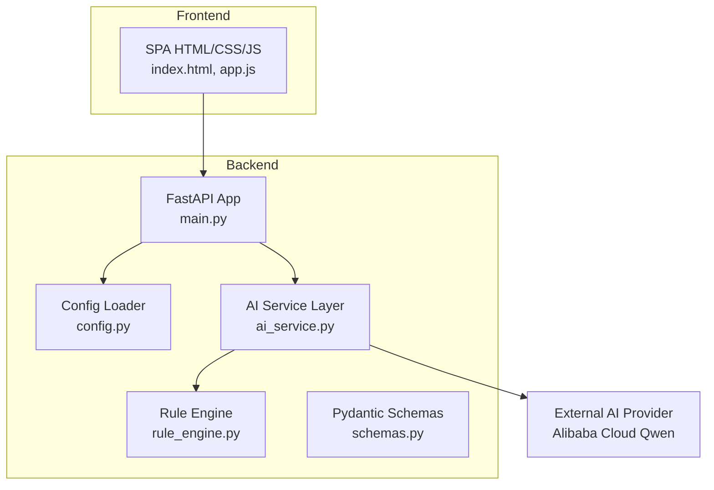
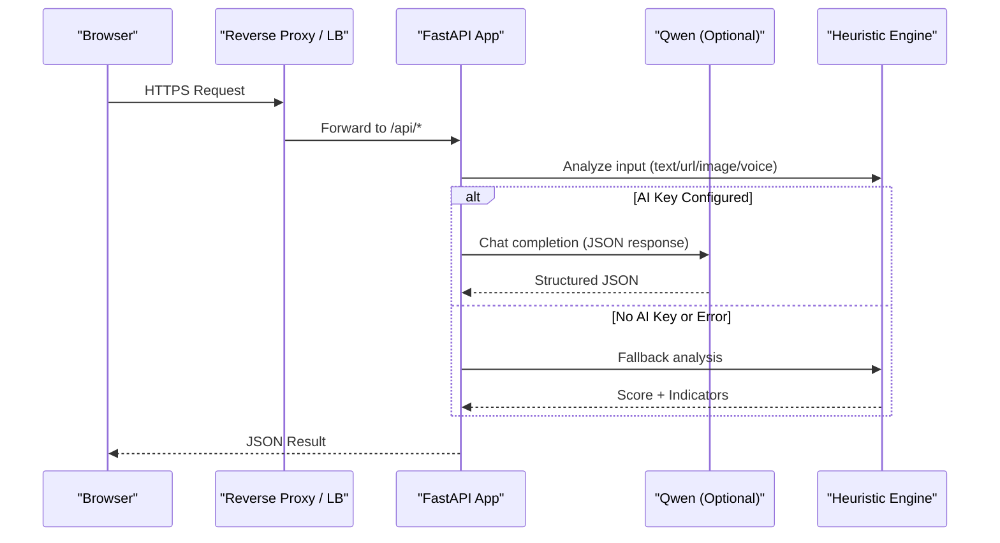
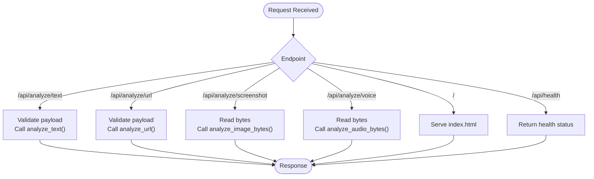
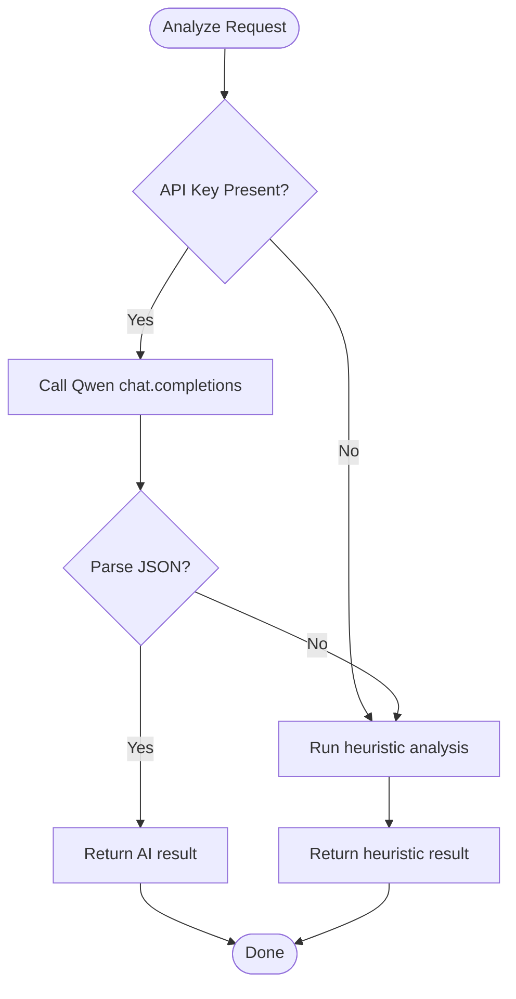
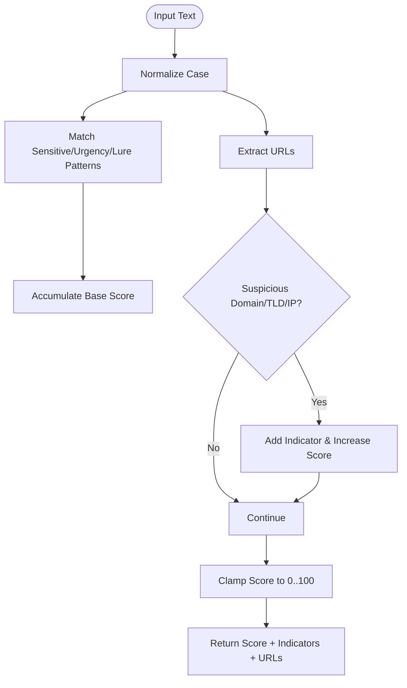
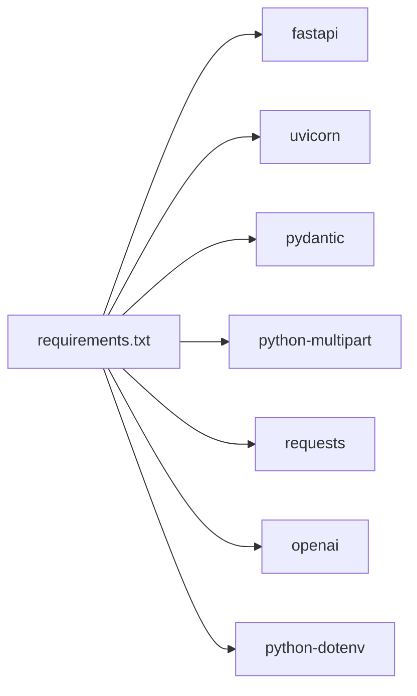

# Deployment Guide

<cite>
**Referenced Files in This Document**
- [README.md](file://README.md)
- [requirements.txt](file://backend/requirements.txt)
- [main.py](file://backend/app/main.py)
- [config.py](file://backend/app/config.py)
- [ai_service.py](file://backend/app/ai_service.py)
- [rule_engine.py](file://backend/app/rule_engine.py)
- [schemas.py](file://backend/app/schemas.py)
- [index.html](file://frontend/index.html)
- [app.js](file://frontend/app.js)
</cite>

## Table of Contents
1. [Introduction](#introduction)
2. [Project Structure](#project-structure)
3. [Core Components](#core-components)
4. [Architecture Overview](#architecture-overview)
5. [Detailed Component Analysis](#detailed-component-analysis)
6. [Dependency Analysis](#dependency-analysis)
7. [Performance Considerations](#performance-considerations)
8. [Troubleshooting Guide](#troubleshooting-guide)
9. [Conclusion](#conclusion)
10. [Appendices](#appendices)

## Introduction
This guide provides production-ready deployment strategies for ScamShield AI, covering local development, containerized deployment with Docker, and cloud platform deployment. It explains environment setup, dependency management, configuration, performance optimization, monitoring and logging, health checks, alerting, backup and recovery, disaster recovery planning, maintenance tasks, security hardening, firewall configuration, access control, and troubleshooting for high-traffic scenarios.

ScamShield AI is a multimodal scam detection platform that analyzes text, URLs, screenshots, and voice recordings using heuristic rules and an optional Alibaba Cloud Qwen LLM via an OpenAI-compatible client. The backend is built with FastAPI and Uvicorn; the frontend is a static SPA served by the backend.

## Project Structure
The application consists of:
- Backend API (FastAPI + Uvicorn) under backend/app
- Static frontend assets under frontend
- Requirements and configuration files at the project root and backend directories

**Diagram sources**
- [main.py:21-83](file://backend/app/main.py#L21-L83)
- [config.py:1-12](file://backend/app/config.py#L1-L12)
- [ai_service.py:9-16](file://backend/app/ai_service.py#L9-L16)
- [rule_engine.py:37-112](file://backend/app/rule_engine.py#L37-L112)
- [schemas.py:1-26](file://backend/app/schemas.py#L1-L26)
- [index.html:1-212](file://frontend/index.html#L1-L212)
- [app.js:138-235](file://frontend/app.js#L138-L235)

**Section sources**
- [README.md:17-60](file://README.md#L17-L60)
- [requirements.txt:1-8](file://backend/requirements.txt#L1-L8)
- [main.py:21-83](file://backend/app/main.py#L21-L83)

## Core Components
- API Server: FastAPI application exposing analysis endpoints and serving the frontend.
- Configuration: Environment-driven settings for AI provider and server binding.
- AI Service: Orchestrates calls to Alibaba Cloud Qwen when configured; otherwise falls back to heuristic analysis.
- Rule Engine: Heuristic-based scoring and indicator extraction for text and URLs.
- Data Models: Pydantic schemas defining request/response contracts.
- Frontend: Static SPA that calls backend APIs and renders results.

Key responsibilities:
- Input validation and routing (main.py)
- Environment configuration loading (config.py)
- AI integration and fallback logic (ai_service.py)
- Deterministic rule-based analysis (rule_engine.py)
- Strong typing and schema enforcement (schemas.py)
- User interaction and API consumption (index.html, app.js)

**Section sources**
- [main.py:21-83](file://backend/app/main.py#L21-L83)
- [config.py:1-12](file://backend/app/config.py#L1-L12)
- [ai_service.py:9-16](file://backend/app/ai_service.py#L9-L16)
- [rule_engine.py:37-112](file://backend/app/rule_engine.py#L37-L112)
- [schemas.py:1-26](file://backend/app/schemas.py#L1-L26)
- [index.html:1-212](file://frontend/index.html#L1-L212)
- [app.js:138-235](file://frontend/app.js#L138-L235)

## Architecture Overview
The runtime architecture comprises:
- A reverse proxy or load balancer (recommended in production) terminating TLS and routing traffic to one or more backend instances.
- One or more FastAPI workers behind Uvicorn, bound to a host/port from environment variables.
- Optional external AI provider (Alibaba Cloud Qwen) accessed via an OpenAI-compatible client; if not configured, the system uses deterministic heuristics.
- Static frontend served directly by the backend for simplicity.

**Diagram sources**
- [main.py:36-68](file://backend/app/main.py#L36-L68)
- [ai_service.py:9-16](file://backend/app/ai_service.py#L9-L16)
- [ai_service.py:124-154](file://backend/app/ai_service.py#L124-L154)
- [rule_engine.py:37-112](file://backend/app/rule_engine.py#L37-L112)

## Detailed Component Analysis

### API Endpoints and Routing
- Health check endpoint for readiness/liveness probes.
- Text analysis endpoint accepting JSON payloads.
- URL analysis endpoint accepting JSON payloads.
- Screenshot upload endpoint for image analysis.
- Voice upload endpoint for audio analysis.
- Static file serving for the SPA.

**Diagram sources**
- [main.py:36-83](file://backend/app/main.py#L36-L83)

**Section sources**
- [main.py:36-83](file://backend/app/main.py#L36-L83)

### Configuration Management
- Loads environment variables for AI provider credentials and base URL.
- Exposes model names for text and vision models.
- Defines server host and port defaults.

Production recommendations:
- Use environment variables or a secrets manager to provide:
  - DASHSCOPE_API_KEY
  - DASHSCOPE_BASE_URL
  - QWEN_MODEL_NAME
  - QWEN_VL_MODEL_NAME
  - PORT
  - HOST
- Pin versions in requirements and use a lockfile for reproducibility.

**Section sources**
- [config.py:1-12](file://backend/app/config.py#L1-L12)
- [README.md:44-53](file://README.md#L44-L53)

### AI Service and Fallback Logic
- Creates an OpenAI-compatible client only when a valid API key is present.
- Performs heuristic pre-scan and augments prompts with signals.
- Parses structured JSON responses from the AI provider.
- Falls back to deterministic heuristic analysis on missing keys or errors.

**Diagram sources**
- [ai_service.py:9-16](file://backend/app/ai_service.py#L9-L16)
- [ai_service.py:124-154](file://backend/app/ai_service.py#L124-L154)
- [ai_service.py:156-176](file://backend/app/ai_service.py#L156-L176)
- [ai_service.py:178-219](file://backend/app/ai_service.py#L178-L219)

**Section sources**
- [ai_service.py:9-16](file://backend/app/ai_service.py#L9-L16)
- [ai_service.py:124-154](file://backend/app/ai_service.py#L124-L154)
- [ai_service.py:156-176](file://backend/app/ai_service.py#L156-L176)
- [ai_service.py:178-219](file://backend/app/ai_service.py#L178-L219)

### Heuristic Rule Engine
- Detects sensitive data requests, urgency/fear tactics, unrealistic lures.
- Extracts URLs and flags suspicious shorteners, TLDs, and direct IP hosts.
- Computes a risk score and returns categorized indicators.

**Diagram sources**
- [rule_engine.py:37-112](file://backend/app/rule_engine.py#L37-L112)

**Section sources**
- [rule_engine.py:37-112](file://backend/app/rule_engine.py#L37-L112)

### Data Contracts
- Pydantic models enforce request and response shapes, ensuring consistent API behavior and clear error messages on invalid inputs.

**Section sources**
- [schemas.py:1-26](file://backend/app/schemas.py#L1-L26)

### Frontend Integration
- SPA tabs for text, screenshot, URL, and voice inputs.
- Calls backend endpoints and renders results including risk gauge, indicators, explanations, and recommended actions.

**Section sources**
- [index.html:1-212](file://frontend/index.html#L1-L212)
- [app.js:138-235](file://frontend/app.js#L138-L235)

## Dependency Analysis
Runtime dependencies include:
- FastAPI and Uvicorn for HTTP serving and ASGI runtime.
- Pydantic for data validation.
- python-multipart for file uploads.
- requests and openai for external AI calls.
- python-dotenv for environment variable loading.

**Diagram sources**
- [requirements.txt:1-8](file://backend/requirements.txt#L1-L8)

**Section sources**
- [requirements.txt:1-8](file://backend/requirements.txt#L1-L8)

## Performance Considerations
- Concurrency and Workers:
  - Run multiple Uvicorn worker processes behind a reverse proxy to utilize CPU cores and handle concurrent requests.
  - Tune worker count based on available CPU resources and request patterns.
- Request Size Limits:
  - Configure maximum upload sizes for images and audio at the reverse proxy and application level to prevent resource exhaustion.
- Caching Strategy:
  - Cache repeated analyses (e.g., identical text or URL hashes) to reduce redundant AI calls and rule computations.
  - Use an in-memory cache for low-latency hits and a persistent store for cross-process sharing if needed.
- External AI Provider:
  - Implement retries with exponential backoff and timeouts for AI calls.
  - Rate-limit outbound requests to avoid throttling and ensure graceful degradation.
- Resource Scaling:
  - Horizontal scaling: run multiple replicas behind a load balancer.
  - Vertical scaling: increase memory and CPU for larger payloads and higher throughput.
- Static Assets:
  - Serve the frontend via a CDN or reverse proxy with caching headers to reduce backend load.

[No sources needed since this section provides general guidance]

## Troubleshooting Guide
Common issues and resolutions:
- Missing or invalid AI API key:
  - Symptom: All AI calls fail; system falls back to heuristic mode.
  - Action: Verify environment variables for API key and base URL; ensure network access to the provider.
- Empty or malformed inputs:
  - Symptom: 400 errors for empty text/URL/file fields.
  - Action: Validate inputs at the client side and retry with correct payloads.
- CORS errors:
  - Symptom: Browser blocks requests from different origins.
  - Action: Ensure CORS middleware allows your frontend origin; restrict to specific domains in production.
- File upload failures:
  - Symptom: Errors reading uploaded files or size limits exceeded.
  - Action: Adjust reverse proxy and application limits; verify supported formats.
- High latency or timeouts:
  - Symptom: Slow responses during peak traffic.
  - Action: Scale horizontally, add caching, tune worker counts, and set appropriate timeouts.

**Section sources**
- [main.py:36-68](file://backend/app/main.py#L36-L68)
- [ai_service.py:9-16](file://backend/app/ai_service.py#L9-L16)
- [ai_service.py:124-154](file://backend/app/ai_service.py#L124-L154)

## Conclusion
ScamShield AI can be deployed locally, containerized, or on cloud platforms with robust configuration and operational practices. By leveraging environment-driven configuration, resilient AI fallbacks, and scalable deployment patterns, you can deliver reliable scam detection services. Apply the performance, security, and monitoring recommendations in this guide to ensure production readiness and maintainability.

[No sources needed since this section summarizes without analyzing specific files]

## Appendices

### Local Development Deployment
- Prerequisites: Python 3.10+ and pip.
- Steps:
  - Create and activate a virtual environment.
  - Install dependencies from requirements.
  - Set environment variables for AI provider (optional).
  - Run the application with Uvicorn in development mode.
- Access the UI at the default host and port.

**Section sources**
- [README.md:26-60](file://README.md#L26-L60)
- [requirements.txt:1-8](file://backend/requirements.txt#L1-L8)
- [main.py:81-83](file://backend/app/main.py#L81-L83)

### Containerized Deployment with Docker
- Build a minimal Python image with pinned dependencies.
- Copy application code and set environment variables for production.
- Expose the configured port and run Uvicorn with multiple workers.
- Mount volumes for logs and persistent caches if needed.
- Use orchestration tools (e.g., Kubernetes) for scaling and self-healing.

[No sources needed since this section provides general guidance]

### Cloud Platform Deployment
- Options:
  - Managed containers (e.g., Kubernetes, ECS, Cloud Run).
  - Serverless functions for stateless API endpoints with separate static hosting for the frontend.
- Configuration:
  - Provide secrets via secure secret managers.
  - Configure domain names, TLS termination, and rate limiting at the platform layer.
- Monitoring:
  - Enable structured logging and metrics export.
  - Integrate with centralized log aggregation and alerting systems.

[No sources needed since this section provides general guidance]

### Environment Setup and Configuration
- Required environment variables:
  - DASHSCOPE_API_KEY: API key for Alibaba Cloud Qwen.
  - DASHSCOPE_BASE_URL: Base URL for the OpenAI-compatible endpoint.
  - QWEN_MODEL_NAME: Model name for text analysis.
  - QWEN_VL_MODEL_NAME: Model name for vision analysis.
  - PORT: Application listening port.
  - HOST: Bind address for the server.
- Best practices:
  - Use environment-specific configuration files or secret stores.
  - Avoid committing secrets to version control.

**Section sources**
- [config.py:1-12](file://backend/app/config.py#L1-L12)
- [README.md:44-53](file://README.md#L44-L53)

### Security Hardening
- Network Security:
  - Terminate TLS at the reverse proxy or load balancer.
  - Restrict inbound ports to necessary services.
  - Use firewalls to limit access to management interfaces.
- Application Security:
  - Validate and sanitize all inputs.
  - Limit file upload sizes and types.
  - Disable debug features and verbose error messages in production.
- Access Control:
  - Enforce authentication and authorization for administrative endpoints.
  - Use least privilege principles for service accounts and secrets.
- Secrets Management:
  - Store API keys and tokens in secure vaults or secret managers.
  - Rotate credentials regularly.

[No sources needed since this section provides general guidance]

### Monitoring and Logging
- Health Checks:
  - Expose a health endpoint for readiness and liveness probes.
- Metrics:
  - Track request rates, latency percentiles, error rates, and resource utilization.
- Logging:
  - Emit structured logs with correlation IDs for tracing requests.
  - Centralize logs for analysis and alerting.
- Alerting:
  - Define alerts for high error rates, latency spikes, and resource saturation.

**Section sources**
- [main.py:36-42](file://backend/app/main.py#L36-L42)

### Backup and Recovery
- Backups:
  - If using persistent storage for caches or logs, schedule regular backups.
  - Version configuration and environment definitions.
- Recovery:
  - Maintain runbooks for restoring services from backups.
  - Test recovery procedures periodically.

[No sources needed since this section provides general guidance]

### Disaster Recovery Planning
- Multi-region deployments for critical services.
- Automated failover and rollback strategies.
- Documented incident response procedures.

[No sources needed since this section provides general guidance]

### Maintenance Tasks
- Update dependencies regularly and test upgrades in staging.
- Monitor deprecations and security advisories.
- Review and optimize configurations based on usage patterns.

[No sources needed since this section provides general guidance]

### High-Traffic Optimization Tips
- Horizontal scaling with auto-scaling policies.
- Efficient caching of repeated analyses.
- Timeouts and circuit breakers for external AI calls.
- CDN for static assets and reduced origin load.

[No sources needed since this section provides general guidance]