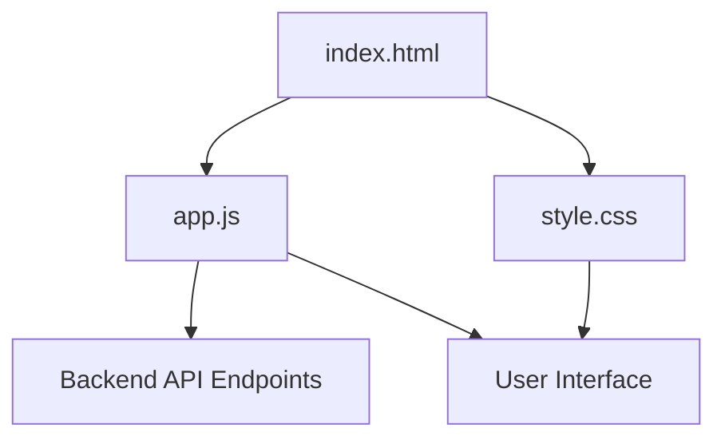
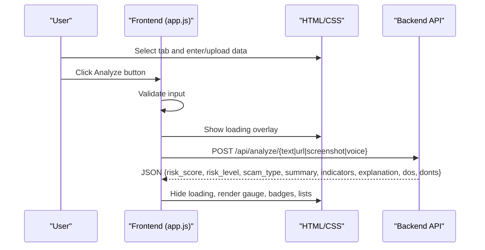
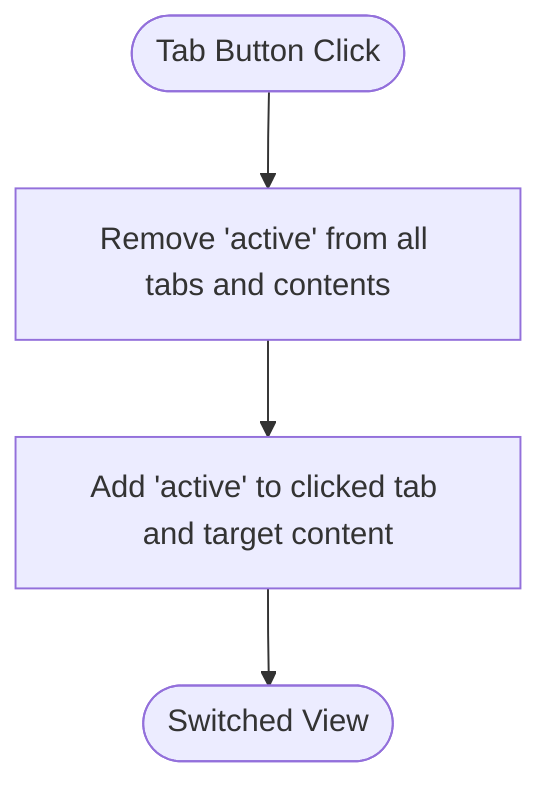
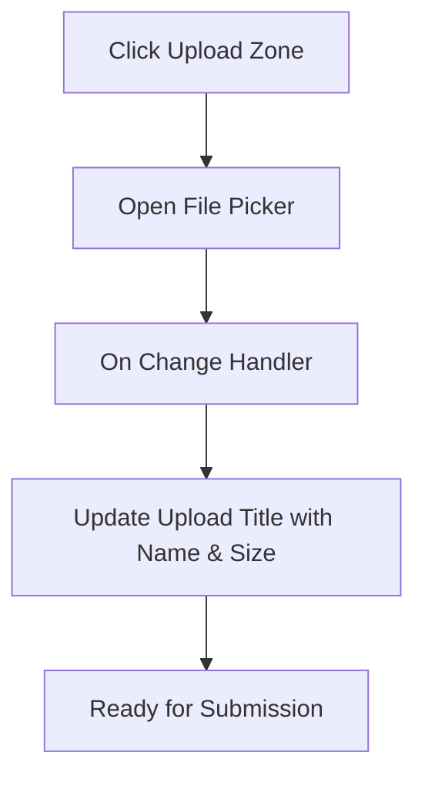
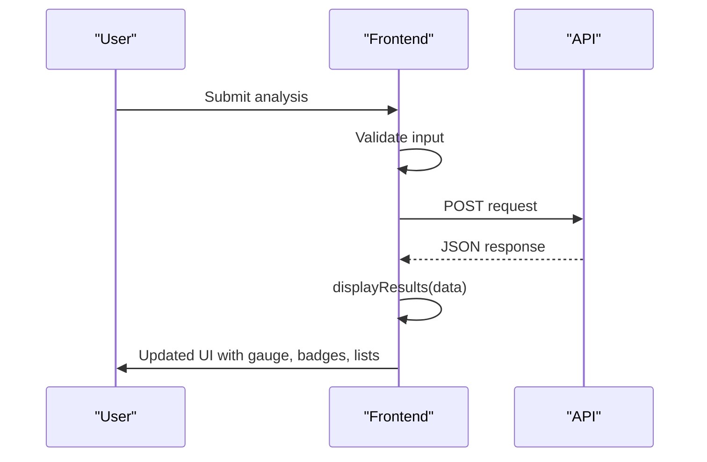
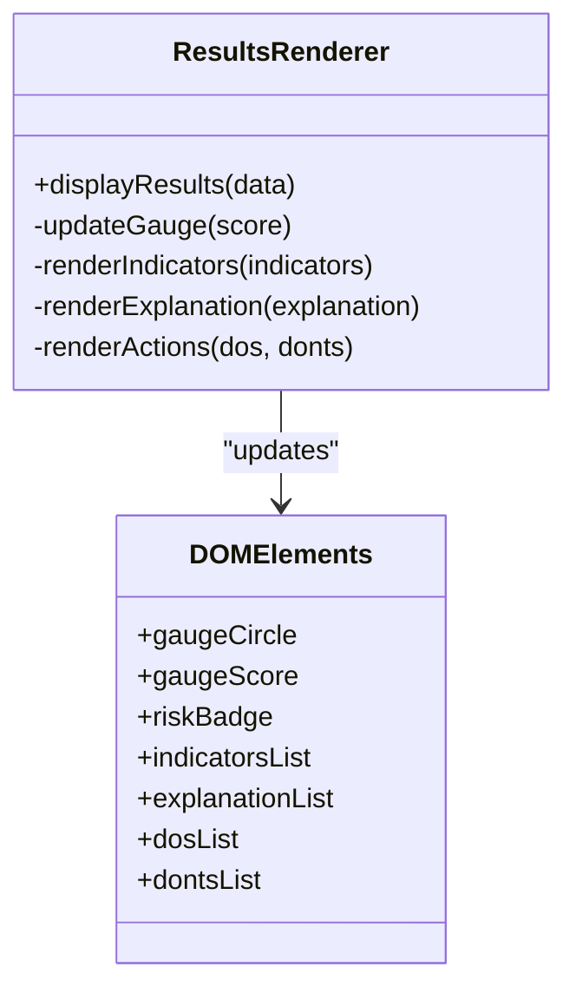
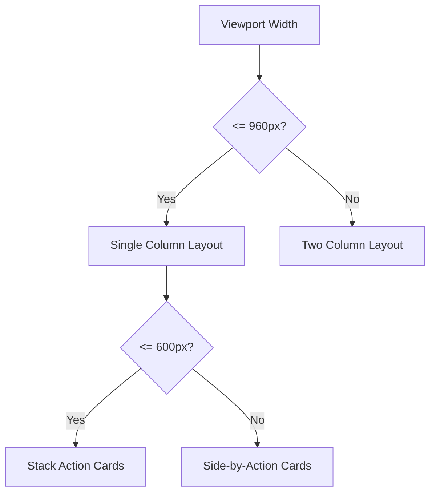
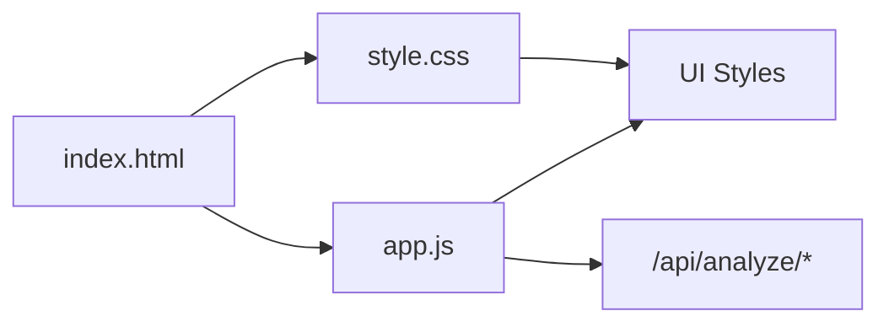

# Frontend Application

<cite>
**Referenced Files in This Document**
- [index.html](file://frontend/index.html)
- [app.js](file://frontend/app.js)
- [style.css](file://frontend/style.css)
- [README.md](file://README.md)
</cite>

## Table of Contents
1. [Introduction](#introduction)
2. [Project Structure](#project-structure)
3. [Core Components](#core-components)
4. [Architecture Overview](#architecture-overview)
5. [Detailed Component Analysis](#detailed-component-analysis)
6. [Dependency Analysis](#dependency-analysis)
7. [Performance Considerations](#performance-considerations)
8. [Troubleshooting Guide](#troubleshooting-guide)
9. [Conclusion](#conclusion)
10. [Appendices](#appendices)

## Introduction
This document describes the frontend application for ScamShield AI, a responsive single-page interface that enables users to submit text, screenshots, URLs, and voice recordings for threat analysis. It explains the tabbed input experience, client-side JavaScript logic for validation and API communication, dynamic result visualization (risk gauge, indicator chips, recommendations), and the responsive CSS design. It also covers user experience considerations such as loading states, error handling, accessibility, customization guidance, browser compatibility, and performance techniques used in the implementation.

## Project Structure
The frontend consists of three primary files:
- index.html: Defines the page layout, tabs, inputs, and result sections.
- app.js: Implements tab switching, file selection feedback, UI state management, form validation, API calls, and dynamic result rendering.
- style.css: Provides a modern dark theme, responsive grid layout, card components, tabs, upload zones, buttons, and result visualizations.

**Diagram sources**
- [index.html:1-212](file://frontend/index.html#L1-L212)
- [app.js:1-236](file://frontend/app.js#L1-L236)
- [style.css:1-630](file://frontend/style.css#L1-L630)

**Section sources**
- [index.html:1-212](file://frontend/index.html#L1-L212)
- [app.js:1-236](file://frontend/app.js#L1-L236)
- [style.css:1-630](file://frontend/style.css#L1-L630)

## Core Components
- Tabbed Input Interface: Four modes—Text/SMS, Screenshot, URL/Link, Voice Audio—switched via tab buttons with active state management.
- File Upload Zones: Click-to-upload areas for images and audio with file selection feedback.
- Results Panel: Displays risk score gauge, risk badge, scam type title, summary, extracted content preview, detected indicators, explanation list, and recommended actions (Do’s and Don’ts).
- Client-Side Logic: Form validation, loading overlay toggling, API requests, and dynamic DOM updates based on backend responses.
- Responsive Styling: CSS Grid layout adapts from two columns to single column on smaller screens; consistent spacing, typography, and color system.

**Section sources**
- [index.html:42-200](file://frontend/index.html#L42-L200)
- [app.js:1-136](file://frontend/app.js#L1-L136)
- [style.css:160-245](file://frontend/style.css#L160-L245)

## Architecture Overview
The frontend is a vanilla JavaScript SPA that communicates with backend endpoints for each input type. The flow includes:
- User selects an input mode and provides data or uploads a file.
- Client validates input and shows a loading overlay.
- Client sends HTTP requests to appropriate endpoints.
- Backend returns structured results including risk score, level, type, summary, indicators, explanations, and recommendations.
- Client renders results into the right panel with dynamic styling and lists.

**Diagram sources**
- [app.js:139-235](file://frontend/app.js#L139-L235)
- [index.html:124-199](file://frontend/index.html#L124-L199)

## Detailed Component Analysis

### Tabbed Input Interface
- Tabs are implemented with buttons that toggle active classes on both the tab button and corresponding content panels.
- Each tab contains specific input controls:
  - Text: textarea with preset demo buttons.
  - Screenshot: drag/click upload zone with hidden file input.
  - URL: text field for link inspection.
  - Voice: upload zone for audio files.

**Diagram sources**
- [app.js:1-11](file://frontend/app.js#L1-L11)
- [index.html:52-65](file://frontend/index.html#L52-L65)

**Section sources**
- [app.js:1-11](file://frontend/app.js#L1-L11)
- [index.html:52-121](file://frontend/index.html#L52-L121)

### File Upload Handling
- Image and voice files are selected via hidden inputs triggered by clicking upload zones.
- Selected files update the upload titles to show file name and size for user feedback.
- Validation ensures a file is selected before submission.

**Diagram sources**
- [index.html:88-121](file://frontend/index.html#L88-L121)
- [app.js:28-46](file://frontend/app.js#L28-L46)

**Section sources**
- [index.html:88-121](file://frontend/index.html#L88-L121)
- [app.js:28-46](file://frontend/app.js#L28-L46)

### API Communication and Result Rendering
- Text and URL submissions send JSON payloads to dedicated endpoints.
- Screenshot and voice submissions use FormData to upload files.
- Loading overlay is shown during processing and hidden after completion or error.
- Results are rendered into:
  - Risk gauge circle with score and color-coded border/shadow.
  - Risk badge with level-based colors.
  - Extracted content box when applicable.
  - Indicator chips with severity classes.
  - Explanation list items.
  - Do’s and Don’ts action cards.

**Diagram sources**
- [app.js:139-235](file://frontend/app.js#L139-L235)
- [index.html:144-199](file://frontend/index.html#L144-L199)

**Section sources**
- [app.js:48-136](file://frontend/app.js#L48-L136)
- [app.js:139-235](file://frontend/app.js#L139-L235)
- [index.html:124-199](file://frontend/index.html#L124-L199)

### Dynamic Result Visualization
- Risk Gauge: Updates score and applies color based on thresholds.
- Risk Badge: Shows level and uses color coding.
- Indicators: Dynamically created chips with severity classes.
- Explanation: List of reasons why the content is dangerous.
- Recommendations: Two-column grid for Do’s and Don’ts.

**Diagram sources**
- [app.js:54-136](file://frontend/app.js#L54-L136)
- [index.html:144-199](file://frontend/index.html#L144-L199)

**Section sources**
- [app.js:54-136](file://frontend/app.js#L54-L136)
- [index.html:144-199](file://frontend/index.html#L144-L199)

### Responsive CSS Styling
- Uses CSS variables for consistent theming.
- Grid layout switches from two columns to one at a breakpoint.
- Cards, tabs, upload zones, and buttons have hover/focus states for interactivity.
- Loading overlay uses backdrop blur and spinner animation.
- Action cards adapt to single column on small screens.

**Diagram sources**
- [style.css:160-172](file://frontend/style.css#L160-L172)
- [style.css:550-561](file://frontend/style.css#L550-L561)

**Section sources**
- [style.css:1-630](file://frontend/style.css#L1-L630)

## Dependency Analysis
- index.html depends on style.css and app.js for presentation and behavior.
- app.js manipulates DOM elements defined in index.html and triggers network requests to backend endpoints.
- style.css defines the visual structure and responsive behavior referenced by HTML classes.

**Diagram sources**
- [index.html:1-212](file://frontend/index.html#L1-L212)
- [app.js:1-236](file://frontend/app.js#L1-L236)
- [style.css:1-630](file://frontend/style.css#L1-L630)

**Section sources**
- [index.html:1-212](file://frontend/index.html#L1-L212)
- [app.js:1-236](file://frontend/app.js#L1-L236)
- [style.css:1-630](file://frontend/style.css#L1-L630)

## Performance Considerations
- Minimal dependencies: Vanilla JavaScript and CSS ensure fast load times and low overhead.
- Efficient DOM updates: Results are rendered by clearing and rebuilding lists rather than heavy reflows.
- CSS animations: Lightweight spinner and transitions avoid expensive effects.
- Network requests: Use fetch with JSON and FormData for efficient payload handling.
- Accessibility: Semantic HTML elements and focus styles improve keyboard navigation and screen reader support.

[No sources needed since this section provides general guidance]

## Troubleshooting Guide
Common issues and resolutions:
- Empty input errors: Ensure text or URL fields are not blank before submission; alerts guide users to correct inputs.
- Missing file selection: For screenshot and voice tabs, verify a file is selected; alerts prompt selection.
- API connectivity errors: Network failures trigger console logging and user alerts; check backend availability and CORS if applicable.
- Loading state stuck: Verify that showLoading(false) executes in finally blocks; confirm no unhandled exceptions prevent hiding the loader.
- Result rendering mismatches: Confirm backend response includes expected fields (risk_score, risk_level, scam_type, summary, indicators, explanation, recommended_dos, recommended_donts).

**Section sources**
- [app.js:139-235](file://frontend/app.js#L139-L235)

## Conclusion
ScamShield AI’s frontend delivers a clean, accessible, and responsive single-page interface for multimodal threat analysis. It combines intuitive tabbed inputs, robust client-side validation, clear loading states, and dynamic result visualization to guide users effectively. The modular structure supports easy customization and extension of new input types and UI components while maintaining performance and cross-device usability.

[No sources needed since this section summarizes without analyzing specific files]

## Appendices

### Customization Guidance
- Add a new input type:
  - Create a new tab button and corresponding content panel in index.html.
  - Implement handlers in app.js for file selection feedback and submission.
  - Define a new endpoint path and fetch call similar to existing ones.
  - Extend displayResults to handle any new fields returned by the backend.
- Customize UI components:
  - Modify CSS variables in style.css to adjust colors, fonts, and spacing.
  - Adjust breakpoints for responsiveness by editing media queries.
  - Enhance accessibility by adding aria attributes and ensuring focus management.

**Section sources**
- [index.html:52-121](file://frontend/index.html#L52-L121)
- [app.js:139-235](file://frontend/app.js#L139-L235)
- [style.css:1-630](file://frontend/style.css#L1-L630)

### Browser Compatibility
- Modern browsers supporting ES6+ features (fetch, async/await) and CSS Grid are required.
- Focus states and semantic HTML improve compatibility across assistive technologies.
- Avoid vendor-specific prefixes; rely on standard properties used throughout the stylesheet.

[No sources needed since this section provides general guidance]