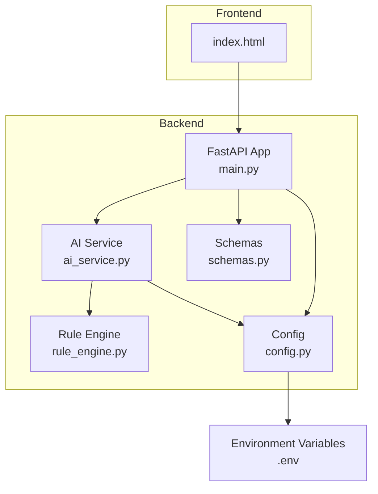
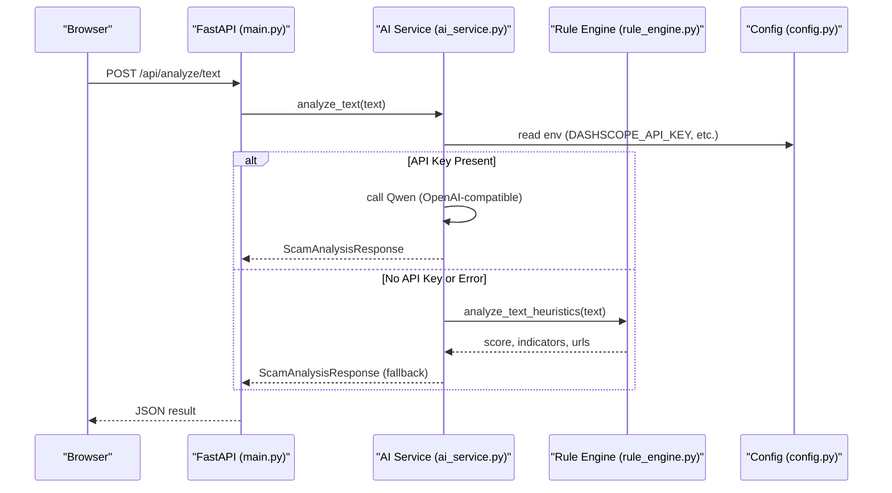
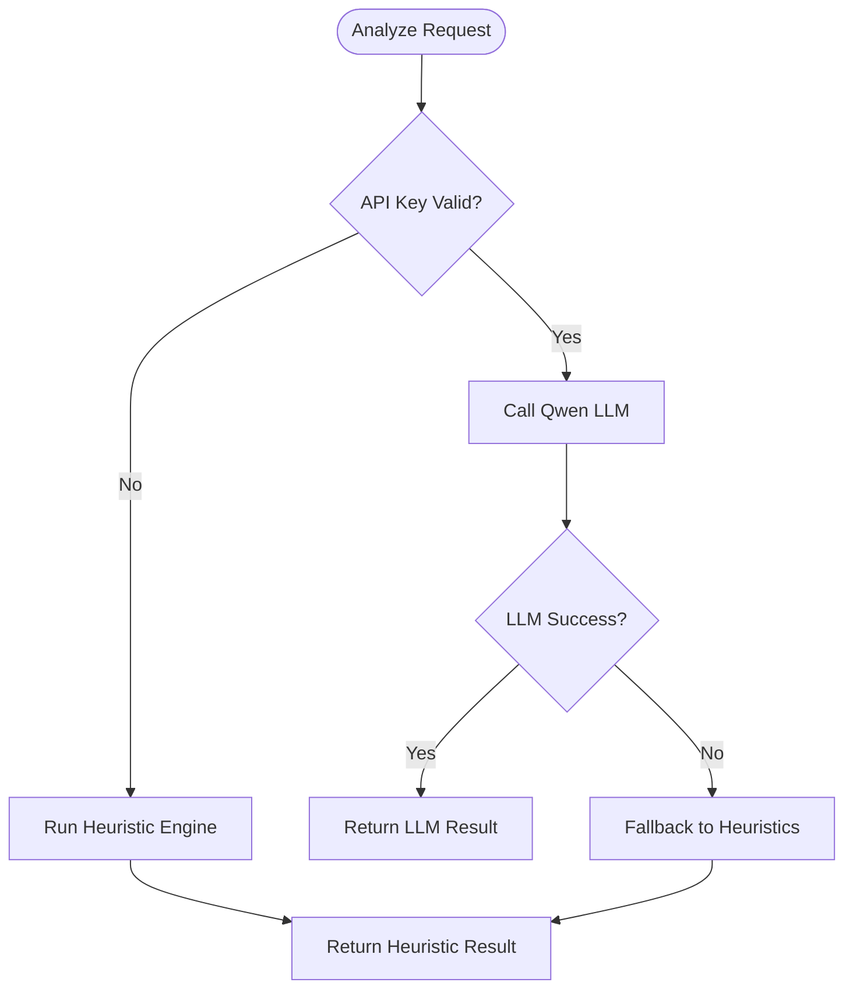

# Getting Started

<cite>
**Referenced Files in This Document**
- [README.md](file://README.md)
- [requirements.txt](file://backend/requirements.txt)
- [main.py](file://backend/app/main.py)
- [config.py](file://backend/app/config.py)
- [ai_service.py](file://backend/app/ai_service.py)
- [rule_engine.py](file://backend/app/rule_engine.py)
- [schemas.py](file://backend/app/schemas.py)
- [index.html](file://frontend/index.html)
</cite>

## Table of Contents
1. Introduction
2. Project Structure
3. Core Components
4. Architecture Overview
5. Detailed Component Analysis
6. Dependency Analysis
7. Performance Considerations
8. Troubleshooting Guide
9. Conclusion
10. Appendices

## Introduction
ScamShield AI is a multimodal scam detection platform that analyzes text, URLs, screenshots, and voice recordings to identify phishing, impersonation, investment scams, and other fraud tactics. It combines rule-based heuristics with optional Alibaba Cloud Qwen LLM reasoning to provide explainable results and actionable guidance. The application includes a responsive web interface served by a FastAPI backend.

## Project Structure
The project consists of:
- Backend (FastAPI + Uvicorn): API endpoints, configuration, AI service integration, and heuristic engine
- Frontend: Static HTML/CSS/JS dashboard mounted under /static
- Configuration via environment variables for API keys and server settings

**Diagram sources**
- [main.py:21-83](file://backend/app/main.py#L21-L83)
- [ai_service.py:9-16](file://backend/app/ai_service.py#L9-L16)
- [rule_engine.py:37-112](file://backend/app/rule_engine.py#L37-L112)
- [config.py:1-12](file://backend/app/config.py#L1-L12)
- [schemas.py:1-26](file://backend/app/schemas.py#L1-L26)
- [index.html:1-212](file://frontend/index.html#L1-L212)

**Section sources**
- [README.md:17-21](file://README.md#L17-L21)
- [main.py:21-83](file://backend/app/main.py#L21-L83)
- [index.html:1-212](file://frontend/index.html#L1-L212)

## Core Components
- FastAPI application: Defines REST endpoints for text, URL, screenshot, and voice analysis; serves the frontend static files; enables CORS.
- AI service: Orchestrates calls to Alibaba Cloud Qwen (OpenAI-compatible client) when an API key is configured; otherwise uses smart heuristic fallback mode.
- Rule engine: Applies regex-based heuristics to detect sensitive data requests, urgency/fear tactics, unrealistic lures, suspicious domains/TLDs, and direct IP hosts.
- Configuration: Loads environment variables for API keys, model names, base URL, host, and port.
- Schemas: Pydantic models defining request/response contracts.

Key responsibilities:
- Input validation and routing (main.py)
- Heuristic scoring and indicator extraction (rule_engine.py)
- Optional LLM-powered analysis with robust fallback (ai_service.py)
- Environment-driven configuration (config.py)
- Data contracts (schemas.py)

**Section sources**
- [main.py:36-68](file://backend/app/main.py#L36-L68)
- [ai_service.py:50-122](file://backend/app/ai_service.py#L50-L122)
- [rule_engine.py:37-112](file://backend/app/rule_engine.py#L37-L112)
- [config.py:1-12](file://backend/app/config.py#L1-L12)
- [schemas.py:1-26](file://backend/app/schemas.py#L1-L26)

## Architecture Overview
The system routes user inputs through FastAPI endpoints to the AI service. If an Alibaba Cloud DashScope API key is present, the service attempts LLM-based analysis; otherwise it falls back to heuristic-only analysis. Results are returned as structured JSON and rendered by the frontend.

**Diagram sources**
- [main.py:44-48](file://backend/app/main.py#L44-L48)
- [ai_service.py:9-16](file://backend/app/ai_service.py#L9-L16)
- [ai_service.py:124-154](file://backend/app/ai_service.py#L124-L154)
- [rule_engine.py:37-112](file://backend/app/rule_engine.py#L37-L112)
- [config.py:1-12](file://backend/app/config.py#L1-L12)

## Detailed Component Analysis

### Prerequisites and Virtual Environment Setup
- Python version: 3.10+
- Create and activate a virtual environment
- Install dependencies from requirements.txt

Steps:
1. Create a virtual environment using your Python interpreter.
2. Activate the virtual environment appropriate for your OS.
3. Install packages listed in requirements.txt.

Verification:
- Confirm Python version meets the minimum requirement.
- Ensure all required packages are installed without errors.

**Section sources**
- [README.md:26-42](file://README.md#L26-L42)
- [requirements.txt:1-8](file://backend/requirements.txt#L1-L8)

### Optional API Key Setup (Alibaba Cloud DashScope)
- The application supports optional integration with Alibaba Cloud Model Studio (DashScope) using an OpenAI-compatible client.
- Provide the API key via environment variable. If missing or invalid, the app automatically runs in smart heuristic fallback mode for offline testing.

Configuration options:
- DASHSCOPE_API_KEY: Your DashScope API key
- DASHSCOPE_BASE_URL: Base URL for the compatible endpoint
- QWEN_MODEL_NAME: Text model name
- QWEN_VL_MODEL_NAME: Vision-language model name
- PORT: Server port (default 8000)
- HOST: Bind address (default 0.0.0.0)

Behavior:
- When no valid API key is set, get_ai_client returns None and the system uses heuristic-only analysis.
- When a valid API key is set, the service attempts LLM-based analysis and falls back to heuristics on any error.

**Section sources**
- [config.py:1-12](file://backend/app/config.py#L1-L12)
- [ai_service.py:9-16](file://backend/app/ai_service.py#L9-L16)
- [ai_service.py:124-154](file://backend/app/ai_service.py#L124-L154)

### Running the Application
Start the server with Uvicorn and access the web interface:

- Command: Run the FastAPI app with Uvicorn, enabling auto-reload and binding to port 8000.
- Web UI: Open http://localhost:8000 in your browser.

Notes:
- The backend mounts the frontend directory under /static and serves index.html at /.
- CORS is enabled to allow local development from various origins.

**Section sources**
- [README.md:55-60](file://README.md#L55-L60)
- [main.py:27-34](file://backend/app/main.py#L27-L34)
- [main.py:70-79](file://backend/app/main.py#L70-L79)
- [main.py:81-83](file://backend/app/main.py#L81-L83)

### Smart Heuristic Fallback Mode (Offline Testing)
When no API key is configured, ScamShield AI still provides full functionality using heuristic analysis:

- Text analysis: Scores based on sensitive data requests, urgency/fear cues, unrealistic lures, and suspicious URLs/domains.
- URL analysis: Evaluates standalone URLs using the same heuristics.
- Image and voice uploads: Returns simulated OCR/transcription results with heuristic-based analysis for demonstration purposes.

This ensures you can test the entire workflow locally without external services.

**Diagram sources**
- [ai_service.py:9-16](file://backend/app/ai_service.py#L9-L16)
- [ai_service.py:50-122](file://backend/app/ai_service.py#L50-L122)
- [ai_service.py:124-154](file://backend/app/ai_service.py#L124-L154)
- [rule_engine.py:37-112](file://backend/app/rule_engine.py#L37-L112)

**Section sources**
- [ai_service.py:50-122](file://backend/app/ai_service.py#L50-L122)
- [ai_service.py:178-219](file://backend/app/ai_service.py#L178-L219)
- [rule_engine.py:37-112](file://backend/app/rule_engine.py#L37-L112)

### API Endpoints and Data Contracts
Endpoints:
- GET /api/health: Health check returning service status and version
- POST /api/analyze/text: Analyze text content
- POST /api/analyze/url: Analyze a URL
- POST /api/analyze/screenshot: Upload image for OCR and analysis
- POST /api/analyze/voice: Upload audio for vishing analysis

Request/Response schemas:
- TextAnalysisRequest: Contains text field
- URLAnalysisRequest: Contains url field
- ScamAnalysisResponse: Structured result including risk score, level, type, summary, indicators, explanations, and recommended actions

Validation:
- Empty inputs raise HTTP 400 errors with descriptive messages.

**Section sources**
- [main.py:36-68](file://backend/app/main.py#L36-L68)
- [schemas.py:1-26](file://backend/app/schemas.py#L1-L26)

### Frontend Integration
- The frontend is a single-page application served statically from the backend.
- It communicates with the backend endpoints to submit text, URLs, images, and audio, then displays risk scores, explanations, and action plans.
- The UI loads styles and scripts from /static.

**Section sources**
- [main.py:70-79](file://backend/app/main.py#L70-L79)
- [index.html:1-212](file://frontend/index.html#L1-L212)

## Dependency Analysis
Core runtime dependencies:
- fastapi: Web framework for building APIs
- uvicorn: ASGI server for running the application
- pydantic: Data validation and serialization
- python-multipart: File upload support
- requests: HTTP client (available for future integrations)
- openai: OpenAI-compatible client used to connect to DashScope
- python-dotenv: Environment variable loading

These are declared in requirements.txt and loaded into the virtual environment during setup.

**Section sources**
- [requirements.txt:1-8](file://backend/requirements.txt#L1-L8)

## Performance Considerations
- Heuristic analysis is lightweight and deterministic, suitable for high-throughput scenarios.
- LLM calls introduce latency and depend on network conditions; ensure timeouts and retries if integrating production-grade clients.
- For large file uploads (images/audio), consider size limits and streaming to avoid memory pressure.
- Use connection pooling and caching where applicable to reduce repeated computations.

[No sources needed since this section provides general guidance]

## Troubleshooting Guide
Common issues and resolutions:

- Python version mismatch
  - Symptom: Import errors or dependency conflicts
  - Resolution: Ensure Python 3.10+ is installed and used to create the virtual environment

- Dependencies not installed
  - Symptom: ModuleNotFoundError on startup
  - Resolution: Reinstall dependencies from requirements.txt inside the activated virtual environment

- Port already in use
  - Symptom: Binding error when starting Uvicorn
  - Resolution: Change the port via environment variable or command-line argument

- CORS errors in browser
  - Symptom: Blocked requests from localhost or dev servers
  - Resolution: Verify CORS middleware is enabled and origins are allowed

- Heuristic fallback always triggered
  - Symptom: No LLM-based analysis even though API key is set
  - Resolution: Ensure DASHSCOPE_API_KEY is correctly set and not a placeholder; verify base URL and model names

- File upload empty
  - Symptom: HTTP 400 error for screenshot/voice endpoints
  - Resolution: Confirm file is selected and non-empty before submission

- Frontend not loading
  - Symptom: Blank page or missing assets
  - Resolution: Confirm frontend directory exists and is mounted under /static; check browser console for 404s

Verification steps:
- Health check: Call GET /api/health and confirm healthy response
- Basic text analysis: Submit a known-safe message and verify low risk score
- Offline mode: Remove API key and confirm heuristic results are returned

**Section sources**
- [README.md:26-60](file://README.md#L26-L60)
- [main.py:36-68](file://backend/app/main.py#L36-L68)
- [config.py:1-12](file://backend/app/config.py#L1-L12)
- [ai_service.py:9-16](file://backend/app/ai_service.py#L9-L16)

## Conclusion
You can quickly set up ScamShield AI using Python 3.10+, a virtual environment, and the provided requirements. Configure an optional DashScope API key to enable LLM-powered analysis; otherwise, the application runs fully offline using smart heuristic fallback. Start the server with Uvicorn and access the web interface at http://localhost:8000 to begin analyzing text, URLs, screenshots, and voice recordings.

[No sources needed since this section summarizes without analyzing specific files]

## Appendices

### Quick Start Checklist
- Install Python 3.10+
- Create and activate a virtual environment
- Install dependencies from requirements.txt
- Optionally set DASHSCOPE_API_KEY and related environment variables
- Start the server with Uvicorn on port 8000
- Open http://localhost:8000 in your browser
- Verify health endpoint and run sample analyses

**Section sources**
- [README.md:26-60](file://README.md#L26-L60)
- [requirements.txt:1-8](file://backend/requirements.txt#L1-L8)
- [config.py:1-12](file://backend/app/config.py#L1-L12)
- [main.py:81-83](file://backend/app/main.py#L81-L83)