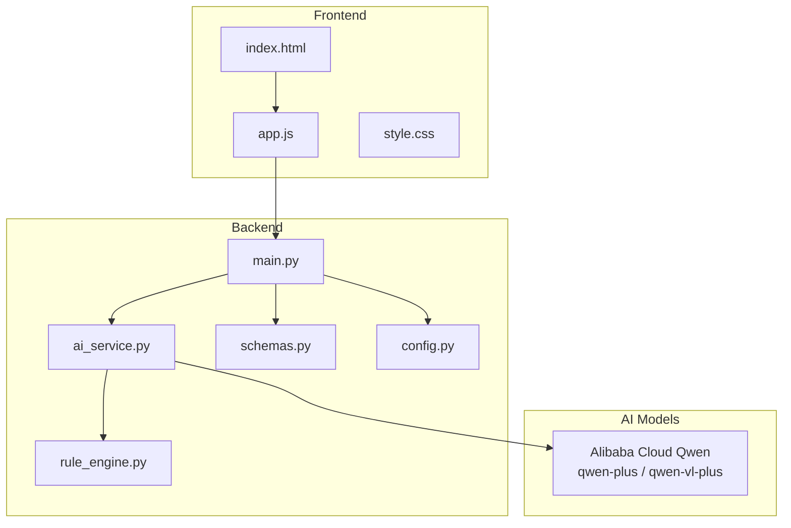
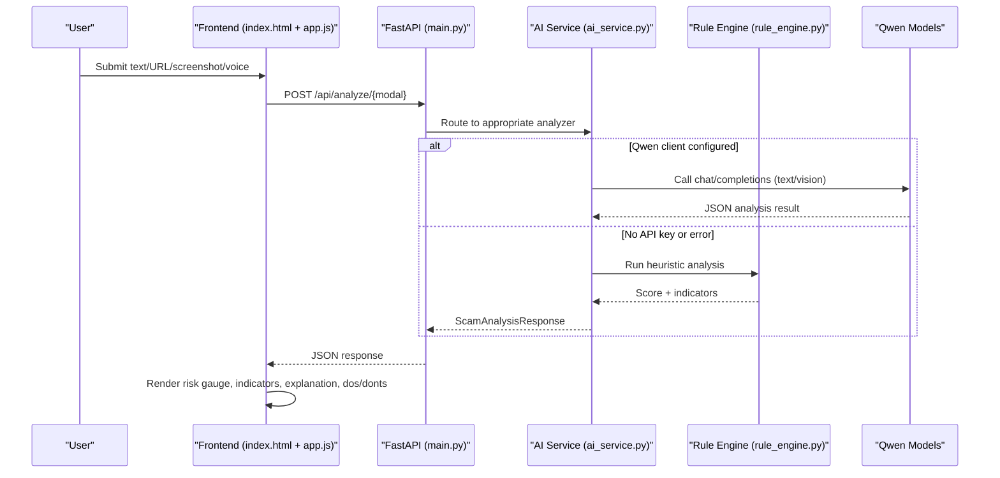
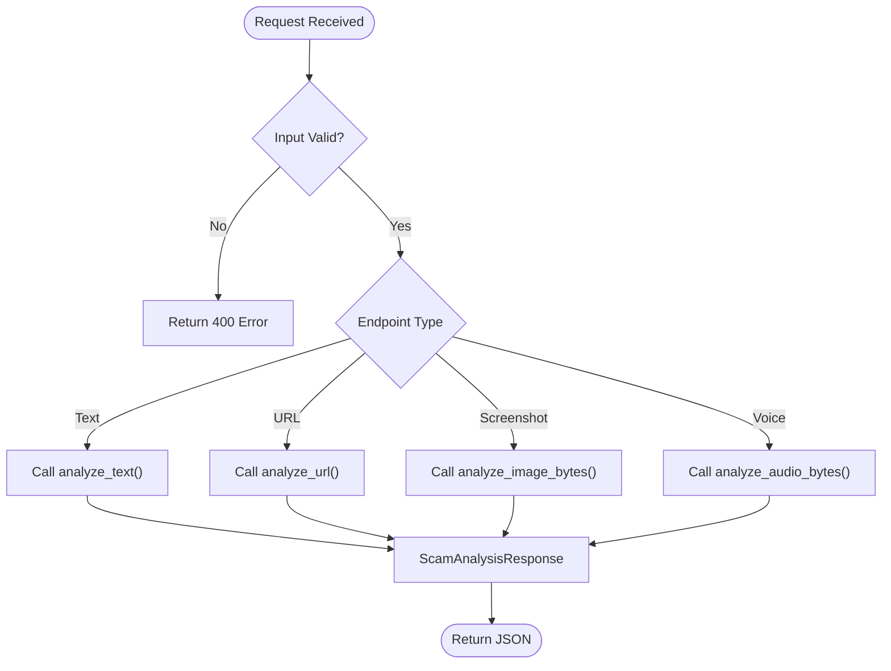
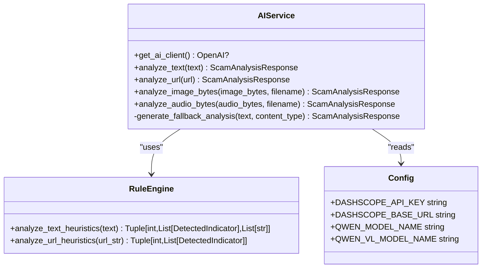
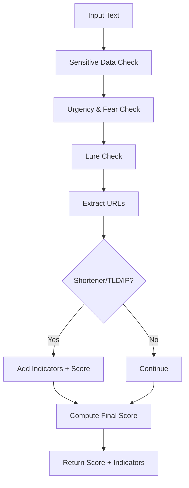
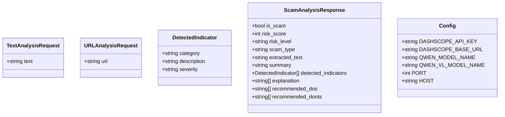
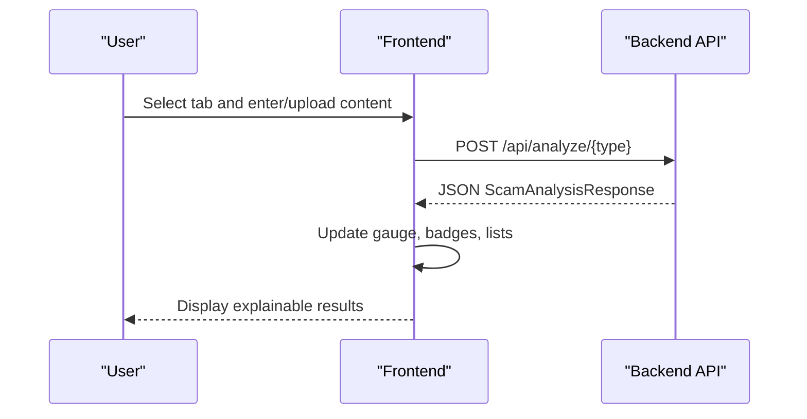
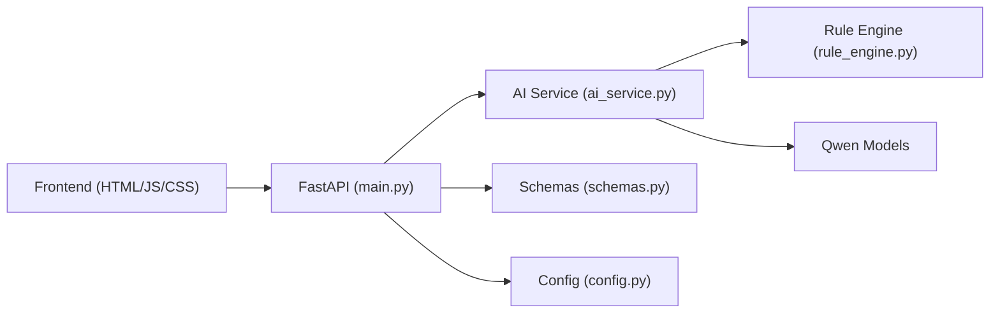

# Project Overview

<cite>
**Referenced Files in This Document**
- [README.md](file://README.md)
- [main.py](file://backend/app/main.py)
- [ai_service.py](file://backend/app/ai_service.py)
- [rule_engine.py](file://backend/app/rule_engine.py)
- [schemas.py](file://backend/app/schemas.py)
- [config.py](file://backend/app/config.py)
- [index.html](file://frontend/index.html)
- [app.js](file://frontend/app.js)
- [requirements.txt](file://backend/requirements.txt)
</cite>

## Table of Contents
1. [Introduction](#introduction)
2. [Project Structure](#project-structure)
3. [Core Components](#core-components)
4. [Architecture Overview](#architecture-overview)
5. [Detailed Component Analysis](#detailed-component-analysis)
6. [Dependency Analysis](#dependency-analysis)
7. [Performance Considerations](#performance-considerations)
8. [Troubleshooting Guide](#troubleshooting-guide)
9. [Conclusion](#conclusion)
10. [Appendices](#appendices)

## Introduction
ScamShield AI is a multimodal cyber threat detection platform that helps users identify financial scams, understand deceptive tactics, and take actionable protection steps. It analyzes text/SMS, screenshots/images (with OCR), URLs/domains, and voice/audio recordings to detect phishing, impersonation, investment fraud, vishing, and more. The system combines fast heuristic checks with Alibaba Cloud Qwen LLM reasoning to produce explainable AI output: clear risk scores, categorized indicators, and practical Do’s and Don’ts.

Key capabilities:
- Text and SMS analysis for urgency, fear manipulation, fake lotteries, and banking impersonation
- Screenshot/image OCR to extract and analyze embedded text from WhatsApp, SMS, and email captures
- URL and domain intelligence to uncover shortened links, spoofed domains, and high-risk TLDs
- Voice/audio scam scanning for vishing patterns
- Dual-layer intelligence using heuristic fallback mode plus Qwen LLM reasoning
- Explainable AI output with consumer-friendly explanations and protective guidance

Technology stack:
- Backend: Python FastAPI with Uvicorn and Pydantic
- Frontend: Vanilla JavaScript single-page application
- AI models: Alibaba Cloud Qwen (qwen-plus for text, qwen-vl-plus for vision)

Practical examples the platform can detect:
- Bank KYC or account suspension messages asking for OTP or credentials
- Lottery/prize winner lures requesting personal or payment details
- Fake job/task offers promising unrealistic earnings via Telegram or crypto
- Shortened or suspicious URLs pointing to high-risk domains
- Voice recordings impersonating tax authorities or law enforcement demanding immediate action

[No sources needed since this section provides a conceptual overview]

## Project Structure
The project follows a clean separation between backend API, AI processing, rule-based heuristics, frontend UI, and configuration.

**Diagram sources**
- [main.py:21-84](file://backend/app/main.py#L21-L84)
- [ai_service.py:1-220](file://backend/app/ai_service.py#L1-L220)
- [rule_engine.py:1-118](file://backend/app/rule_engine.py#L1-L118)
- [schemas.py:1-26](file://backend/app/schemas.py#L1-L26)
- [config.py:1-12](file://backend/app/config.py#L1-L12)
- [index.html:1-212](file://frontend/index.html#L1-L212)
- [app.js:1-236](file://frontend/app.js#L1-L236)

**Section sources**
- [main.py:21-84](file://backend/app/main.py#L21-L84)
- [index.html:1-212](file://frontend/index.html#L1-L212)
- [app.js:1-236](file://frontend/app.js#L1-L236)
- [requirements.txt:1-8](file://backend/requirements.txt#L1-L8)

## Core Components
- API layer (FastAPI): Exposes endpoints for text, URL, screenshot, and voice analysis; serves the frontend static files.
- AI service: Orchestrates multimodal analysis by calling Qwen models when available and falling back to heuristic analysis otherwise.
- Rule engine: Implements heuristic pattern matching for sensitive data requests, urgency/fear cues, lure patterns, and suspicious URLs/domains.
- Data schemas: Defines request/response contracts ensuring consistent payloads across the frontend and backend.
- Configuration: Loads environment variables for API keys, model names, and server settings.
- Frontend: Provides an interactive dashboard with tabs for different input modalities and displays explainable results.

**Section sources**
- [main.py:21-84](file://backend/app/main.py#L21-L84)
- [ai_service.py:1-220](file://backend/app/ai_service.py#L1-L220)
- [rule_engine.py:1-118](file://backend/app/rule_engine.py#L1-L118)
- [schemas.py:1-26](file://backend/app/schemas.py#L1-L26)
- [config.py:1-12](file://backend/app/config.py#L1-L12)
- [index.html:1-212](file://frontend/index.html#L1-L212)
- [app.js:1-236](file://frontend/app.js#L1-L236)

## Architecture Overview
ScamShield AI uses a dual-layer approach:
- Heuristic fallback mode: Fast, rule-based scoring and indicator detection without external dependencies.
- Multimodal analysis with Qwen LLM: When configured, leverages Alibaba Cloud Qwen for advanced reasoning and vision-language tasks.

**Diagram sources**
- [main.py:44-68](file://backend/app/main.py#L44-L68)
- [ai_service.py:9-17](file://backend/app/ai_service.py#L9-L17)
- [ai_service.py:124-176](file://backend/app/ai_service.py#L124-L176)
- [rule_engine.py:37-112](file://backend/app/rule_engine.py#L37-L112)
- [app.js:139-236](file://frontend/app.js#L139-L236)

## Detailed Component Analysis

### API Layer (FastAPI)
- Health check endpoint for service status
- Endpoints for text, URL, screenshot, and voice analysis
- CORS enabled for cross-origin frontend access
- Static file serving for the frontend SPA

**Diagram sources**
- [main.py:36-68](file://backend/app/main.py#L36-L68)

**Section sources**
- [main.py:21-84](file://backend/app/main.py#L21-L84)

### AI Service (Multimodal Processing)
- Detects whether Qwen client is configured; if not, runs heuristic fallback mode
- For text: runs heuristic pre-scan then calls Qwen with structured prompt and JSON schema
- For images: encodes image to base64 and sends to Qwen-VL for OCR and analysis; falls back to simulated OCR and heuristic analysis
- For audio: simulates transcription and applies heuristic analysis
- Returns standardized ScamAnalysisResponse with risk score, level, type, indicators, explanation, and recommended actions

**Diagram sources**
- [ai_service.py:1-220](file://backend/app/ai_service.py#L1-L220)
- [rule_engine.py:1-118](file://backend/app/rule_engine.py#L1-L118)
- [config.py:1-12](file://backend/app/config.py#L1-L12)

**Section sources**
- [ai_service.py:1-220](file://backend/app/ai_service.py#L1-L220)

### Rule Engine (Heuristic Fallback Mode)
- Pattern matching for sensitive information requests (OTP, CVV, passwords, IDs)
- Urgency and fear tactics (account suspension, legal threats)
- Unrealistic rewards/lures (lottery, guaranteed returns, fake jobs)
- URL/domain checks for shorteners, high-risk TLDs, and direct IP hosts
- Produces a composite heuristic score and categorized indicators

**Diagram sources**
- [rule_engine.py:6-112](file://backend/app/rule_engine.py#L6-L112)

**Section sources**
- [rule_engine.py:1-118](file://backend/app/rule_engine.py#L1-L118)

### Data Schemas and Configuration
- Request/response models ensure consistent payloads and validation
- Environment-driven configuration for API keys, model names, and server settings

**Diagram sources**
- [schemas.py:1-26](file://backend/app/schemas.py#L1-L26)
- [config.py:1-12](file://backend/app/config.py#L1-L12)

**Section sources**
- [schemas.py:1-26](file://backend/app/schemas.py#L1-L26)
- [config.py:1-12](file://backend/app/config.py#L1-L12)

### Frontend (Vanilla JavaScript SPA)
- Tabbed interface for text, screenshot, URL, and voice inputs
- Preset demo scenarios to quickly test common scam types
- File selection feedback and loading states
- Renders results including risk gauge, scam type, summary, indicators, explanation, and recommended actions

**Diagram sources**
- [index.html:42-200](file://frontend/index.html#L42-L200)
- [app.js:139-236](file://frontend/app.js#L139-L236)

**Section sources**
- [index.html:1-212](file://frontend/index.html#L1-L212)
- [app.js:1-236](file://frontend/app.js#L1-L236)

## Dependency Analysis
- Backend depends on FastAPI, Uvicorn, Pydantic, python-multipart, requests, openai, python-dotenv
- Frontend communicates with backend via REST endpoints and renders responses dynamically
- AI service conditionally depends on Alibaba Cloud Qwen; gracefully degrades to heuristic fallback mode

**Diagram sources**
- [requirements.txt:1-8](file://backend/requirements.txt#L1-L8)
- [main.py:21-84](file://backend/app/main.py#L21-L84)
- [ai_service.py:1-220](file://backend/app/ai_service.py#L1-L220)
- [rule_engine.py:1-118](file://backend/app/rule_engine.py#L1-L118)
- [schemas.py:1-26](file://backend/app/schemas.py#L1-L26)
- [config.py:1-12](file://backend/app/config.py#L1-L12)

**Section sources**
- [requirements.txt:1-8](file://backend/requirements.txt#L1-L8)
- [main.py:21-84](file://backend/app/main.py#L21-L84)

## Performance Considerations
- Heuristic fallback mode ensures low-latency analysis without network calls, ideal for offline testing or degraded environments
- Qwen integration adds richer reasoning but introduces latency; consider caching frequent analyses or batching where applicable
- Image uploads are base64-encoded; optimize payload size and consider compression for large screenshots
- Use CORS judiciously in production to limit allowed origins

[No sources needed since this section provides general guidance]

## Troubleshooting Guide
- Missing or invalid API key: System automatically switches to heuristic fallback mode; verify environment variables and model names
- Network errors during Qwen calls: Errors are caught and fall back to heuristic analysis; check connectivity and base URL
- Empty uploads: Endpoints validate file contents and return 400 errors if empty; ensure frontend passes valid files
- CORS issues: Ensure allow_origins includes your frontend origin in development or configure appropriately for production

**Section sources**
- [ai_service.py:9-17](file://backend/app/ai_service.py#L9-L17)
- [ai_service.py:152-176](file://backend/app/ai_service.py#L152-L176)
- [main.py:44-68](file://backend/app/main.py#L44-L68)
- [config.py:1-12](file://backend/app/config.py#L1-L12)

## Conclusion
ScamShield AI delivers a robust, multimodal threat detection experience combining fast heuristic checks with advanced Qwen LLM reasoning. Its explainable AI output empowers users to understand risks and act confidently. The modular architecture supports easy extension to additional modalities and rules while maintaining reliability through graceful fallback mechanisms.

[No sources needed since this section summarizes without analyzing specific files]

## Appendices

### Practical Scam Scenarios and Detection
- Bank KYC impersonation: Urgent account suspension message requesting OTP and link verification
- Lottery/prize lure: Winner notification asking for personal and payment details to claim a prize
- Fake job/task offer: Promises of high daily earnings via Telegram tasks and crypto payments
- Suspicious URL: Shortened links or domains with high-risk TLDs used to mask malicious destinations
- Vishing call recording: Impersonation of tax or law enforcement demanding immediate action or payment

These scenarios are supported by both heuristic pattern matching and Qwen-powered reasoning when configured.

[No sources needed since this section provides conceptual examples]