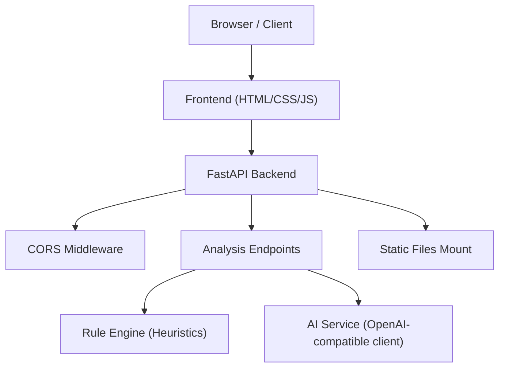
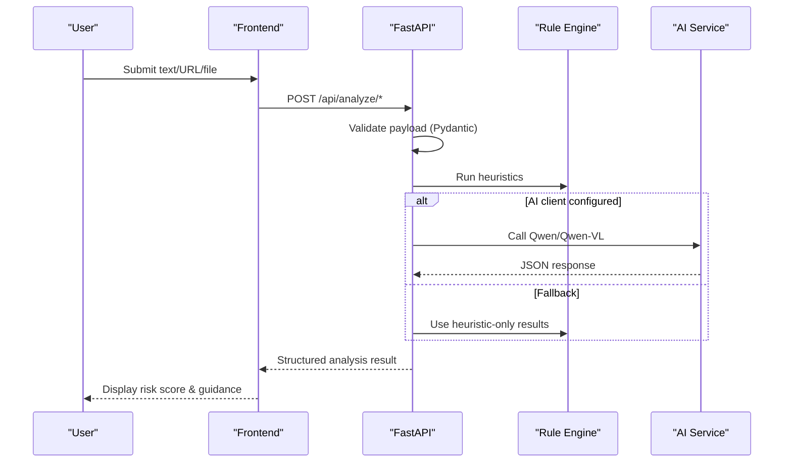
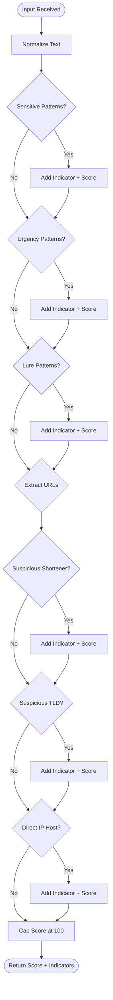
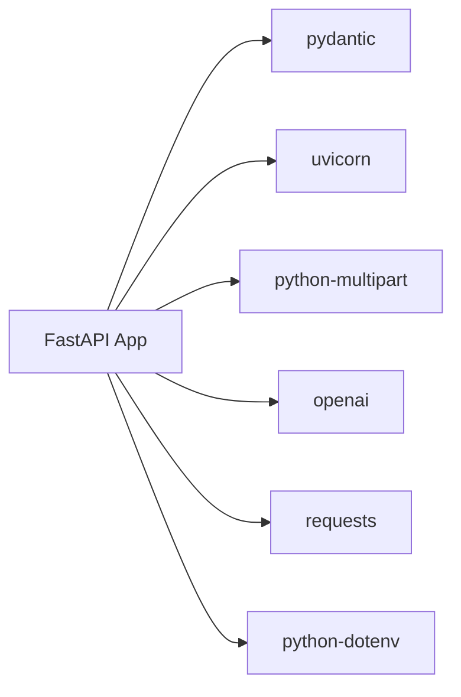

# Security Considerations

<cite>
**Referenced Files in This Document**
- [main.py](file://backend/app/main.py)
- [config.py](file://backend/app/config.py)
- [ai_service.py](file://backend/app/ai_service.py)
- [rule_engine.py](file://backend/app/rule_engine.py)
- [schemas.py](file://backend/app/schemas.py)
- [app.js](file://frontend/app.js)
- [index.html](file://frontend/index.html)
- [requirements.txt](file://backend/requirements.txt)
- [README.md](file://README.md)
</cite>

## Table of Contents
1. [Introduction](#introduction)
2. [Project Structure](#project-structure)
3. [Core Components](#core-components)
4. [Architecture Overview](#architecture-overview)
5. [Detailed Component Analysis](#detailed-component-analysis)
6. [Dependency Analysis](#dependency-analysis)
7. [Performance Considerations](#performance-considerations)
8. [Troubleshooting Guide](#troubleshooting-guide)
9. [Conclusion](#conclusion)
10. [Appendices](#appendices)

## Introduction
This document provides comprehensive security guidance for ScamShield AI, covering application and user data protection. It focuses on cross-origin resource sharing (CORS), input validation and sanitization, secure file upload handling for screenshots and audio, API key and environment variable security, secure communication protocols, frontend security measures (XSS prevention, CSRF considerations, safe file handling), secure deployment practices, logging and monitoring for security events, vulnerability assessment procedures, privacy considerations, data retention policies, compliance requirements, and best practices across development, testing, and production environments.

## Project Structure
ScamShield AI consists of a FastAPI backend that exposes analysis endpoints and serves a static frontend. The frontend is a single-page application with HTML, CSS, and vanilla JavaScript. Configuration is loaded from environment variables via dotenv.

**Diagram sources**
- [main.py:21-84](file://backend/app/main.py#L21-L84)
- [ai_service.py:9-16](file://backend/app/ai_service.py#L9-L16)
- [rule_engine.py:37-118](file://backend/app/rule_engine.py#L37-L118)

**Section sources**
- [main.py:21-84](file://backend/app/main.py#L21-L84)
- [index.html:1-212](file://frontend/index.html#L1-L212)
- [app.js:1-236](file://frontend/app.js#L1-L236)
- [requirements.txt:1-8](file://backend/requirements.txt#L1-L8)

## Core Components
- Application entrypoint and middleware configuration:
  - FastAPI app initialization, CORS middleware, health endpoint, analysis endpoints, static file serving, and server run configuration.
- Configuration management:
  - Environment-based loading of API keys, base URLs, model names, host, and port using dotenv.
- AI service integration:
  - OpenAI-compatible client setup for Alibaba Cloud DashScope, fallback heuristic analysis, image and audio processing flows.
- Rule engine:
  - Heuristic pattern matching for sensitive data requests, urgency tactics, lures, URL shorteners, suspicious TLDs, and IP domains.
- Data schemas:
  - Pydantic models for request/response validation and constraints.
- Frontend:
  - UI for text, URL, screenshot, and voice inputs; result rendering; file selection and submission to backend endpoints.

**Section sources**
- [main.py:21-84](file://backend/app/main.py#L21-L84)
- [config.py:1-12](file://backend/app/config.py#L1-L12)
- [ai_service.py:9-220](file://backend/app/ai_service.py#L9-L220)
- [rule_engine.py:1-118](file://backend/app/rule_engine.py#L1-L118)
- [schemas.py:1-26](file://backend/app/schemas.py#L1-L26)
- [app.js:1-236](file://frontend/app.js#L1-L236)
- [index.html:1-212](file://frontend/index.html#L1-L212)

## Architecture Overview
The system uses a layered architecture:
- Frontend collects user inputs and uploads files, then calls backend endpoints.
- Backend validates inputs via Pydantic schemas and applies heuristics before optionally invoking the AI service.
- Responses are structured and returned to the frontend for display.

**Diagram sources**
- [main.py:44-68](file://backend/app/main.py#L44-L68)
- [ai_service.py:124-220](file://backend/app/ai_service.py#L124-L220)
- [rule_engine.py:37-118](file://backend/app/rule_engine.py#L37-L118)

## Detailed Component Analysis

### CORS Configuration and Cross-Origin Security
- Current behavior:
  - CORS middleware is enabled with allow_origins set to wildcard, credentials allowed, all methods and headers permitted.
- Risks:
  - Wildcard origins with credentials can expose the API to malicious sites if not carefully controlled.
- Recommendations:
  - Restrict allow_origins to known frontends (e.g., specific domains or localhost during development).
  - Explicitly enumerate allowed methods and headers instead of using wildcards.
  - Consider enabling credentials only when necessary and ensure proper origin checks.
  - Add rate limiting and request size limits at the gateway or middleware layer.

**Section sources**
- [main.py:27-34](file://backend/app/main.py#L27-L34)

### Input Validation and Sanitization
- Validation:
  - Requests are validated using Pydantic models with required fields and constraints (e.g., risk_score range).
  - Basic emptiness checks are performed for text and URL payloads before processing.
- Sanitization:
  - No explicit sanitization beyond schema validation is implemented.
- Recommendations:
  - Enforce strict content types for file uploads (image/* and audio/*).
  - Implement maximum file size limits and content-type checks.
  - Add length limits for text inputs to prevent abuse.
  - Normalize and validate URLs strictly (scheme, domain, path).
  - Escape or sanitize any user-provided content rendered in the frontend to prevent XSS.

**Section sources**
- [schemas.py:4-26](file://backend/app/schemas.py#L4-L26)
- [main.py:44-68](file://backend/app/main.py#L44-L68)
- [app.js:138-235](file://frontend/app.js#L138-L235)

### Secure File Upload Handling (Screenshots and Audio)
- Current behavior:
  - Endpoints accept multipart file uploads for screenshots and voice recordings.
  - Empty file checks are performed; filenames are used but not sanitized.
  - Image bytes are base64-encoded for AI processing; audio is processed via simulated transcription in fallback mode.
- Risks:
  - Missing file type validation and size limits could allow malicious payloads.
  - Filenames are passed through without sanitization.
- Recommendations:
  - Validate MIME types and magic bytes for uploaded files.
  - Enforce maximum file sizes and reject oversized uploads.
  - Sanitize filenames and store files in isolated directories with restricted permissions.
  - Scan uploaded files for malware before processing.
  - Limit concurrent uploads and implement queueing to avoid resource exhaustion.
  - Consider streaming large files to reduce memory usage.

**Section sources**
- [main.py:56-68](file://backend/app/main.py#L56-L68)
- [ai_service.py:178-220](file://backend/app/ai_service.py#L178-L220)

### API Key Protection Strategies and Environment Variable Security
- Current behavior:
  - API keys and configuration are loaded from environment variables via dotenv.
  - If no valid key is provided, the system falls back to heuristic analysis.
- Risks:
  - Hardcoded defaults or missing .env files may lead to insecure defaults.
  - Dotenv must be protected from version control leaks.
- Recommendations:
  - Never commit secrets to source control; use secret managers in production.
  - Rotate API keys regularly and restrict scopes to minimum required.
  - Validate presence and format of required environment variables at startup.
  - Log configuration load status without exposing secrets.
  - Use separate environments for dev/test/prod with distinct credentials.

**Section sources**
- [config.py:1-12](file://backend/app/config.py#L1-L12)
- [ai_service.py:9-16](file://backend/app/ai_service.py#L9-L16)
- [README.md:44-53](file://README.md#L44-L53)

### Secure Communication Protocols
- Current behavior:
  - The application runs via Uvicorn and serves static assets locally by default.
- Risks:
  - Running without HTTPS exposes traffic to interception.
- Recommendations:
  - Deploy behind a reverse proxy (e.g., Nginx) terminating TLS with strong cipher suites.
  - Enforce HTTPS redirects and enable HSTS.
  - Use secure cookies and appropriate SameSite attributes for session cookies.
  - Ensure upstream services (AI provider) communicate over encrypted channels.

**Section sources**
- [main.py:81-84](file://backend/app/main.py#L81-L84)

### Frontend Security Measures
- XSS Prevention:
  - Results are rendered using innerText, which avoids executing injected scripts.
- CSRF Protection:
  - The frontend uses fetch to call same-origin endpoints served by the backend; CSRF tokens are not implemented. For same-site deployments this reduces risk, but additional protections (tokens, SameSite cookies) are recommended if cross-site interactions occur.
- Safe File Handling:
  - File inputs are constrained to image/* and audio/* via accept attributes.
  - Selected files are appended to FormData and sent to backend endpoints.
- Recommendations:
  - Add Content Security Policy (CSP) headers to restrict script execution and external resources.
  - Validate and sanitize user inputs on the client side as an additional layer.
  - Implement error boundaries and graceful failure modes for network errors.
  - Avoid inline event handlers where possible; prefer unobtrusive event binding.

**Section sources**
- [index.html:67-121](file://frontend/index.html#L67-L121)
- [app.js:54-136](file://frontend/app.js#L54-L136)
- [app.js:187-235](file://frontend/app.js#L187-L235)

### Heuristic Analysis and Pattern Matching
- The rule engine applies regex patterns to detect sensitive data requests, urgency tactics, lures, suspicious domains, high-risk TLDs, and direct IP hosts.
- Scores are aggregated and capped at 100; indicators are collected for explanation and guidance.
- This provides immediate risk signals even when AI services are unavailable.

**Diagram sources**
- [rule_engine.py:37-118](file://backend/app/rule_engine.py#L37-L118)

**Section sources**
- [rule_engine.py:1-118](file://backend/app/rule_engine.py#L1-L118)

### Privacy Considerations and Data Retention
- Data minimization:
  - Process only necessary data; avoid storing raw inputs unless required for auditing or improvement.
- Anonymization:
  - Strip personally identifiable information (PII) from logs and retained artifacts.
- Retention policy:
  - Define clear retention periods for logs, uploaded files, and analysis results; automate deletion after expiry.
- Access controls:
  - Restrict access to sensitive data to authorized personnel and systems.
- Compliance:
  - Align with applicable regulations (e.g., GDPR, CCPA) regarding consent, rights to erasure, and data portability.

[No sources needed since this section provides general guidance]

### Logging and Monitoring for Security Events
- Recommendations:
  - Log authentication attempts, authorization failures, invalid inputs, and upload anomalies.
  - Include timestamps, source IPs, and request IDs; exclude sensitive data from logs.
  - Monitor for unusual spikes in requests or failed validations.
  - Integrate centralized logging and alerting for critical security events.
  - Regularly review logs and adjust thresholds based on observed behavior.

[No sources needed since this section provides general guidance]

### Vulnerability Assessment Procedures
- Code-level scanning:
  - Use static analysis tools to identify vulnerabilities in Python and JavaScript code.
- Dependency auditing:
  - Regularly update dependencies and audit for known CVEs.
- Penetration testing:
  - Conduct periodic assessments focusing on CORS misconfiguration, injection points, and file upload risks.
- Runtime protection:
  - Employ WAF rules to block common attack patterns.
- Continuous integration:
  - Embed security checks into CI pipelines to catch issues early.

[No sources needed since this section provides general guidance]

### Best Practices Across Environments
- Development:
  - Use local development servers with strict CORS restrictions and minimal privileges.
  - Mock external APIs where possible to avoid leaking real credentials.
- Testing:
  - Include unit and integration tests for validation, error paths, and security controls.
  - Test file upload handling with malicious payloads in isolated environments.
- Production:
  - Harden the server, enforce HTTPS, limit exposed ports, and apply least privilege principles.
  - Use secret managers and rotate credentials regularly.
  - Enable comprehensive monitoring and alerting.

[No sources needed since this section provides general guidance]

## Dependency Analysis
External dependencies include FastAPI, Uvicorn, Pydantic, python-multipart, requests, openai, and python-dotenv. These introduce potential supply chain risks and require regular updates and audits.

**Diagram sources**
- [requirements.txt:1-8](file://backend/requirements.txt#L1-L8)

**Section sources**
- [requirements.txt:1-8](file://backend/requirements.txt#L1-L8)

## Performance Considerations
- Large file uploads:
  - Stream processing to reduce memory footprint; enforce size limits.
- AI service latency:
  - Cache repeated analyses where appropriate; implement timeouts and retries with exponential backoff.
- Heuristic pre-checks:
  - Use fast rule-based checks to short-circuit expensive AI calls when possible.
- Concurrency:
  - Configure worker processes appropriately; monitor CPU and memory usage.

[No sources needed since this section provides general guidance]

## Troubleshooting Guide
- Common issues:
  - Missing or invalid API keys: System falls back to heuristic mode; verify environment configuration.
  - CORS errors: Adjust allow_origins to match frontend domain; ensure credentials policy aligns with requirements.
  - File upload failures: Validate MIME types and sizes; check server storage permissions.
  - Network errors: Inspect client-side fetch calls and backend availability; add retry logic and user-friendly messages.
- Debugging steps:
  - Enable detailed logging temporarily to trace request flow.
  - Validate Pydantic schemas and request payloads.
  - Test endpoints independently using curl or Postman.

**Section sources**
- [config.py:1-12](file://backend/app/config.py#L1-L12)
- [ai_service.py:9-16](file://backend/app/ai_service.py#L9-L16)
- [main.py:27-34](file://backend/app/main.py#L27-L34)
- [app.js:138-235](file://frontend/app.js#L138-L235)

## Conclusion
ScamShield AI implements foundational security measures including CORS middleware, input validation via Pydantic, and environment-based configuration. To strengthen security posture, restrict CORS origins, enforce strict file upload validation and size limits, protect API keys with secret management, deploy behind HTTPS with a reverse proxy, and adopt comprehensive logging, monitoring, and vulnerability assessment practices. Frontend rendering uses safe text insertion, but CSP and additional client-side safeguards are recommended. Adhering to privacy principles, data retention policies, and compliance requirements will further enhance trust and resilience.

## Appendices

### API Endpoints Summary
- Health check: GET /api/health
- Text analysis: POST /api/analyze/text
- URL analysis: POST /api/analyze/url
- Screenshot analysis: POST /api/analyze/screenshot
- Voice analysis: POST /api/analyze/voice

**Section sources**
- [main.py:36-68](file://backend/app/main.py#L36-L68)

### Environment Variables Reference
- DASHSCOPE_API_KEY: API key for Alibaba Cloud DashScope
- DASHSCOPE_BASE_URL: Base URL for DashScope API
- QWEN_MODEL_NAME: Model name for text analysis
- QWEN_VL_MODEL_NAME: Model name for vision analysis
- PORT: Server port
- HOST: Server host binding

**Section sources**
- [config.py:6-11](file://backend/app/config.py#L6-L11)